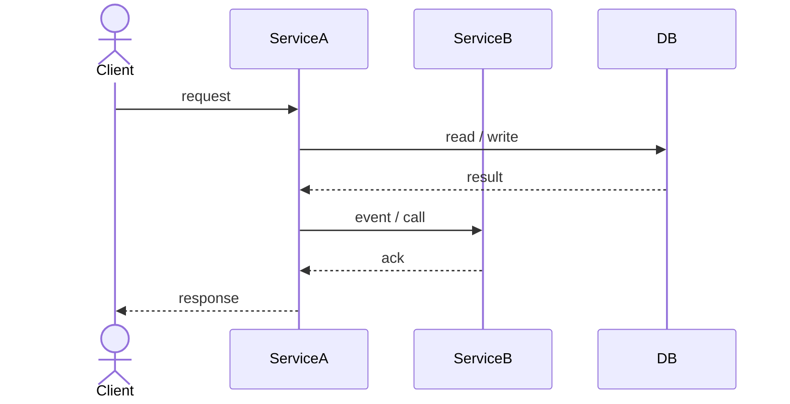
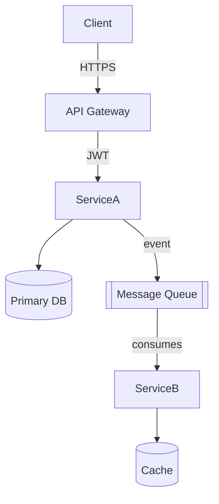
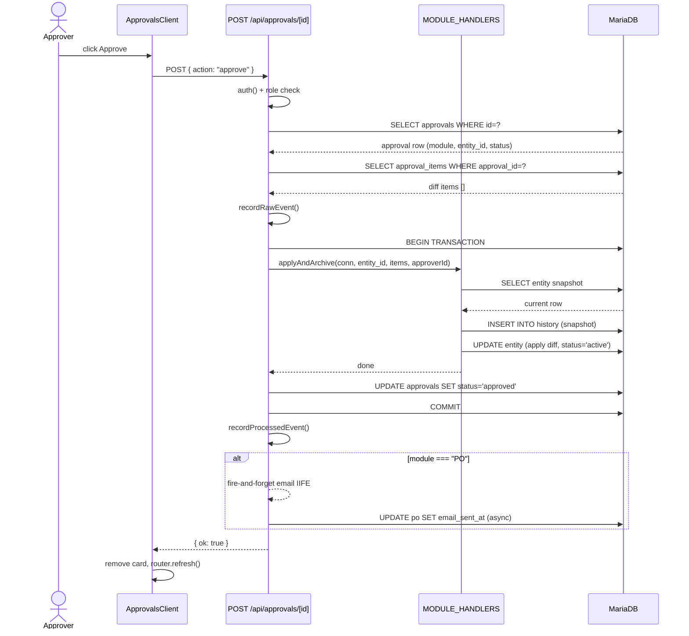
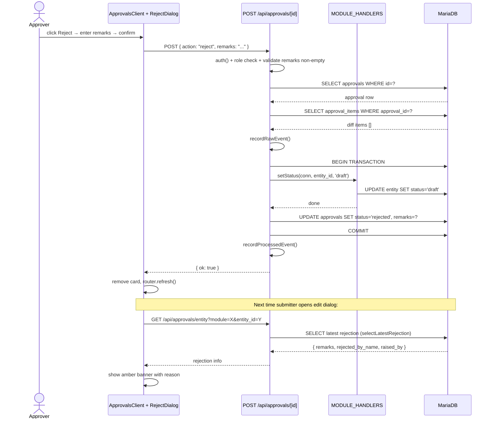
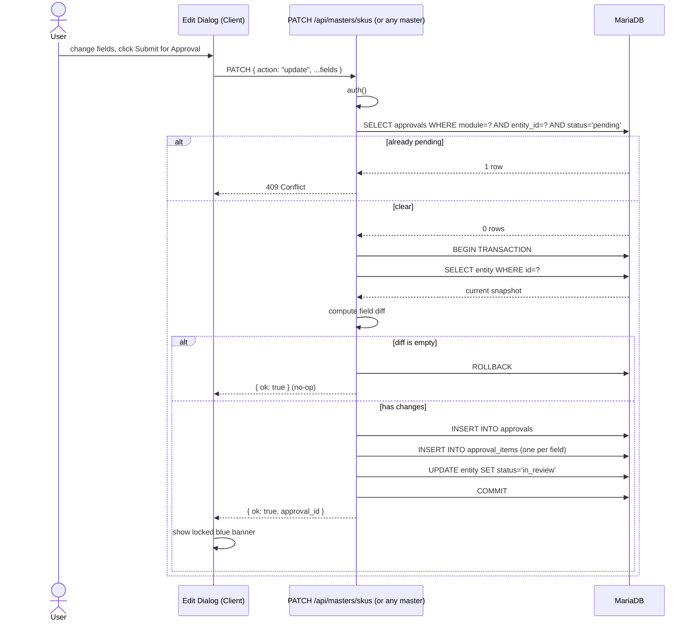
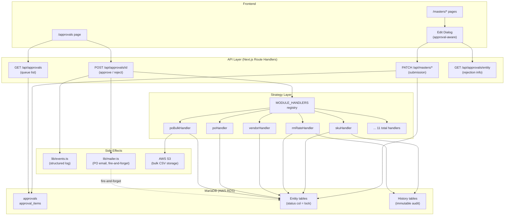
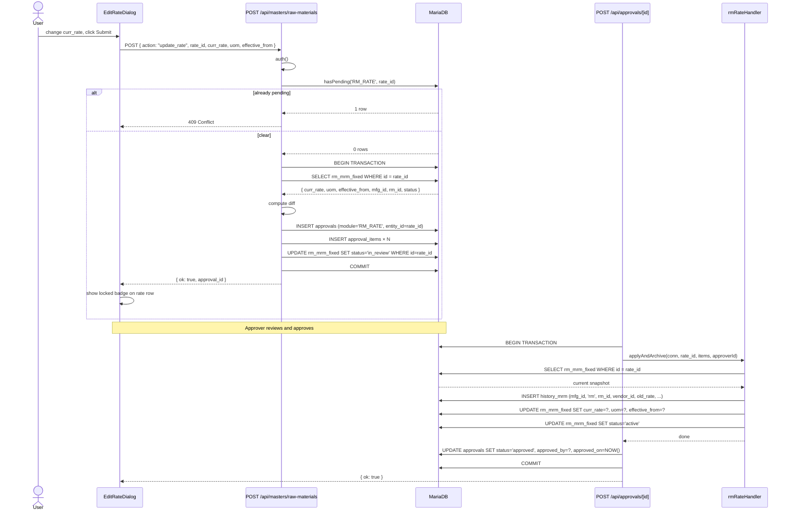
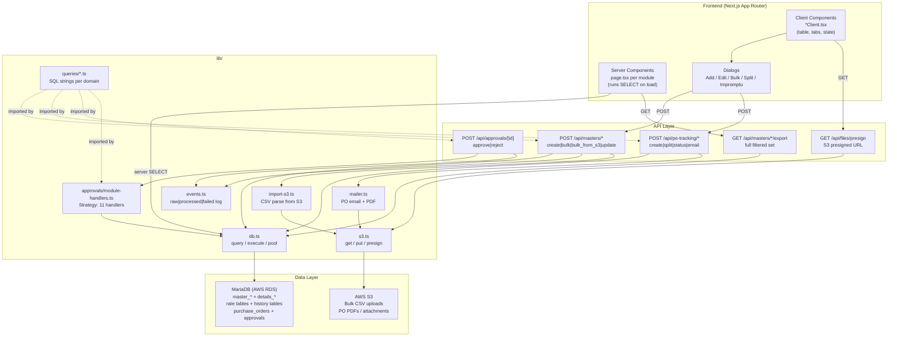

# System Architecture Discussion Framework

> **Role:** Senior Staff Engineer & System Architect  
> **Purpose:** Collaboratively design and deeply understand system architecture, event flows, and engineering trade-offs — feature by feature, step by step.

---

## How We Work

For every feature or use case brought to this discussion:

1. Start with the **high-level architecture**.
2. Break it down into **individual components** and their responsibilities.
3. Explain **how components communicate** with each other.
4. Describe **all events** being generated and consumed.
5. Explain **why each design decision** was made.
6. Mention **alternative approaches** and their pros/cons.
7. Highlight **scalability, reliability, consistency, and failure scenarios**.
8. Explain **data flow, state transitions, and event ordering**.
9. Where applicable, discuss:
   - Synchronous vs Asynchronous communication
   - Message queues and brokers
   - Event sourcing
   - Saga patterns
   - Idempotency
   - Retry mechanisms
   - Distributed transactions
   - Caching strategies
   - Database design implications
   - Observability and monitoring

---

## Response Template

Every feature or flow discussion follows this structure:

---

### 1. Business Requirement

> What problem are we solving?

- User-facing problem statement
- Functional requirements
- Non-functional requirements (latency, throughput, consistency guarantees)
- Out of scope

---

### 2. High-Level Architecture

> Components involved and why.

- List every service / component participating
- Responsibility of each component (single-sentence)
- Ownership boundaries (what does NOT belong to each component)
- Why this decomposition was chosen over alternatives

---

### 3. Step-by-Step Request Flow

> Detailed sequence from the first request until completion.

1. Client sends `<request>`
2. `<Component A>` receives it, validates, and …
3. `<Component B>` is called synchronously / asynchronously because …
4. …
5. Response / side effect reaches the client / downstream system

Include:
- Auth & authorization checks
- Validation layers
- Retry points
- Where the request can fail and what happens

---

### 4. Event Flow

For **each event** produced in this flow:

| Field | Details |
|---|---|
| **Event Name** | `entity.action.v1` (e.g., `order.created.v1`) |
| **Producer** | Which service emits it |
| **Trigger** | What causes emission (DB commit, API call, …) |
| **Payload** | Key fields (IDs, timestamps, state snapshot) |
| **Consumers** | Which services subscribe and why |
| **Side Effects** | What each consumer does |
| **Ordering Guarantee** | At-most-once / at-least-once / exactly-once |
| **Failure Handling** | DLQ, retry policy, idempotency key |

---

### 5. Sequence Diagram



*(Diagram is generated per feature.)*

---

### 6. Architecture Diagram



*(Diagram is generated per feature.)*

---

### 7. Database Impact

- **Tables / Entities created or modified**
- **Schema changes** (new columns, indexes, constraints)
- **Transaction boundaries** — what is atomic, what is eventual
- **Read vs write patterns** — OLTP vs OLAP separation if needed
- **Index strategy** — covering indexes, composite keys
- **Data retention / archival** considerations

---

### 8. Edge Cases & Failure Scenarios

| Scenario | Impact | Mitigation |
|---|---|---|
| Service crash mid-transaction | Partial write | Idempotent retry + saga compensation |
| Duplicate event delivery | Double processing | Idempotency key on consumer |
| Timeout between services | Orphaned state | Timeout + compensating rollback |
| DB primary failover | Write unavailability | Read replica fallback + retry queue |
| Race condition on shared record | Dirty read / lost update | Optimistic locking / row-level lock |
| Message queue backlog | Consumer lag | Partition scaling + lag alerting |
| Schema migration on live traffic | Downtime risk | Expand-contract migration pattern |

---

### 9. Scaling Considerations

| Traffic Level | Bottleneck | Approach |
|---|---|---|
| **10x** | Single DB writer | Connection pooling, query optimization |
| **100x** | DB read throughput | Read replicas, query cache (Redis) |
| **1000x** | DB write throughput | Horizontal sharding, CQRS, event sourcing |

Also consider:
- Stateless services → horizontal pod autoscaling
- Hot partition keys in message queues
- Cache stampede on cold start
- Global vs regional deployments

---

### 10. Engineering Trade-offs

| Decision | Chosen Approach | Alternative | Why Chosen |
|---|---|---|---|
| Sync vs async | Async (event) | Sync HTTP | Decouples services, better resilience |
| At-least-once delivery | Yes | Exactly-once | Simpler infra; idempotency handles duplicates |
| Saga vs 2PC | Saga (choreography) | 2PC | No distributed lock; each service owns rollback |
| CQRS | Read/write model split | Single model | Independent scaling of read path |

---

## Design Review Rules

These rules govern every discussion in this framework:

- **Challenge assumptions** — if a requirement seems ambiguous or contradictory, ask before designing.
- **Ask clarifying questions first** — do not jump to implementation before the design is agreed.
- **No implementation until the architecture is approved** — design review precedes code.
- **Think in production scale** — every decision must hold at millions of requests per day.
- **Make trade-offs explicit** — never hide a decision; always state what is gained and what is sacrificed.
- **Failure is first-class** — design the unhappy path before the happy path is complete.
- **Single responsibility** — each component owns exactly one concern; coupling is a red flag.
- **Prefer reversible decisions** — flag irreversible architectural choices explicitly.

---

## Discussion Log

> Append a new `##` section below each time we design a feature together.

---

## Feature 01 — Approval Flow

### 1. Business Requirement

**Problem:** Master data (SKUs, vendors, manufacturers, raw/packing materials, rates, purchase orders) is shared across the organization. Allowing any user to directly mutate these records creates audit risk, data quality issues, and irreversible accidents.

**Solution:** Every edit to a master record must be reviewed and explicitly approved by a user with `admin` or `manager` role before the change is persisted.

**Functional requirements:**
- Any authenticated user can submit an edit (raise an approval request)
- Only `admin` / `manager` roles can approve or reject
- Approval must record who changed what, from what value, to what value — field level
- A rejected record must carry a mandatory reason (remarks) and be re-editable
- An entity with a pending approval must be locked from further edits (prevents concurrent approvals)
- Every approval must have a full audit trail
- New modules can be added without changing the approval routing logic

**Non-functional requirements:**
- Approval action (approve/reject) must be atomic — partial application of a diff must be impossible
- The `hasPending` guard must be race-condition safe
- PO email notification after approval must not block or fail the approval transaction

**Out of scope:**
- Multi-level approval chains (e.g. manager → CFO)
- Approval delegation
- Email notifications to submitters on rejection
- Time-based auto-expiry of pending approvals

---

### 2. High-Level Architecture

```
┌─────────────────────┐        ┌───────────────────────────┐
│   Submitter (UI)    │        │    Approver (UI)           │
│  /masters/* pages   │        │    /approvals page         │
└────────┬────────────┘        └────────────┬───────────────┘
         │ PATCH/POST                        │ POST
         ▼                                   ▼
┌─────────────────────┐        ┌───────────────────────────┐
│ Master API Routes   │        │  POST /api/approvals/[id] │
│ /api/masters/skus   │        │  (approve / reject)        │
│ /api/masters/rm     │        └────────────┬───────────────┘
│ /api/masters/pm     │                     │
│ /api/masters/vendor │                     ▼
│ /api/masters/mfg    │        ┌───────────────────────────┐
│ /api/po-tracking    │        │  MODULE_HANDLERS registry  │
└────────┬────────────┘        │  (Strategy Pattern)        │
         │ INSERT              └────────────┬───────────────┘
         ▼                                  │ conn.execute
┌─────────────────────┐                     ▼
│   approvals table   │        ┌───────────────────────────┐
│   approval_items    │        │  MariaDB (AWS RDS)         │
│   (diff store)      │        │  entity tables + history   │
└─────────────────────┘        └───────────────────────────┘
```

**Components and their single responsibility:**

| Component | Responsibility |
|---|---|
| Master API routes | Compute field-level diff; write `approvals` + `approval_items`; lock entity to `in_review` |
| `GET /api/approvals` | Return all pending approvals with diff items and human-readable entity labels |
| `POST /api/approvals/[id]` | Auth gate; route action to correct `ModuleHandler`; own the DB transaction |
| `MODULE_HANDLERS` registry | Strategy pattern — one object per module encapsulating approve/reject SQL |
| `approvals` table | Source of truth for approval lifecycle state |
| `approval_items` table | Immutable field-level diff record (old → new per field) |
| Entity tables | Hold live data; `status` column acts as a distributed lock (`in_review`) |
| History tables | Immutable audit log of what was active before each approval |
| `lib/events.ts` | Structured event logging (raw / processed / failed) |
| `lib/mailer.ts` | Fire-and-forget PO email after approval |

---

### 3. Step-by-Step Request Flow

#### 3a. Submission (raising an approval)

1. User opens an edit dialog on a master page (e.g. `/masters/skus`)
2. User changes one or more fields and clicks "Submit for Approval"
3. Client POSTs to the master API route (e.g. `PATCH /api/masters/skus` with `action: "update"`)
4. API authenticates the session (`auth()`)
5. API calls `hasPending(module, entity_id)` — if a row exists, returns `409 Conflict` immediately
6. API opens a DB connection and starts a transaction
7. API reads the current entity snapshot from the DB (`selectById`)
8. API computes the diff: `Object.entries(proposed).filter(([k,v]) => String(current[k]) !== String(v))`
9. If diff is empty → rollback, return `{ ok: true }` (no-op)
10. API inserts one row into `approvals` (raised_by, module, entity_id, status=`pending`)
11. API inserts one row into `approval_items` per changed field (approval_id, field_name, old_value, new_value)
12. API sets entity `status = 'in_review'` (locking it)
13. Commit → return `{ ok: true, approval_id }`
14. Edit dialog now shows the "locked" blue banner; all fields are disabled

#### 3b. Approval queue view

1. Approver visits `/approvals`
2. Page server component calls `GET /api/approvals`
3. API runs `listPending` SQL → gets all approvals with `status = 'pending'`
4. For each approval: parallel fetch of `approval_items` + entity label (module-specific SQL)
5. Returns enriched array to client → rendered as `ApprovalCard` components
6. Each card shows: entity code/name, submitter, raised date, field-level diff table

#### 3c. Approve action

1. Approver clicks "Approve" on a card
2. `ApprovalsClient` POSTs `{ action: "approve" }` to `POST /api/approvals/[id]`
3. API authenticates and checks `admin|manager` role — `403` if missing
4. API fetches `approvals` row by id → `404` if not found, `409` if not `pending`
5. API looks up `MODULE_HANDLERS[approval.module]` → `422` if unknown module
6. API fetches `approval_items` for this approval id
7. API fires a raw event log (`recordRawEvent`)
8. API opens a `PoolConnection` and calls `beginTransaction()`
9. API calls `handler.applyAndArchive(conn, entity_id, items, approverId)`:
   - Reads current entity snapshot inside the transaction
   - Writes current snapshot to the history table (audit trail)
   - Applies the diff fields to the entity row
   - Sets entity `status = 'active'`
10. API executes `markApproved` (sets `approvals.status = 'approved'`, stamps `approved_by`, `approved_on`)
11. `conn.commit()`
12. API fires `recordProcessedEvent`
13. **If module = `PO`**: fire-and-forget async IIFE sends PO email → stamps `email_sent_at` on success
14. Return `{ ok: true }` to client
15. Client removes card from local state, calls `router.refresh()` to re-sync server data

#### 3d. Reject action

1. Approver clicks "Reject" → `RejectDialog` opens (modal requiring remarks)
2. Approver types mandatory remarks and confirms
3. Client POSTs `{ action: "reject", remarks: "..." }` to `POST /api/approvals/[id]`
4. API validates `remarks` is non-empty — `400` if missing
5. Steps 3–8 same as approve path
6. API calls `handler.setStatus(conn, entity_id, STATUS.DRAFT)` — entity becomes re-editable
7. API executes `markRejected` (sets `approvals.status = 'rejected'`, stamps remarks, approver, timestamp)
8. `conn.commit()`
9. Return `{ ok: true }` to client
10. On next open of edit dialog: dialog fetches `GET /api/approvals/entity?module=X&entity_id=Y` → shows amber rejection banner with remarks

---

### 4. Event Flow

| # | Event | Producer | Trigger | Payload | Consumers | Side Effects | Failure Handling |
|---|---|---|---|---|---|---|---|
| E1 | Approval submitted | Master API route | User submits edit | `{ approval_id, module, entity_id, raised_by }` | None (synchronous only) | `approvals` + `approval_items` written; entity `status → in_review` | Transaction rollback on any failure |
| E2 | `APPROVAL` raw event | `POST /api/approvals/[id]` | Before transaction opens | `{ approvalId, module, entityId, action, remarks }` | `lib/events.ts` log | Structured log entry | Non-blocking; logged to console if events system fails |
| E3 | `APPROVAL` processed event | `POST /api/approvals/[id]` | After `conn.commit()` | `{ approvalId, module, entityId, action }` | `lib/events.ts` log | Marks event as successfully processed | Non-blocking |
| E4 | `APPROVAL` failed event | `POST /api/approvals/[id]` | In `catch` block after rollback | `{ approvalId, module, action, error }` | `lib/events.ts` log | Marks event as failed with error message | Non-blocking |
| E5 | PO email (fire-and-forget) | `POST /api/approvals/[id]` | After approve commit, only if `module === "PO"` | `po_id` | `lib/mailer.ts → sendPoEmail()` | Email sent to mfg; `email_sent_at` stamped | Error caught and logged; does **not** roll back the approval |

**Ordering guarantees:**
- E1 is fully synchronous and atomic — either all DB writes happen or none
- E2 fires before the transaction; E3/E4 fire after commit/rollback — ordering is deterministic within a single request
- E5 is decoupled from E3 — email failure cannot reverse the approval

---

### 5. Sequence Diagram

#### Approve path



#### Reject path



#### Submission path



---

### 6. Architecture Diagram



---

### 7. Database Impact

#### Tables

**`approvals`**

| Column | Type | Notes |
|---|---|---|
| `id` | INT PK AUTO_INCREMENT | |
| `raised_by` | INT FK → users.id | Submitter |
| `module` | VARCHAR | `SKU`, `VENDOR`, `PO`, etc. |
| `entity_id` | INT | FK to the entity in its own table |
| `approval_type` | VARCHAR | Always `'edit'` currently |
| `status` | ENUM | `pending` → `approved` \| `rejected` |
| `approved_by` | INT FK → users.id | Null until actioned |
| `approved_on` | DATETIME | Null until actioned |
| `remarks` | TEXT | Mandatory on rejection |
| `raised_on` | DATETIME | DEFAULT NOW() |

**`approval_items`**

| Column | Type | Notes |
|---|---|---|
| `id` | INT PK | |
| `approval_id` | INT FK → approvals.id | |
| `field_name` | VARCHAR | Column name that changed |
| `old_value` | TEXT | String-cast old value |
| `new_value` | TEXT | String-cast proposed value |

**Entity tables** (e.g. `master_skus`, `master_vendors`, …)
- `status` ENUM column acts as a distributed optimistic lock
- States: `active` → `in_review` → `active` (approved) or `draft` (rejected)

**History tables** (e.g. `sku_history`, `rm_mrm_history`, …)
- Written inside `applyAndArchive` before the UPDATE
- Immutable — never updated after insert

#### Transaction boundary

Every approval action (approve or reject) is one atomic transaction:

```
BEGIN
  applyAndArchive  OR  setStatus       ← module handler
  markApproved     OR  markRejected    ← approval record
COMMIT
```

No work from the handler leaks outside the transaction. The route handler owns all lifecycle calls.

#### Indexes needed (not yet enforced in code — worth adding)

```sql
-- Drives hasPending check (called on every edit submission)
CREATE INDEX idx_approvals_pending ON approvals (module, entity_id, status);

-- Drives listPending (the approvals queue page)
CREATE INDEX idx_approvals_status ON approvals (status, raised_on DESC);

-- Drives getItems (called for every approval in the list)
CREATE INDEX idx_approval_items_approval_id ON approval_items (approval_id);
```

---

### 8. Edge Cases & Failure Scenarios

| Scenario | Current Behaviour | Risk Level | Mitigation |
|---|---|---|---|
| **Race condition: two users submit edits for the same entity simultaneously** | `hasPending` SELECT runs before transaction opens — window exists | Medium | Add a unique DB constraint: `UNIQUE(module, entity_id, status='pending')` or use `SELECT ... FOR UPDATE` on the entity row inside the transaction |
| **DB crash after `COMMIT` but before fire-and-forget email** | Email never sent; `email_sent_at` not stamped | Low | `email_sent_at IS NULL` query can identify POs needing re-send; manual retry or a background job |
| **Entity deleted while approval is pending** | `applyAndArchive` throws "entity not found" → transaction rollback → `500` response | Low | Soft-delete pattern; or a FK constraint on `approvals.entity_id` preventing deletion |
| **Approver approves their own edit** | Currently allowed — no self-approval guard | Medium | Add `if (approval.raised_by === approverId) return 403` check in the route |
| **Duplicate POST to approve/reject (double-click or retry)** | `status !== 'pending'` check returns `409` — idempotent by design | None | Already handled |
| **Unknown module in `approvals.module`** | Returns `422 Unprocessable Entity` | None | Already handled |
| **MariaDB nested transaction** (handler calls beginTransaction inside the route's open transaction) | MariaDB implicitly commits — data corruption | Critical | Rule enforced in code: handlers receive `conn`, must never call `beginTransaction/commit/rollback`. Enforced by convention + `ModuleHandler` interface design |
| **`PO_BULK` S3 fetch fails** | Throws inside handler → rollback → `500`. Approval remains `pending` | Medium | S3 fetch happens before any DB writes inside the handler — correct. But approval stays pending forever if the file is gone from S3. Add a TTL or manual cancel mechanism |
| **Long-running `PO_BULK` CSV parse inside a DB transaction** | Holds the DB connection open for the full S3 fetch + parse duration | Medium | S3 fetch is done first (before any conn.execute), minimising hold time. At scale, move S3 parse outside the transaction |
| **`approval_items` values are all strings** | Numeric drift: `"100.0" !== "100"` may produce phantom diffs | Low | Normalise values before diff computation (trim, parseFloat → toString for numerics) |

---

### 9. Scaling Considerations

| Traffic Level | Bottleneck | Observed Symptom | Approach |
|---|---|---|---|
| **Current** | Single MariaDB writer | None — traffic is low | Connection pool (mysql2 `pool`) is sufficient |
| **10x** | `hasPending` + `listPending` full-table scans | Slow submission + slow approvals page | Add the three indexes listed in §7. This alone handles 10x |
| **100x** | DB read throughput on `listPending` (N+1 pattern: 1 list query + 2 queries per row) | Approvals page latency spikes | Rewrite `listPending` to JOIN `approval_items` + entity label in a single query. Add a read replica for the list |
| **1000x** | DB write throughput; single-table bottleneck on `approvals`; connection pool exhaustion | Write latency > 1s; connection timeouts | Partition `approvals` by `module`; separate approval microservice; async processing via message queue (SQS/Kafka); CQRS — separate read model for the approval queue |

**The N+1 query problem in `GET /api/approvals`:**

The current implementation runs:
- 1 query for `listPending`
- For each of N approvals: 2 parallel queries (`getItems` + `entityLabelSql`)
- Total: `1 + 2N` queries per page load

At 50 pending approvals that's 101 queries. At 10x traffic with 500 pending, that's 1001. This should be rewritten as a JOIN before it becomes a problem.

---

### 10. Engineering Trade-offs

| Decision | Chosen Approach | Alternative | Why Chosen | Cost |
|---|---|---|---|---|
| **Strategy Pattern for module handlers** | `MODULE_HANDLERS` registry; one object per module | Giant `switch` in the route handler; or separate API route per module | Adding a new module requires zero changes to the route handler — only add one object to the registry | Convention-only enforcement — nothing prevents a handler from calling `commit()` |
| **Synchronous approval action** | Entire approve/reject in one HTTP request + one DB transaction | Async job queue (SQS → worker → DB) | Simpler; consistent response; no polling needed at current scale | Holds HTTP connection open for the full duration; not suitable if handlers are slow |
| **Field-level diff in `approval_items`** | One row per changed field | Store full JSON snapshot as a blob | Human-readable diff in the UI; queryable; easy to show old vs new per field | All values stored as TEXT — type information lost; requires string normalisation |
| **Entity `status` as a distributed lock** | `in_review` status prevents concurrent edits | Separate `locked_by` / `locked_at` column; Redis-based lock | Reuses existing status column; no additional infrastructure | Locking is coarse — only one pending approval per entity, ever. Cannot have multiple pending changes to different field groups |
| **Fire-and-forget PO email** | Async IIFE after commit; `email_sent_at` stamped on success | Block approval response until email sent; or a message queue | Approval response is fast regardless of email server latency; failure doesn't undo the approval | Email is best-effort — if the process crashes between commit and email send, the email is lost |
| **History tables for audit** | Snapshot written inside `applyAndArchive` before UPDATE | Event sourcing (full event log, derive state) | Simpler; no replay complexity; history is immediately queryable | Not a full audit log of all state — only captures the snapshot at the moment of approval. Pre-approval edits are in `approval_items`, not history |
| **Single transaction across handler + approval record** | `conn` passed into handler; `commit` owned by route | Two-phase commit; saga | Atomic by design; cannot have approval marked as approved but entity not updated (or vice versa) | If handler is slow, transaction holds DB locks longer |
| **No self-approval guard** | Submitter can approve their own edit | Check `raised_by !== approverId` | Not implemented yet | Compliance risk in regulated environments |

---

## Feature 02 — Masters & Purchase Orders: Full Technical Architecture

### 1. Business Requirement

**Problem:** An ERP needs a single source of truth for all materials, suppliers, manufacturers, and products. These records are referenced by every downstream module (manufacturing, procurement, inventory, BOM). Any mutation must be auditable and, for most entities, approval-gated.

**Modules covered:**
- SKU Master
- Vendor Master
- Manufacturer (MFG) Master
- Raw Material (RM) Master + RM Rate tables (MFG rate, Vendor rate)
- Packing Material (PM) Master + PM Rate tables (MFG rate, Vendor rate)
- Purchase Orders (PO) — impromptu + normal + bulk CSV

**Non-functional requirements:**
- All list endpoints must be paginated — no unbounded SELECTs in production
- Bulk imports (CSV) run in a single transaction — partial failure rolls back everything
- Export endpoints bypass pagination and stream the full filtered set
- All reads use the `? IS NULL OR col LIKE ?` null-safe filter pattern — one query handles both "search" and "no search" without branching

---

### 2. Folder & File Placement

```
erp_project/
│
├── app/
│   ├── masters/                              ← UI pages (Server Components + Client wrappers)
│   │   ├── skus/
│   │   │   ├── page.tsx                      ← Server component: runs SELECT, passes props
│   │   │   ├── SkusClient.tsx                ← "use client" — table, dialogs, actions
│   │   │   ├── EditSkuDialog.tsx             ← Approval-aware edit dialog
│   │   │   └── AddSkuDialog.tsx              ← Create + bulk import dialog
│   │   ├── vendors/                          ← Same structure as skus/
│   │   ├── manufacturers/                    ← Same structure as skus/
│   │   ├── raw-materials/                    ← Multi-view: base / by-mfg / by-vendor
│   │   ├── packing-materials/                ← Same structure as raw-materials/
│   │   └── bom-master/                       ← BOM (no approval flow)
│   │
│   ├── po-tracking/
│   │   └── po-procurement/
│   │       ├── page.tsx                      ← Server component: paginated SELECT
│   │       ├── PoProcurementClient.tsx       ← "use client" — table, tabs, modals
│   │       ├── PoTable.tsx                   ← Rows + inline status actions
│   │       ├── AddPODialog.tsx               ← Normal PO (no approval)
│   │       ├── ImpromptuPODialog.tsx         ← IMP PO (triggers PO approval)
│   │       ├── SplitPODialog.tsx             ← Split a PO into two rows
│   │       ├── PoBulkUploadDialog.tsx        ← CSV → PO_BULK approval
│   │       ├── po-types.ts                   ← TypeScript types for PO module
│   │       └── po-utils.ts                   ← Shared helpers (po_no generation etc.)
│   │
│   └── api/
│       ├── masters/
│       │   ├── skus/
│       │   │   ├── route.ts                  ← POST: create / bulk / bulk_from_s3 / update
│       │   │   └── export/route.ts           ← GET: full filtered CSV/XLSX export
│       │   ├── vendors/                      ← Same pattern
│       │   ├── manufacturers/                ← Same pattern
│       │   ├── raw-materials/                ← Same pattern + rate sub-actions
│       │   ├── packing-materials/            ← Same pattern + rate sub-actions
│       │   ├── material-master/              ← Combined RM + PM view + export
│       │   └── bom-master/                   ← BOM CRUD + export
│       │
│       ├── approvals/
│       │   ├── route.ts                      ← GET pending list
│       │   ├── [id]/route.ts                 ← POST approve / reject
│       │   └── entity/route.ts               ← GET rejection info for edit dialogs
│       │
│       └── files/
│           └── presign/route.ts              ← S3 presigned URL for CSV preview
│
├── lib/
│   ├── db.ts                                 ← mysql2 pool: query / execute / pool
│   ├── constants.ts                          ← STATUS + APPROVAL_STATUS typed consts
│   ├── events.ts                             ← Structured event logging (raw/processed/failed)
│   ├── mailer.ts                             ← PO email + PDF generation
│   ├── s3.ts                                 ← S3 get / put / presign helpers
│   ├── import-s3.ts                          ← CSV parser for S3-backed bulk imports
│   ├── auth.ts                               ← NextAuth session helper
│   ├── approvals/
│   │   └── module-handlers.ts                ← Strategy pattern: one object per module
│   └── queries/
│       ├── skus.ts                           ← All SQL for master_skus + sku_history
│       ├── vendors.ts                        ← All SQL for master_vendors + details_vendor
│       ├── manufacturers.ts                  ← All SQL for master_mfgs + details_mfg
│       ├── raw-materials.ts                  ← All SQL for master_rm + rm_mrm_fixed + rm_vrm_dynamic
│       ├── packing-materials.ts              ← All SQL for master_pm + pm_mrm_fixed + pm_vrm_dynamic
│       ├── approvals.ts                      ← All SQL for approvals + approval_items
│       ├── purchase-orders.ts                ← All SQL for purchase_orders
│       └── bom.ts                            ← All SQL for bom + bom_details + bom_misc
│
└── types/
    └── masters.ts                            ← TypeScript row types: Sku, Mfg, Vendor, RM, PM, BOM
```

**Rule:** Every query file is the single owner of its domain's SQL strings. No SQL in route handlers, no SQL in components, no SQL in module handlers. All SQL is centrally readable per domain.

---

### 3. The Three Structural Tiers

The master entities follow three distinct structural patterns. Which tier an entity belongs to determines its API shape, DB schema, and approval handler structure.

```
Tier 1 — Single Table        Tier 2 — Dual Table              Tier 3 — Three-Layer
─────────────────────────    ───────────────────────────────   ──────────────────────────────────────
master_skus                  master_vendors                    master_rm
  └── sku_history (audit)      └── details_vendor               ├── rm_mrm_fixed   (MFG rates)
                                    (status lives here)          ├── rm_vrm_dynamic (Vendor rates)
                             master_mfgs                         ├── history_mrm    (rate audit log)
                               └── details_mfg                  └── history_vrm    (rate audit log)
                                    (status lives here)
                                                              master_pm
                                                                ├── pm_mrm_fixed
                                                                ├── pm_vrm_dynamic
                                                                ├── history_mrm    (SHARED with RM)
                                                                └── history_vrm    (SHARED with RM)

Entity      Tier   Module code    Status column lives in
─────────   ────   ────────────   ─────────────────────────
SKU           1    SKU            master_skus.status
VENDOR        2    VENDOR         details_vendor.status
MFG           2    MFG            details_mfg.status
RM base       3    RM_MAT         master_rm.status
PM base       3    PM_MAT         master_pm.status
RM × MFG      3    RM_RATE        rm_mrm_fixed.status
PM × MFG      3    PM_RATE        pm_mrm_fixed.status
RM × Vendor   3    RM_VRM         rm_vrm_dynamic.status
PM × Vendor   3    PM_VRM         pm_vrm_dynamic.status
```

**Why split base + details (Tier 2)?**
`master_vendors.code` and `master_mfgs.code` are immutable identity fields used as foreign keys everywhere. Keeping them in a separate table means status changes and financial data updates never touch the identity row — reducing lock contention and migration risk.

**Why shared history tables for RM and PM (Tier 3)?**
`history_mrm` and `history_vrm` both have a `mtrl_type` column (`'rm'` or `'pm'`) as a discriminator. One audit table per rate relationship type rather than four tables (`rm_mrm_history`, `pm_mrm_history`, `rm_vrm_history`, `pm_vrm_history`). The query pattern is identical for both material types.
Trade-off: harder to add a type-specific column later; no DB FK on `mtrl_id`.

---

### 4. Database Schema — All Tables

#### 4a. SKU Master (Tier 1)

```
master_skus
┌─────────────┬────────────────┬────────────────────────────────────────────┐
│ id          │ INT PK AI      │ Internal identity                          │
│ sku_code    │ VARCHAR UNIQUE │ Business key — immutable after creation     │
│ name        │ VARCHAR        │                                            │
│ brand       │ VARCHAR NULL   │                                            │
│ category    │ VARCHAR NULL   │                                            │
│ status      │ ENUM           │ active | inactive | in_review | draft      │
│ created_by  │ INT FK→users   │                                            │
│ created_at  │ DATETIME       │ DEFAULT NOW()                              │
└─────────────┴────────────────┴────────────────────────────────────────────┘

sku_history  (immutable audit — written before every approved update)
┌─────────────┬─────────────────────────────────────────────────────────────┐
│ id          │ INT PK AI                                                   │
│ sku_id      │ INT FK→master_skus.id                                       │
│ sku_code    │ VARCHAR        snapshot at time of change                   │
│ name        │ VARCHAR        snapshot                                     │
│ brand       │ VARCHAR NULL   snapshot                                     │
│ category    │ VARCHAR NULL   snapshot                                     │
│ status      │ VARCHAR NULL   snapshot                                     │
│ changed_by  │ INT FK→users                                                │
│ changed_at  │ DATETIME DEFAULT NOW()                                      │
└─────────────┴─────────────────────────────────────────────────────────────┘
```

#### 4b. Vendor Master (Tier 2 — Dual Table)

```
master_vendors                           details_vendor
┌──────────┬──────────────────────┐     ┌─────────────────┬──────────────────────────────┐
│ id       │ INT PK AI            │     │ vendor_id       │ INT  (logical FK → vendors.id)│
│ code     │ VARCHAR UNIQUE       │     │ location        │ VARCHAR NULL                 │
│ name     │ VARCHAR              │     │ status          │ ENUM (active|inactive|        │
│ type     │ ENUM(rm|pm|both)     │     │                 │       in_review|draft)        │
└──────────┴──────────────────────┘     │ zone            │ VARCHAR NULL                 │
                                        │ registered_name │ VARCHAR NULL                 │
                                        └─────────────────┴──────────────────────────────┘

⚠ No DB-enforced FK between the two tables — linked by convention only.
  Status lives in details_vendor; setStatus only touches that table.
```

#### 4c. Manufacturer Master (Tier 2 — Dual Table)

```
master_mfgs                              details_mfg
┌──────────┬──────────────────────┐     ┌─────────────────┬──────────────────────────────┐
│ id       │ INT PK AI            │     │ mfg_id          │ INT (logical FK → mfgs.id)   │
│ code     │ VARCHAR              │     │ status          │ ENUM                         │
│ name     │ VARCHAR              │     │ location        │ VARCHAR NULL                 │
└──────────┴──────────────────────┘     │ gst_number      │ VARCHAR NULL                 │
                                        │ registered_name │ VARCHAR NULL                 │
                                        │ zone            │ VARCHAR NULL                 │
                                        │ bank_name       │ VARCHAR NULL                 │
                                        │ ifsc_number     │ VARCHAR NULL                 │
                                        │ account_number  │ VARCHAR NULL                 │
                                        │ email           │ VARCHAR NULL  ← used for PO  │
                                        └─────────────────┴──────────────────────────────┘
```

#### 4d. Raw Material (Tier 3 — Three Layers)

```
master_rm
┌──────────────┬────────────────┐
│ id           │ INT PK AI      │
│ rm_code      │ VARCHAR UNIQUE │  auto-generated business key
│ name         │ VARCHAR        │
│ make         │ VARCHAR NULL   │
│ type         │ VARCHAR NULL   │
│ uom          │ VARCHAR NULL   │
│ status       │ ENUM           │  active|inactive|in_review|draft
│ hsn_code     │ VARCHAR NULL   │
│ inci_name    │ VARCHAR NULL   │
└──────────────┴────────────────┘

rm_mrm_fixed  (RM × Manufacturer rate — one row per RM+MFG pair)
┌─────────────────────┬───────────────────────────────┐
│ id                  │ INT PK AI  ← approval entity_id for RM_RATE
│ rm_id               │ INT FK→master_rm               │
│ mfg_id              │ INT FK→master_mfgs             │
│ mfg_code            │ VARCHAR                        │
│ curr_rate           │ DECIMAL                        │
│ uom                 │ VARCHAR NULL                   │
│ approved_vendor_id  │ INT NULL FK→master_vendors     │
│ approved_vendor_code│ VARCHAR NULL                   │
│ effective_from      │ DATE NULL                      │
│ status              │ ENUM  active|in_review|draft   │
│ updated_on          │ DATETIME                       │
└─────────────────────┴───────────────────────────────┘

rm_vrm_dynamic  (RM × Vendor rate — one row per RM+Vendor pair)
┌───────────────┬───────────────────────────────────────┐
│ id            │ INT PK AI  ← approval entity_id for RM_VRM
│ rm_id         │ INT FK→master_rm                      │
│ vendor_id     │ INT FK→master_vendors                 │
│ vendor_code   │ VARCHAR                               │
│ curr_rate     │ DECIMAL                               │
│ moq           │ DECIMAL                               │
│ uom           │ VARCHAR                               │
│ effective_from│ DATE                                  │
│ effective_to  │ DATE NULL                             │
│ status        │ ENUM                                  │
│ updated_on    │ DATETIME                              │
└───────────────┴───────────────────────────────────────┘

history_mrm  (shared with PM — discriminated by mtrl_type)
┌───────────────┬───────────────────────────────────────┐
│ id            │ INT PK AI                             │
│ mfg_id        │ INT                                   │
│ mtrl_type     │ ENUM('rm','pm')  ← discriminator      │
│ mtrl_id       │ INT              ← rm_id or pm_id     │
│ vendor_id     │ INT NULL                              │
│ rate          │ DECIMAL                               │
│ effective_from│ DATE                                  │
│ effective_to  │ DATE NULL                             │
│ status        │ VARCHAR                               │
│ archived_at   │ DATETIME DEFAULT NOW()                │
└───────────────┴───────────────────────────────────────┘

history_vrm  (shared with PM — discriminated by mtrl_type)
┌───────────────┬───────────────────────────────────────┐
│ id            │ INT PK AI                             │
│ mtrl_type     │ ENUM('rm','pm')  ← discriminator      │
│ mtrl_id       │ INT                                   │
│ vendor_id     │ INT                                   │
│ rate          │ DECIMAL                               │
│ moq           │ DECIMAL NULL                          │
│ uom           │ VARCHAR NULL                          │
│ effective_from│ DATE                                  │
│ effective_to  │ DATE NULL                             │
│ status        │ VARCHAR                               │
│ archived_at   │ DATETIME DEFAULT NOW()                │
└───────────────┴───────────────────────────────────────┘
```

#### 4e. Packing Material (Tier 3 — mirrors RM exactly)

```
master_pm          → mirrors master_rm (pm_code, no inci_name)
pm_mrm_fixed       → mirrors rm_mrm_fixed (pm_id instead of rm_id)
pm_vrm_dynamic     → mirrors rm_vrm_dynamic (pm_id instead of rm_id)
history_mrm        → SHARED with RM (mtrl_type = 'pm')
history_vrm        → SHARED with RM (mtrl_type = 'pm')
```

#### 4f. Purchase Orders

```
purchase_orders
┌──────────────────┬──────────────────────────────────────────────────────────────────────┐
│ id               │ INT PK AI                                                            │
│ po_no            │ VARCHAR UNIQUE  IMP-YYYY-NNN (impromptu) | PO-YYYY-NNN (normal/bulk)│
│ mfg_id           │ INT FK→master_mfgs.id                                                │
│ date             │ DATE            DEFAULT CURDATE()                                    │
│ sku_code         │ VARCHAR         logical FK→master_skus.sku_code (no DB constraint)  │
│ qty              │ DECIMAL                                                              │
│ unit_price       │ DECIMAL NULL                                                         │
│ total_amount     │ DECIMAL NULL                                                         │
│ expected_on      │ DATE NULL                                                            │
│ received_qty     │ DECIMAL NULL                                                         │
│ invoice_no       │ VARCHAR NULL                                                         │
│ destination      │ VARCHAR NULL    warehouse name                                       │
│ status           │ ENUM            draft|raised|punched|partially_received|received|cancelled│
│ po_type          │ ENUM            impromptu|normal                                     │
│ attachment_key   │ VARCHAR NULL    S3 key for PO PDF                                   │
│ csv_source_key   │ VARCHAR NULL    S3 key of bulk CSV that created this PO             │
│ email_sent_at    │ DATETIME NULL   stamped on first successful email send               │
└──────────────────┴──────────────────────────────────────────────────────────────────────┘
```

---

### 5. API Design Pattern (Common to All Masters)

Every master API route uses a **single POST endpoint with an `action` discriminator** rather than separate REST endpoints per operation.

```
POST /api/masters/<entity>
  body.action = "create"         →  INSERT one row
  body.action = "bulk"           →  INSERT N rows (CSV parsed client-side, sent in body)
  body.action = "bulk_from_s3"   →  INSERT N rows (CSV fetched from S3 by key)
  body.action = "update"         →  Compute diff → submit to approval flow
  body.action = "add_rate"       →  Insert a rate row (RM/PM only)
  body.action = "update_rate"    →  Diff rate row → submit to approval flow (RM/PM only)

GET /api/masters/<entity>
  ?search=&status=&page=&limit=  →  Paginated list + total count

GET /api/masters/<entity>/export
  ?search=&status=               →  All matching rows, no limit
```

**Why `action` discriminator instead of REST verbs?**
One Next.js route file per domain. One auth guard, one event logging setup, one error boundary. New operations are additive — no new route files. Trade-off: non-RESTful; harder to auto-document with standard OpenAPI tooling.

#### The null-safe filter pattern

Every paginated SELECT uses this shape:

```sql
WHERE (? IS NULL OR sku_code LIKE ?)
  AND (? IS NULL OR name     LIKE ?)
  AND (? IS NULL OR status    = ?)
```

The calling code passes `null` when a filter is absent:

```ts
const like = search ? `%${search}%` : null
await query(sql.selectPaginated, [like, like, like, like, status ?? null, status ?? null, limit, offset])
```

MariaDB short-circuits `NULL IS NULL` to `TRUE` immediately — no full-table scan from the `IS NULL` check itself. The real cost is still the `LIKE '%term%'` when a search term is present (no index use on leading wildcard). At scale, replace with full-text index or Elasticsearch.

#### Paginated response shape

```json
{ "data": [...rows], "total": 248, "page": 1, "limit": 25 }
```

Export endpoints return the raw row array with no pagination envelope.

---

### 6. Step-by-Step Request Flows

#### 6a. Create (single record)

```
Client  POST { action: "create", ...fields }
  → auth()                              401 if no session
  → validate required fields            400 if missing
  → recordRawEvent()
  → execute(sql.insert, [...params])
      ER_DUP_ENTRY  →  409
      other error   →  500
  → recordProcessedEvent({ id: insertId })
  → return { id }
```

**Vendor / MFG** — two-table insert, requires a transaction:
```
  → conn.beginTransaction()
  → conn.execute(insertBase)     → get insertId
  → conn.execute(insertDetails, [insertId, ...])
  → conn.commit()
```

**Vendor create** — additionally raises an approval immediately (new vendor starts as `in_review`):
```
  → conn.execute(insertApproval, [userId, "VENDOR", vendorId])
  → conn.execute(insertApprovalItem, [...]) for each non-empty field
  → conn.commit()
  → return { ok: true, approval_id }
```

#### 6b. Bulk import (client-side CSV)

```
Client  POST { action: "bulk", rows: [...] }
  → auth()
  → rows empty  →  400
  → recordRawEvent({ rowCount })
  → conn.beginTransaction()
  → for each row:
      → conn.execute(insert, [...])
          ER_DUP_ENTRY  →  skipped++   (not an error — continue loop)
          other error   →  throw       → rollback → 500
      → inserted++
  → conn.commit()
  → recordProcessedEvent({ inserted, skipped })
  → return { inserted, skipped }
```

All-or-nothing for non-duplicate errors. Duplicates are silently skipped and counted.

#### 6c. Bulk import (S3-backed)

```
Client  POST { action: "bulk_from_s3", key: "uploads/file.csv" }
  → auth()
  → parseS3Import(key)      fetch from S3, parse CSV header + rows
      error  →  400 "Failed to parse file"
  → rows empty  →  400
  → same transaction loop as 6b above
```

**Why S3?** Files larger than a direct HTTP POST body limit (~4 MB in Next.js default config) are first uploaded to S3 via a presigned PUT. The API reads from S3 using the key. The client never sends raw CSV bytes to the API server.

#### 6d. Update (approval submission — identical across all modules)

```
Client  POST { action: "update", id, ...fields }
  → auth()
  → hasPending(module, id)   →  409 if a pending approval already exists
  → conn.beginTransaction()
  → selectById(id)           →  read current snapshot
  → compute diff:
      Object.entries(proposed).filter(([k,v]) => String(current[k] ?? "") !== String(v ?? ""))
  → diff empty               →  rollback → { ok: true, message: "No changes" }
  → insertApproval(userId, module, id)
  → insertApprovalItem × N   (one per changed field)
  → setStatus("in_review", id)
  → conn.commit()
  → return { ok: true, approval_id }
```

---

### 7. PO Full Architecture

Purchase Orders are architecturally distinct from master modules. They have three creation paths and a richer status lifecycle.

#### 7a. PO Types

| Type | `po_no` prefix | Created via | Approval? | Initial status |
|---|---|---|---|---|
| **Impromptu** | `IMP-YYYY-NNN` | `ImpromptuPODialog` | Yes — `PO` module | `draft` |
| **Normal** | `PO-YYYY-NNN` | `AddPODialog` | No | `raised` immediately |
| **Bulk CSV** | `PO-YYYY-NNN` | `PoBulkUploadDialog` | Yes — `PO_BULK` module | `raised` on approve |

#### 7b. PO Status State Machine

```
                        ┌──────────────────────────┐
                        │    Impromptu PO            │
                        │  INSERT status = 'draft'   │
                        └────────────┬─────────────┘
                                     │ approval submitted
                                     ▼
                              [ approvals queue ]
                             /                    \
                      Approved                 Rejected
                         │                        │
                         ▼                        ▼
Normal PO ──────►    raised  ◄──────────── draft (re-editable)
                         │
              ┌──────────┴──────────┐
              │                     │
              ▼                     ▼
           punched           split operation
              │               ├─ parent qty reduced
              ▼               └─ child PO inserted as 'raised'
    partially_received
              │
              ▼
          received ────── cancelled (reachable from any non-terminal state)
```

#### 7c. Normal PO (no approval)

```
User fills AddPODialog
  → POST { action: "create_normal", mfg_id, sku_code, qty, expected_on, destination }
  → countNormal()        generate PO-YYYY-NNN
  → execute(insertNormal, [po_no, mfg_id, sku_code, qty, expected_on, destination])
                         status = 'raised', po_type = 'normal'
  → return { id, po_no }
  → No approval record created — PO is immediately actionable
```

#### 7d. Impromptu PO (approval required)

```
User fills ImpromptuPODialog
  → POST { action: "create_impromptu", mfg_id, sku_code, qty, expected_on, destination }
  → conn.beginTransaction()
  → countImpromptu()     generate IMP-YYYY-NNN
  → INSERT purchase_orders  status = 'draft', po_type = 'impromptu'
  → INSERT approvals        module = 'PO', entity_id = po.id
  → INSERT approval_items   (mfg, sku, qty, expected_on as fields)
  → conn.commit()
  → PO waits in /approvals queue

On approval → poHandler.applyAndArchive(conn, poId):
  → UPDATE purchase_orders SET status = 'raised'
  → (no history table — PO approval is a status promotion, not a field diff)
```

#### 7e. Bulk CSV PO (PO_BULK approval)

```
Phase 1 — Upload
  User selects CSV file in PoBulkUploadDialog
  → GET /api/files/presign → S3 presigned PUT URL
  → Client PUT file directly to S3 (no server involvement)
  → POST { action: "bulk_upload", s3_key }
      → INSERT approvals (module = 'PO_BULK', entity_id = userId)
      → INSERT approval_items [{ field_name: 's3_key', new_value: s3_key }]
      → No POs inserted yet

Phase 2 — Approval (on approve in /approvals)
  → poBulkHandler.applyAndArchive(conn, userId, items, approverId)
      → items.find(i => i.field_name === 's3_key').new_value  → s3Key
      → getFileBuffer(s3Key)   fetch CSV from S3
      → parseCsv(text)         internal RFC-4180 parser
      → skip header row
      → for each valid data row:
          → SELECT master_mfgs WHERE code = mfg_code  (must exist)
          → countNormal()  → generate PO-YYYY-NNN
          → INSERT purchase_orders (status = 'raised', csv_source_key = s3Key)
      → all inside the open transaction — entire batch commits or rolls back
```

#### 7f. PO Email Flow

```
Approval committed for module = 'PO'
  → fire-and-forget IIFE (does NOT block the HTTP response):
      → query(selectForEmail, [poId])
            JOIN: master_mfgs, details_mfg, master_skus, master_warehouse, users
      → if details_mfg.email IS NULL → log warning, skip
      → generate PDF attachment
      → send via nodemailer / SES to details_mfg.email
      → execute(setEmailSentAt, [poId])
            UPDATE purchase_orders SET email_sent_at = NOW()
            WHERE id = ? AND email_sent_at IS NULL   ← idempotent guard
      → error caught → logged, NOT re-thrown (approval is already committed)
```

#### 7g. PO Split Operation

```
User clicks Split on a raised/punched PO
  → SplitPODialog: enter split_qty + destination
  → POST { action: "split", id, split_qty, destination }
  → conn.beginTransaction()
  → selectForSplit(id)              read current PO
  → validate: split_qty < (qty - received_qty)
  → new_parent_qty = current.qty - split_qty
  → execute(setQty, [new_parent_qty, id])
  → countNormal()                   generate new PO-YYYY-NNN for child
  → execute(insertSplit, [po_no, mfg_id, sku_code, split_qty, expected_on, 'raised', destination])
  → conn.commit()
  → return { ok: true, child_po_no }
```

---

### 8. Sequence Diagram — Full RM Rate Update (Most Complex Flow)

This touches three independent status fields across three tables.



---

### 9. Architecture Diagram — Full Masters + PO System



---

### 10. Edge Cases & Failure Scenarios

| Scenario | Module | Impact | Mitigation |
|---|---|---|---|
| **Duplicate code on bulk import** | All | Row silently skipped | `ER_DUP_ENTRY` caught per-row inside loop; `skipped` counter returned |
| **S3 file deleted after PO_BULK approval submitted** | PO_BULK | `applyAndArchive` throws; approval stays `pending` forever | Needs a "cancel pending approval" admin action; currently no mechanism exists |
| **Rate row locked (`in_review`) but base entity editable** | RM_RATE, PM_RATE | Rate locked; base RM/PM editable simultaneously | By design — two independent `hasPending` checks. No cross-check between base and rate |
| **`history_mrm` / `history_vrm` wrong `mtrl_type` written** | RM, PM | Corrupt history reads | `mtrl_type` is hardcoded per handler — not derived from runtime data. Convention-safe but not type-enforced |
| **PO email: process crash between `commit` and email send** | PO | Email never sent; `email_sent_at` stays NULL | Query `WHERE email_sent_at IS NULL AND status = 'raised'` to identify re-send candidates |
| **Split PO: split_qty ≥ remaining qty** | PO | Parent would reach 0 or negative qty | Must validate `split_qty < (current.qty - received_qty)` before executing |
| **PO number generation race condition** | PO | Two concurrent requests see same COUNT → duplicate `po_no` → `ER_DUP_ENTRY` | At scale: replace COUNT-based generation with a DB sequence or advisory lock (`GET_LOCK`) |
| **`sku_code` in `purchase_orders` is a logical FK (no DB constraint)** | PO | SKU renamed or deactivated; PO holds stale code | Enforce at application layer: block PO creation if `master_skus.status` is `inactive`; already done via `skuOptions` query filtering |
| **Vendor `create` submits approval for a brand-new record** | VENDOR | `approval_items.old_value = ""` for all fields | Intentional — signals "new record". Approval handler applies `new_value` unconditionally; works correctly |
| **`? IS NULL OR col LIKE ?` with leading wildcard** | All reads | No index use on `LIKE '%term%'` | Acceptable at current scale. At 100x: full-text index (`FULLTEXT`) or Elasticsearch for search |

---

### 11. Scaling Considerations

| Traffic | Bottleneck | Symptom | Approach |
|---|---|---|---|
| **10x** | Missing indexes on filter columns | Slow list pages and exports | Add: `INDEX(status, name)` on `master_skus`, `master_rm`, `master_pm`; `INDEX(status)` on rate tables |
| **10x** | Bulk import holding connection through large CSV | Connection pool exhaustion | Cap import at 500 rows server-side; chunk larger files client-side |
| **100x** | Export queries — unbounded SELECT on writer | Writer lock contention | Route exports to read replica; add hard row cap (e.g. 10 000 rows) with warning |
| **100x** | `LIKE '%term%'` search — no index | P95 list latency spikes under load | Replace with `FULLTEXT` index on `(name, code)` columns; or proxy search through Elasticsearch |
| **100x** | Shared `history_mrm` / `history_vrm` growing unbounded | Slow history reads | Partition by year or archive rows > 2 years to cold table |
| **1000x** | Single MariaDB writer | Write latency > 1s | CQRS: writes unchanged; reads → read replicas or Elasticsearch; rate tables → dedicated microservice with its own DB |
| **1000x** | PO number generation by COUNT | Race condition at high concurrency | Replace with DB sequence (`CREATE SEQUENCE`) or a dedicated serial number table with row-level lock |

---

### 12. Engineering Trade-offs

| Decision | Chosen | Alternative | Why | Cost |
|---|---|---|---|---|
| **`action` discriminator in POST body** | Single route, multiple actions | Separate REST endpoints per verb | One file per domain; one auth guard; additive growth | Non-RESTful; harder to OpenAPI-document without discriminator support |
| **Null-safe WHERE (`? IS NULL OR col LIKE ?`)** | One prepared statement | Two queries: with/without filter | No string interpolation; no SQL injection risk; single DB round-trip | Leading-wildcard LIKE kills index — acceptable now, replace with FTS at scale |
| **Shared `history_mrm` / `history_vrm`** | `mtrl_type` discriminator | Separate history table per material type | Half the table count; identical query pattern for RM and PM | Cannot add a material-type-specific column without affecting both; no FK on `mtrl_id` |
| **No DB FK between dual-table entities** | Convention: `details_vendor.vendor_id = master_vendors.id` | Explicit FK constraint | Avoids FK-related lock contention on writes; simpler migrations | Orphaned detail rows possible; no referential integrity at DB level |
| **Logical FK for `sku_code` in POs** | `VARCHAR sku_code` | `INT sku_id FK→master_skus.id` | SKU code is the universal cross-module business key; avoids JOIN in most read paths | SKU rename/delete doesn't cascade; PO rows can hold stale codes |
| **S3 for bulk imports** | Upload to S3 → API reads S3 key | Stream file body directly to API | No request size limit; file is durable for retry; S3 key stored in `approval_items` for audit | More infrastructure; S3 access adds latency; S3 deletion breaks pending approvals |
| **PO number by COUNT** | `SELECT COUNT(*) WHERE po_no LIKE 'PO-%'` | DB sequence / serial table with lock | Simple; no extra table | Race condition at concurrent inserts — acceptable now, must fix before high-volume launch |
