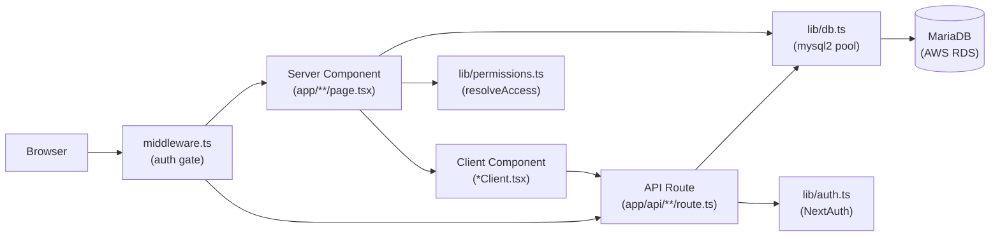
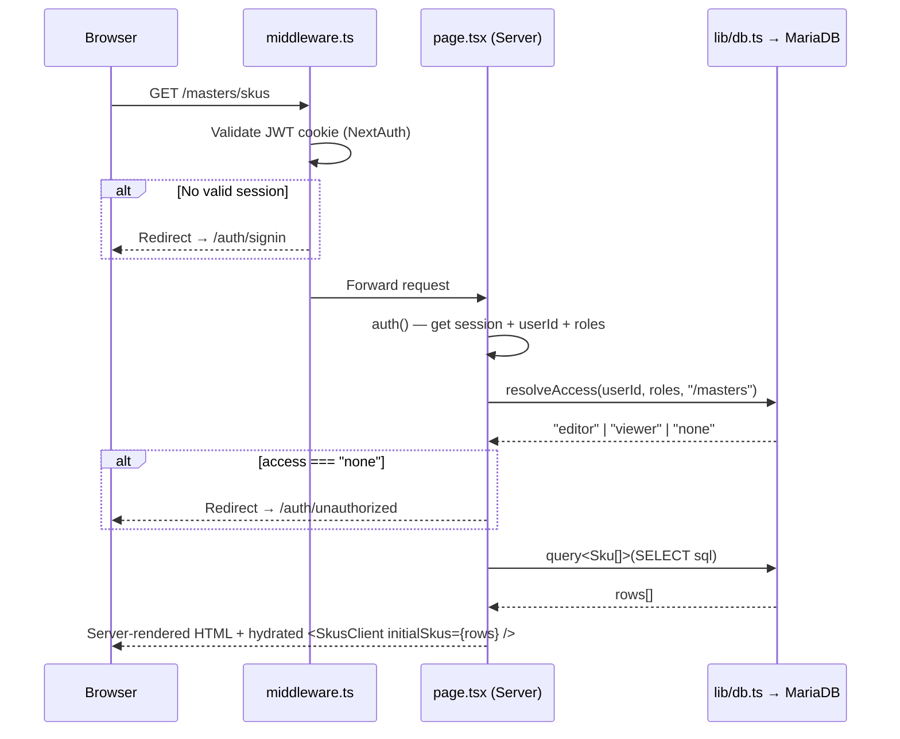

# System Architecture

> **Related docs:** [Database Schema](./database-schema.md) · [Authentication & Permissions](./authentication-and-permissions.md) · [Frontend Patterns](./frontend-patterns.md)

## Technology Stack

| Technology | Version | Role | Notable constraint |
|------------|---------|------|--------------------|
| Next.js | 16 | Full-stack framework (App Router) | `serverExternalPackages: ["mysql2"]` required |
| React | 19 | UI rendering | Server Components for data, Client Components for interactivity |
| TypeScript | 6 | Type safety across the entire codebase | Strict mode enabled |
| Tailwind CSS | v4 | Utility-first styling | CSS-first config — no `tailwind.config.js` needed for most customisation |
| shadcn/ui + Radix UI | — | Component library | Components live in `components/ui/`; use the shadcn CLI to regenerate |
| mysql2 | 3 | Runtime database access | Connection pool in `lib/db.ts`; NOT Prisma Client |
| Prisma | 7 | Schema definition and migrations **only** | Client generated to `app/generated/prisma/` — not imported at runtime |
| NextAuth | v5 beta | Authentication | Google OAuth only, JWT strategy |
| MariaDB | — | Primary database (AWS RDS) | Accessed via `mysql2` connection pool |

## High-Level Component Map



## Authenticated Page Load Lifecycle



## API Mutation Lifecycle

```mermaid
sequenceDiagram
    participant C as Client Component
    participant R as route.ts (API)
    participant DB as lib/db.ts → MariaDB

    C->>R: POST /api/masters/skus\n{ action: "create", sku_code: "SKU001", name: "..." }
    R->>R: auth() — verify session (401 if missing)
    R->>R: Parse body, validate required fields (400 if missing)
    R->>DB: execute(INSERT INTO skus ...)
    DB-->>R: ResultSetHeader { insertId: 42 }
    R-->>C: 200 { id: 42 }
    C->>C: router.refresh()
    note over C: Triggers Server Component re-fetch;\nnew row appears in table
```

## Directory Map

| Path | Purpose |
|------|---------|
| `app/` | Next.js App Router — all pages, layouts, and API routes |
| `app/api/` | REST API route handlers (mutations only; reads happen in server components) |
| `app/masters/` | The fully-implemented Masters module (SKUs, Vendors, Manufacturers, RM, PM, BOM) |
| `app/auth/` | Sign-in, error, and unauthorised pages |
| `app/generated/prisma/` | **Auto-generated** Prisma Client — do not edit; do not import in application code |
| `components/` | Shared React components |
| `components/ui/` | shadcn/ui component primitives (Button, Input, Dialog, Table, Badge, etc.) |
| `components/masters/` | Reusable masters UI: AddRecordDialog, CsvImportDialog, MasterToolbar, SearchInput |
| `lib/` | Core server-side utilities |
| `lib/db.ts` | mysql2 connection pool singleton with `query()` and `execute()` helpers |
| `lib/auth.ts` | NextAuth configuration, callbacks, and session management |
| `lib/permissions.ts` | `resolveAccess()` — the RBAC decision function |
| `lib/logger.ts` | Winston structured logger — console (pretty) + daily-rotate file transports. Import as `import logger from "@/lib/logger"` in any route or server-side file. |
| `lib/mailer.ts` | PO email dispatch via Gmail SMTP (nodemailer). `fetchPoData()` shared between email send and PDF preview. |
| `lib/s3.ts` | S3 helpers: presigned URLs, file upload/download, fire-and-forget event writes |
| `lib/events.ts` | Thin wrappers around `putEvent` — `recordRawEvent`, `recordProcessedEvent`, `recordFailedEvent` |
| `lib/utils.ts` | `cn()` — Tailwind class name utility |
| `lib/constants.ts` | Typed `STATUS` and `APPROVAL_STATUS` const objects — use these instead of raw string literals across the codebase |
| `lib/queries/` | SQL statement strings grouped by domain |
| `lib/approvals/module-handlers.ts` | Strategy pattern registry — each approval module (`SKU`, `RM_RATE`, `PM_VRM`, etc.) owns its `setStatus` and `applyAndArchive` logic here; adding a new module requires adding one entry, the route never changes |
| `lib/pdf/po-document.tsx` | React PDF template for PO documents — renders branded A4 PDF, used by preview and email send |
| `types/` | TypeScript types for database row shapes and NextAuth session augmentation |
| `prisma/` | `schema.prisma` (source of truth for DB models) + migration history |
| `scripts/` | One-off utility scripts (seed, test-connection) |
| `logs/` | Winston log output — `app-YYYY-MM-DD.log` (all levels, 14-day retention) and `error-YYYY-MM-DD.log` (errors only, 30-day retention). Gitignored. |
| `public/` | Static assets served directly by Next.js |

## The Prisma / mysql2 Split

This is the most common point of confusion in this codebase.

**`prisma/schema.prisma`** is the single source of truth for the database structure. It is used to:
- Generate SQL migration files (`npx prisma migrate dev`)
- Apply migrations in production (`npx prisma migrate deploy`)
- Browse the schema visually (`npx prisma studio`)

**At runtime, nothing uses Prisma Client.** All database calls go through `lib/db.ts`:

```ts
// lib/db.ts — the only database interface in application code
export async function query<T>(sql: string, params?: any[]): Promise<T[]>
export async function execute(sql: string, params?: any[]): Promise<mysql.ResultSetHeader>
```

SQL strings live in `lib/queries/<domain>.ts` and are called from API routes and server components.

```ts
// DO: import from lib/db.ts
import { query, execute } from "@/lib/db";

// DO NOT: import from generated Prisma client at runtime
import { PrismaClient } from "@/app/generated/prisma"; // ← wrong
```

## Stub Modules

The following modules have an `app/<module>/page.tsx` file showing a "Coming soon" placeholder. No API routes or database logic exist for them yet.

- `app/finance/`
- `app/hr-payroll/`
- `app/inventory/`
- `app/manufacturing/`
- `app/sales-crm/`
- `app/reports/`

> `app/po-tracking/` is **fully implemented** — see [API Reference](./api-reference.md#purchase-orders) for the PO API surface.

See [Adding a New Module](./adding-a-new-module.md) for how to implement one from scratch, and [docs/architecture-evolution.md](./architecture-evolution.md) for the planned gateway + events pattern to adopt when building them.
