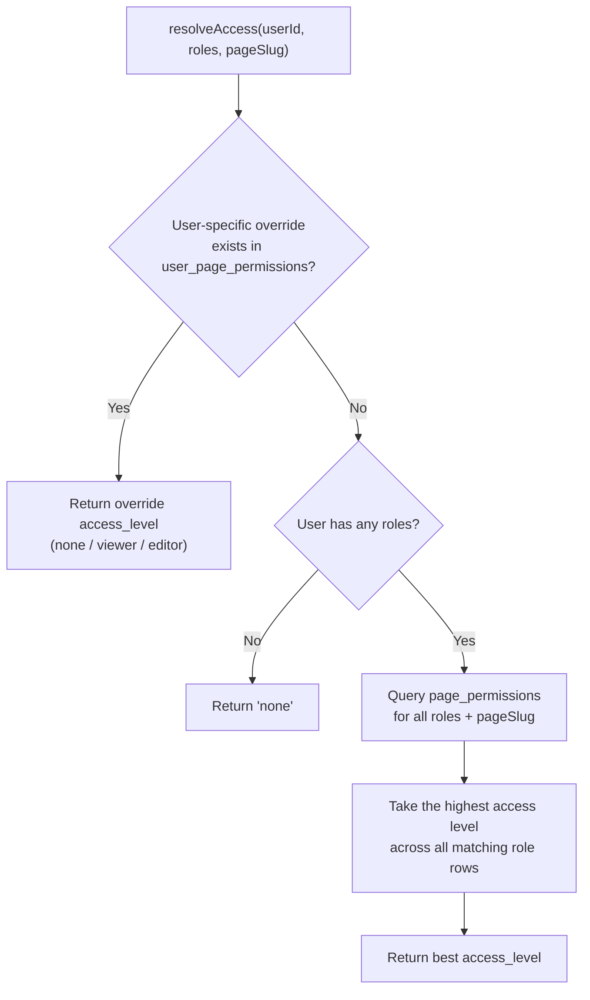

# Authentication & Permissions

> **Related docs:** [Architecture](./architecture.md) · [Database Schema](./database-schema.md) · [API Reference](./api-reference.md)

## Authentication Stack

| Layer | Technology | Details |
|-------|------------|---------|
| Provider | Google OAuth 2.0 | No password login. Email must exist in `users` table. |
| Auth library | NextAuth v5 (beta) | `next-auth@5.0.0-beta.31` |
| Session strategy | JWT (stateless) | Cookie-based; token signed with `AUTH_SECRET` |
| Configuration | `auth.config.ts` + `lib/auth.ts` | Config object + full NextAuth setup with callbacks |

## Sign-In Flow

```mermaid
sequenceDiagram
    participant B as Browser
    participant G as Google OAuth
    participant NA as NextAuth (lib/auth.ts)
    participant DB as MariaDB

    B->>G: Click "Sign in with Google"
    G-->>B: OAuth consent screen
    B->>G: User grants permission
    G-->>NA: Callback with user profile (email, name, sub)
    NA->>NA: signIn callback
    NA->>DB: SELECT from users WHERE email = ?
    alt User not found or status = 'inactive'
        NA-->>B: Redirect → /auth/error (AccessDenied)
    end
    NA->>NA: jwt callback — load userId + roles from DB
    NA->>DB: SELECT roles from user_roles WHERE user_id = ?
    DB-->>NA: roles[]
    NA->>NA: Stamp { userId, roles } into JWT token
    NA->>NA: session callback — expose userId + roles on session.user
    NA->>NA: events.signIn — write session record + session_history "login"
    NA->>DB: INSERT INTO sessions ...
    NA->>DB: INSERT INTO session_history (event: 'login') ...
    NA-->>B: JWT cookie set; redirect → /
```

## Middleware Gate (`middleware.ts`)

The middleware runs on **every request** except:
- `_next/static` — Next.js static assets
- `_next/image` — Next.js image optimisation
- `favicon.ico`
- `public/` — static files

What it does:
- Validates the JWT cookie using NextAuth
- Redirects unauthenticated requests to `/auth/signin`

What it does **not** do:
- Check page-level permissions (that happens inside each server component)
- Authorise API routes (each route calls `auth()` manually)

## Two-Layer RBAC

Access control is a two-layer system. Both layers are resolved by `lib/permissions.ts:resolveAccess()`.

### Layer 1 — Role-based (`page_permissions` table)

Every role has a default access level for each page slug. Seeded by `npm run db:seed` (source: `scripts/seed-permissions.ts`).

| Role | `/` | `/manufacturing` | `/inventory` | `/finance` | `/hr-payroll` | `/sales-crm` | `/reports` | `/sheet-viewer` | `/masters` | `/po-tracking` |
|------|-----|-----------------|-------------|-----------|--------------|-------------|-----------|----------------|-----------|---------------|
| `developer` | editor | editor | editor | editor | editor | editor | editor | editor | editor | editor |
| `production_operations` | viewer | editor | viewer | none | none | none | viewer | viewer | none | viewer |
| `production_head` | viewer | editor | viewer | none | viewer | viewer | editor | editor | none | editor |
| `cost_creator` | viewer | viewer | viewer | editor | none | none | editor | editor | none | none |
| `bom_creator` | viewer | editor | viewer | viewer | none | none | viewer | viewer | none | none |

> Roles not listed for a slug default to `"none"` — the user will be redirected to `/auth/unauthorized`.

### Layer 2 — User-specific overrides (`user_page_permissions` table)

A per-user entry for a given `page_slug` completely overrides the role-based access for that page. Managed by developers via `/api/admin/user-permissions`. Useful for granting a single user elevated or restricted access without changing their role.

## `resolveAccess()` — The Decision Function

**File:** `lib/permissions.ts`



Access levels rank: `none` (0) < `viewer` (1) < `editor` (2). A user with both `production_operations` (viewer for `/reports`) and a user override (editor for `/reports`) gets `editor`.

### Using access in a server component

```ts
import { auth } from "@/lib/auth";
import { resolveAccess } from "@/lib/permissions";
import { redirect } from "next/navigation";

export default async function SkusPage() {
  const session = await auth();
  if (!session) redirect("/auth/signin");

  const userId = Number(session.user.id);
  const access = await resolveAccess(userId, session.user.roles, "/masters");
  if (access === "none") redirect("/auth/unauthorized");

  // access is "viewer" or "editor" — proceed to fetch data
}
```

### Using access in an API route

```ts
import { auth } from "@/lib/auth";
import { NextResponse } from "next/server";

export async function POST(req: Request) {
  const session = await auth();
  if (!session) return NextResponse.json({ error: "Unauthorized" }, { status: 401 });

  // For developer-only routes:
  if (!session.user.roles.includes("developer")) {
    return NextResponse.json({ error: "Forbidden" }, { status: 403 });
  }
  // ...
}
```

> **Note:** The current codebase checks auth manually in every route. The planned `withGateway()` wrapper in [docs/architecture-evolution.md](./architecture-evolution.md) will centralise this.

## Admin Permission Endpoints

| Endpoint | Method | Auth | Description |
|----------|--------|------|-------------|
| `/api/admin/permissions` | GET | developer role | List all role-page permissions |
| `/api/admin/permissions` | POST | developer role | Upsert a role-page permission |
| `/api/admin/user-permissions` | GET | developer role | List user-specific overrides (optionally filtered by `?user_id=`) |
| `/api/admin/user-permissions` | POST | developer role | Upsert a user-specific override |
| `/api/admin/user-permissions` | DELETE | developer role | Remove a user-specific override |

## Session Lifecycle (Database Side)

| Event | What happens in the DB |
|-------|------------------------|
| Sign in | INSERT into `sessions` (UUID `session_id`, `is_active = true`); INSERT into `session_history` (`event = 'login'`) |
| Sign out | UPDATE `sessions` SET `is_active = false`; INSERT into `session_history` (`event = 'logout'`) |
| Token refresh | INSERT into `session_history` (`event = 'token_refreshed'`) |
| Session expiry | Status updates to `expired` in `session_history` |
| Admin revocation | Status updates to `revoked` in `session_history` |

The `sessions` table holds the **current state**. `session_history` is **append-only** and never mutated.

## AUTH_SECRET Warning

`AUTH_SECRET` is used to sign JWT cookies. If you change this value (in `.env` or on the server), **every existing session cookie becomes invalid**. All signed-in users will be silently logged out on their next request and redirected to the sign-in page. Coordinate this change with the team if users are actively working.
