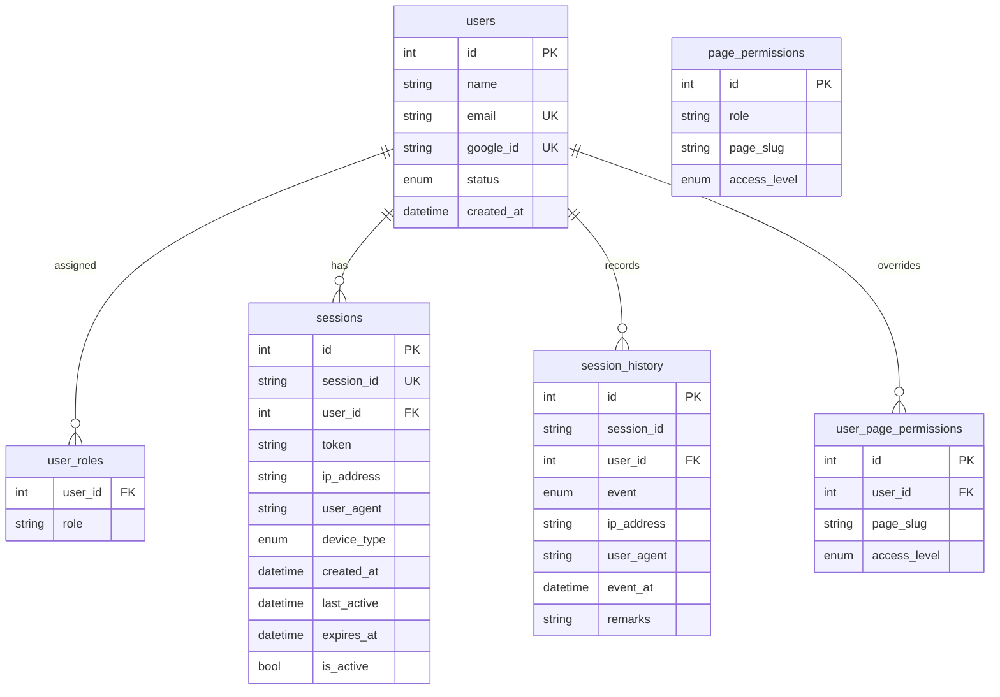
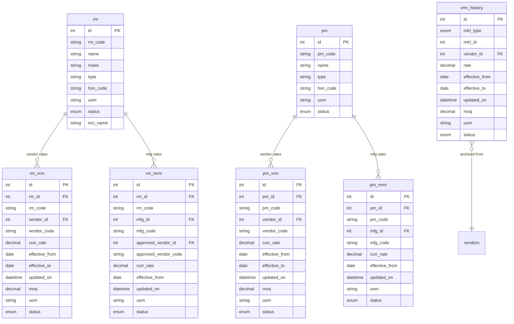
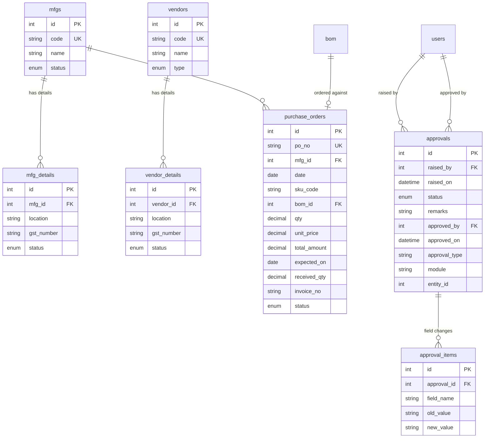

# Database Schema Reference

> **Related docs:** [Architecture](./architecture.md) · [Authentication & Permissions](./authentication-and-permissions.md)

The source of truth for all models is **`prisma/schema.prisma`**. This document groups them by business domain, describes relationships, and explains naming conventions.

At runtime, queries are raw SQL strings in `lib/queries/<domain>.ts` executed via `lib/db.ts`. Prisma Client is not used at runtime.

---

## Domain 1 — Users & Authentication



### Table descriptions

**`users`** — System user accounts. Only users with `status = 'active'` can sign in. Populated manually or via the seed script; Google OAuth matches on `email`.

**`user_roles`** — Many-to-many role assignments. Composite PK `(user_id, role)`. Roles are arbitrary strings; the seeded values are `developer`, `production_operations`, `production_head`, `cost_creator`, `bom_creator`.

**`sessions`** — One active row per signed-in session. `session_id` is a UUID. `is_active = false` means the user signed out or the session was revoked.

**`session_history`** — Append-only audit log. Events: `login`, `logout`, `expired`, `revoked`, `token_refreshed`.

**`page_permissions`** — Role-based access matrix. Unique key `(role, page_slug)`. Access levels: `none`, `viewer`, `editor`. Seeded by `npm run db:seed`.

**`user_page_permissions`** — Per-user overrides that take precedence over role-based permissions. Managed via `/api/admin/user-permissions`.

---

## Domain 2 — Products (SKUs & BOM)

```mermaid
erDiagram
    skus {
        int id PK
        string sku_code UK
        string name
        string brand
        string category
        enum status
        datetime created_at
        int created_by FK
    }
    sku_details {
        int id PK
        int sku_id UK_FK
        string sku_type
        enum demand_type
        decimal filling
        enum filling_uom
        decimal mrp
        string ean_code UK
        decimal weight
        enum weight_uom
        decimal length
        decimal breadth
        decimal height
        string hsn_code
        decimal gst_pct
        int curr_bom_id FK
        datetime last_updated
    }
    sku_variants {
        int id PK
        int parent_sku_id FK
        int variant_sku_id FK
        string sku_code
        string size
        datetime created_at
    }
    bom {
        int id PK
        string bom_code
        string sku_code FK
        int mfg_id FK
        int created_by FK
        datetime created_at
        enum status
    }
    bom_details {
        int id PK
        int bom_id FK
        enum mtrl_type
        int mtrl_id
        decimal amount
        string uom
        decimal mtrl_cost
        date effective_from
        date effective_till
        datetime last_updated
        enum status
    }
    bom_history {
        int id PK
        int bom_id FK
        enum mtrl_type
        int mtrl_id
        decimal amount
        string uom
        decimal mtrl_cost
        date effective_from
        date effective_till
        datetime last_updated
        enum status
    }
    bom_misc {
        int id PK
        int bom_id FK
        int mfg_id FK
        enum type
        decimal cost
        date effective_from
        date effective_till
        datetime last_updated
        enum status
    }

    skus ||--o| sku_details : "has detail"
    skus ||--o{ sku_variants : "is parent"
    skus ||--o{ sku_variants : "is variant"
    skus ||--o{ bom : "has BOMs"
    bom ||--o{ bom_details : "contains materials"
    bom ||--o{ bom_history : "audit trail"
    bom ||--o{ bom_misc : "misc costs"
    sku_details }o--o| bom : "current BOM"
```

### Table descriptions

**`skus`** — Stock Keeping Units. `sku_code` is the human-readable business key (unique). `status` enum: `active`, `discontinued`, `new_launch`, `inactive`.

**`sku_details`** — Extended product attributes (dimensions, MRP, EAN code, GST). One-to-one with `skus`. `curr_bom_id` points to the currently active BOM. `demand_type` enum: `A`, `B`, `C`, `NPL` (New Product Launch).

**`sku_variants`** — Hierarchical relationships between SKU sizes. Composite unique key `(parent_sku_id, variant_sku_id)`.

**`bom`** (Bill of Materials) — A recipe linking an SKU to a manufacturing site with a versioned BOM code. `status` enum: `draft`, `active`, `inactive`, `in_review`, `discontinued`.

**`bom_details`** — Individual material line items within a BOM. `mtrl_type` is either `rm` (raw material) or `pm` (packing material); `mtrl_id` is the FK to the respective `rm` or `pm` table. `status` enum: `active`, `inactive`, `discontinued`.

**`bom_history`** — Immutable audit trail of every material line that was ever in a BOM. Written when a BOM detail is modified.

**`bom_misc`** — Miscellaneous cost lines attached to a BOM at a specific manufacturing site. `type` enum: `jw` (job work), `shrink`, `shipper`, `utility`, `margin`, `rm_loss`, `pm_loss`.

---

## Domain 3 — Materials & Rate Masters



### Table descriptions

**`rm`** (Raw Materials) — Raw material master. `rm_code` is the business key. `inci_name` is the INCI (International Nomenclature of Cosmetic Ingredients) name. `status` enum: `active`, `discontinued`.

**`pm`** (Packing Materials) — Packing material master. `pm_code` is the business key. `status` enum: `active`, `discontinued`.

**`rm_vrm`** — Raw Material Vendor Rate Master. The current vendor price for a raw material. `moq` = minimum order quantity. `status` enum: `active`, `inactive`, `discontinued`.

**`rm_mrm`** — Raw Material Manufacturer Rate Master. Links a raw material to the manufacturing site that uses it, with the approved vendor for that site.

**`pm_vrm`** — Packing Material Vendor Rate Master. Same pattern as `rm_vrm` but for packing materials.

**`pm_mrm`** — Packing Material Manufacturer Rate Master.

**`vrm_history`** — Append-only archive of superseded vendor rates. When a vendor rate is updated, the old `rm_vrm` or `pm_vrm` row is archived here before the update. `mtrl_type` identifies whether `mtrl_id` points to `rm` or `pm`.

---

## Domain 4 — Organisation (Manufacturers & Vendors) and Procurement



### Table descriptions

**`mfgs`** — Manufacturing sites (internal plants or contract manufacturers). `code` is unique. `status` enum: `active`, `inactive`.

**`mfg_details`** — Location and GST number for a manufacturer. `status` enum: `active`, `inactive`.

**`vendors`** — Supplier master. `code` is unique. `type` enum: `rm` (raw material supplier), `pm` (packing material supplier), `both`.

**`vendor_details`** — Location and GST number for a vendor. `status` enum: `active`, `inactive`, `blacklisted`, `discontinued`.

**`purchase_orders`** — Purchase orders issued to manufacturers. `po_no` is unique. `received_qty` defaults to 0. `status` lifecycle: `draft` → `raised` → `punched` → `partially_received` → `received` (or `short_closed` / `cancelled`).

**`approvals`** — Generic approval request header. `module` and `entity_id` identify what is being approved. `status` enum: `pending`, `approved`, `rejected`, `withdrawn`.

**`approval_items`** — Individual field-level changes within an approval request. Stores `old_value` and `new_value` as strings for any field type.

> **Note:** The `approvals` table and workflow exist in the schema and database but approval logic is not yet wired into the application UI. See [docs/architecture-evolution.md](./architecture-evolution.md) §5.3 for the planned event-driven approval integration.

---

## Naming Conventions

| Pattern | Meaning | Example |
|---------|---------|---------|
| `_mrm` suffix | Manufacturer Rate Master — links a material to a manufacturing site with a price | `rm_mrm`, `pm_mrm` |
| `_vrm` suffix | Vendor Rate Master — links a material to a vendor with a price and MOQ | `rm_vrm`, `pm_vrm` |
| `_code` fields | Human-readable business key, separate from the auto-increment `id` | `sku_code`, `vendor.code`, `mfgs.code` |
| `created_by` | FK to `users.id`, stamped at insert time by the API route | `skus.created_by`, `bom.created_by` |
| `effective_from` / `effective_till` | Date range for which a rate or BOM detail is valid | `rm_vrm.effective_from`, `bom_details.effective_from` |
| `mtrl_type` | Discriminator to distinguish `rm` vs `pm` in polymorphic tables | `bom_details.mtrl_type`, `vrm_history.mtrl_type` |

---

## How to Add a New Table

1. Add the model to `prisma/schema.prisma` following the existing naming and type conventions.
2. Run `npx prisma migrate dev --name add-<table-name>` to create and apply the migration.
3. Add SQL query strings to `lib/queries/<domain>.ts`.
4. Add the corresponding TypeScript row type to `types/masters.ts` (or a new `types/<domain>.ts` file).
5. Reference the table in API routes via `query()` or `execute()` from `lib/db.ts`.

See [Adding a New Module](./adding-a-new-module.md) for the full step-by-step guide.
