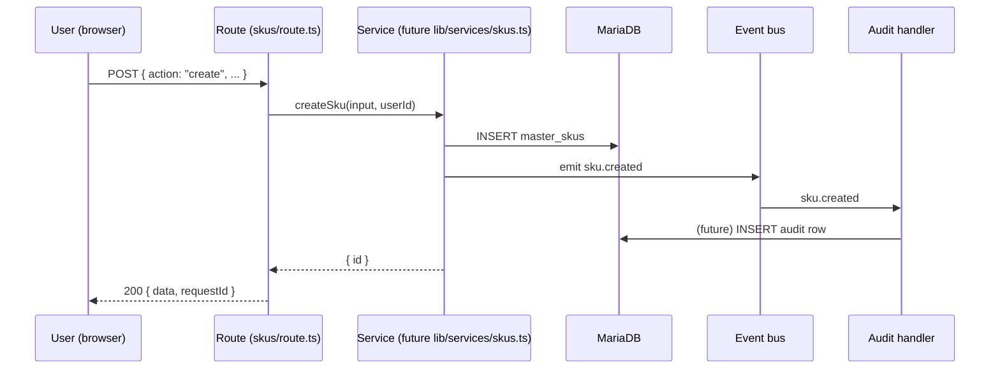
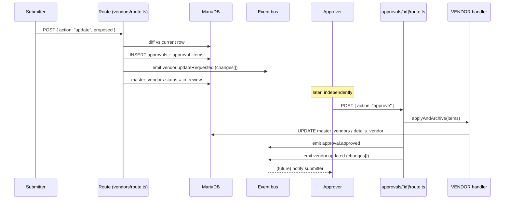
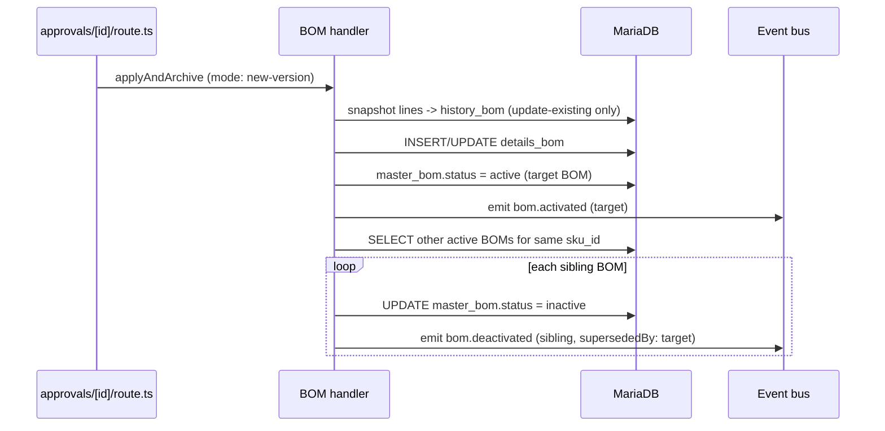
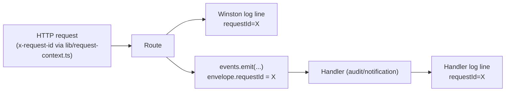

# ERP Discovery Report — Full (Phases 0–9), Single File

> **Status:** All phases (0–9) complete · **Owner:** Ajay · **Last updated:** 2026-07-04
>
> This single file contains the full content of everything gathered toward an event-driven-architecture decision for the ERP — no need to open any other doc to read this end to end. The original five docs still exist separately in `docs/` and remain the source of truth if this file and they ever diverge; this is a point-in-time merge.

---

## Table of contents

1. [Phase 0 — Project Discovery (new)](#phase-0)
2. [Phase 1–3 — Domain, Workflow, Entity Discovery](#phase-1-3)
3. [Architecture Evolution Plan — full](#arch-evolution)
4. [Event-Driven Architecture — Options & Decision Document — full](#event-options)
5. [Event Catalog — full](#event-catalog)
6. [Event Instrumentation Blueprint — full](#instrumentation-blueprint)
7. [Interaction Logging Map — full](#logging-map)
8. [Quick-fix punch list](#punch-list)
9. [BOM drift check — verified](#drift-risk)
10. [Phase 7 — Storage Strategy](#phase-7)
11. [Phase 8 — Architecture Review](#phase-8)
12. [Phase 9 — Migration Strategy](#phase-9)

---

<a id="phase-0"></a>
## 1. Phase 0 — Project Discovery (fresh this session)

### Tech stack
Next.js 16 (App Router) · React 19 · TypeScript 6 (strict) · Tailwind v4 · shadcn/ui + Radix · mysql2 3 (runtime DB access) · Prisma 7 (schema/migrations only — client at `app/generated/prisma/`, never imported at runtime) · MariaDB on AWS RDS · NextAuth v5-beta (Google OAuth, JWT) · Winston + winston-daily-rotate-file · AWS SDK S3 client (two buckets: `AWS_S3_BUCKET_FILES`, `AWS_S3_BUCKET_EVENTS`) · nodemailer via Gmail SMTP for PO emails (Resend present in `.env` but commented out, unused) · @react-pdf/renderer (PO PDFs) · exceljs (CSV/XLSX import-export) · Zod (pilot — see the BOM correction in §9: it now covers **two** routes, SKU and BOM, not one).

### Project structure
- `app/` — pages + API routes. Live business pages: `masters/` (skus, vendors, manufacturers, raw-materials, packing-materials, material-master, bom-master), `po-tracking/` (**3 sub-pages**, not 1 — `po-procurement`, `rm-pm-procurement`, `dispatch-calendar`; only `po-procurement` has real API routes today), `approvals/` + `approvals/history/`, `auth/`. Page shells with no route logic yet: `inventory/`, `manufacturing/`, `finance/`, `sales-crm/`, `hr-payroll/`, `reports/`, `sheet-viewer/`.
- `app/api/` — `masters/`, `purchase-orders/`, `approvals/`, `admin/`, `auth/`, `upload/`, `files/`, `google-sheet/`.
- `lib/` — `db.ts`, `auth.ts`, `permissions.ts`, `logger.ts`, `events.ts`, `s3.ts`, `constants.ts`, `request-context.ts`, `query-timing.ts` (new, see below), `gateway/` (pilot), `validation/` (Zod, SKU only), `approvals/` (strategy-pattern module handlers), `master-routes/`, `pdf/`, `queries/`.
- `prisma/schema.prisma` — schema source of truth; model names diverge from real MariaDB table names (mapping table in `CLAUDE.md`).
- `scripts/` — includes `testing_uniware_connection.ts` (new, untracked).

### Architecture confirmed against `docs/architecture.md`
Browser → `middleware.ts` (NextAuth JWT gate) → Server Component (`page.tsx`, reads via `lib/db.ts`) or API Route (`route.ts`) → mysql2 pool → MariaDB. Client Components (`*Client.tsx`) call back into API routes. Matches the "synchronous monolith with inline side-effects" framing used throughout §3 below — no contradiction found.

### New findings not previously documented anywhere in `docs/`
1. **Uniware/Unicommerce integration in progress.** `.env` has `UNIWARE_USER_NAME` / `UNIWARE_PASSWORD` / `UNIWARE_BASE_URL` (the `.env` section header calls it "Unicommerce", the code/env-var prefix calls it "Uniware" — same product, inconsistent naming even within one file). `scripts/testing_uniware_connection.ts` (untracked, last touched 2026-07-03) is a manual OAuth-token connectivity spike — no application code consumes it yet. This is a real external-system boundary (almost certainly order/inventory sync for a WMS/OMS) that no existing doc accounts for. Needs a decision on scope before Domain Discovery can call it "done."
2. **A second, independent logging mechanism exists.** `lib/query-timing.ts` + `QUERY_AUDIT_GUIDE.md` (root-level) implement `console.log`-based query-duration tracking (`[QUERY]`, `🐢 [SLOW]` tags) wired into 3 pages (SKUs, Vendors, Raw Materials) — separate from and unrelated to the Winston structured logger described in §3. Two parallel logging systems, not one.
3. **`architecture-discussion-framework.md`** (72KB, root) is a discussion *methodology template*, not a business/system document — flagged so it's not mistaken for project documentation, otherwise out of scope.
4. **Two AWS S3 buckets**, not one — `AWS_S3_BUCKET_FILES` (attachments) vs `AWS_S3_BUCKET_EVENTS` (the raw/processed/failed event sink) are already separated at the infra level. Relevant input to the (still open) storage-strategy phase.

---

<a id="phase-1-3"></a>
## 2. Phase 1–3 — Domain, Workflow, Entity Discovery (from `CLAUDE.md` + the docs merged below)

**Domain Discovery:** Single Next.js monolith, one MariaDB. Every side-effect (audit, approval, notification) currently runs inline inside the HTTP request. Cross-cutting concerns (auth, validation, rate limiting, logging, error shape) are copy-pasted per route — no central gateway except the SKU pilot. Registered domains/modules: `SKU`, `RM_MAT`/`RM_RATE`/`RM_VRM`, `PM_MAT`/`PM_RATE`/`PM_VRM`, `VENDOR`, `MFG`, `BOM`, `PO`/`PO_BULK`. **New:** the Uniware/Unicommerce boundary (Phase 0, above) is a domain not yet reflected anywhere else — likely order or inventory sync; needs a business-owner conversation to scope before it's added to the event catalog.

**Business Workflow Discovery:**
- **Approval workflow** (canonical, all masters): submit → diff computed → `approvals` + `approval_items` rows inserted → entity `status → in_review` (locks further edits) → approver reviews at `/approvals` → approve (`applyAndArchive`, status → `active`) or reject (`setStatus`, status → `draft`, original submitter can re-edit).
- **PO lifecycle**: `draft` (impromptu, needs approval) or `raised` directly (normal PO, no approval) → `approved` → `raised` → `punched` → `partially_received`/`received` → `short_closed`/`cancelled`. Splitting a PO is the *only* receiving mechanism — there's no dedicated "Receive" action.
- **BOM lifecycle**: submit (new-version or update-existing) → approval → activation (writes lines, sets `active`) → fan-out: every other active BOM for the same SKU is deactivated in a loop (one DB write + one status change per sibling).
- **New from the §9 correction below:** there is a dedicated, previously-undocumented **BOM History page** (`app/masters/bom-master/history/`) — a read-only listing of every BOM header that has at least one archived revision in `history_bom`, reusing the same `BomTable`/`BomListItem` shape as the live listing. It has its own server page, client component, and hook (`useBomHistoryPanel.ts`). No mutations happen here; it exists purely so a "when did this BOM last change and what did it look like before" question is answerable without a DB console. This wasn't in the event catalog, instrumentation blueprint, or logging map at all.

**Entity & Aggregate Discovery:**
- Prisma model names ≠ real MariaDB table names (`skus`→`master_skus`, `vendors`→`master_vendors`, `vendor_details`→`details_vendor`, `mfgs`→`master_mfgs`, `mfg_details`→`details_mfg`, `rm`→`master_rm`, `pm`→`master_pm`).
- `approvals` + `approval_items` is a generic, reusable diff-tracking pair (`module`, `entity_id`, `field_name`/`old_value`/`new_value`) — already fits every module without a new table.
- **Known schema drift:** `sku_history` is live in the DB (`lib/queries/skus.ts:94`) but absent from `prisma/schema.prisma`.
- **Missing history tables:** Vendor, Manufacturer, RM base record (`RM_MAT`), PM base record (`PM_MAT`) have no history table — approving an edit overwrites the row with no other durable record of the prior value except the (already-stale) `approval_items` row.

---

<a id="arch-evolution"></a>
## 3. Architecture Evolution Plan (full content, originally `docs/architecture-evolution.md`)

> **Status:** In progress (Part A pilot shipped) · **Scope:** Evolve the existing Next.js monolith · **Last updated:** 2026-07-01

### 3.1 Context — why this change

Today the ERP is a **synchronous monolith**:

- One Next.js 16 app, one MariaDB (AWS RDS), accessed via raw `mysql2` in `lib/db.ts`.
- Every side-effect runs **inline** inside the HTTP request: a masters insert, its audit trail, any future approval/notification logic all happen in one blocking transaction.
- Cross-cutting concerns (auth, validation, rate limiting, logging, error shape) are **copy-pasted per route** (`app/api/masters/*`, `app/api/admin/*`). There is no Zod, no request ID, no central error format.

> **Already addressed (June–July 2026):**
> - The approval handler now uses a **Strategy pattern** — per-module logic lives in `lib/approvals/module-handlers.ts`; the route is a thin dispatcher. Adding a new module requires one new entry there, not a route edit.
> - `lib/constants.ts` provides typed `STATUS` and `APPROVAL_STATUS` constants eliminating raw string literals.
> - **Winston structured logger** (`lib/logger.ts`) is deployed and adopted across all API routes (masters, approvals, PO). Every log line includes `requestId`, `module`, `userId`, and relevant domain fields. Console transport uses a human-readable pretty format; file transports write JSON to `logs/app-*.log` and `logs/error-*.log` with daily rotation.
> - **S3 event pipeline** (`lib/events.ts` → `lib/s3.ts`) records `raw-events`, `processed-events`, and `failed-events` to a dedicated S3 bucket for all master and PO operations.
> - **API Gateway (Part A) — Step 1 & pilot done (2026-07-01):** `lib/gateway/with-gateway.ts` + `lib/gateway/errors.ts` ship the `withGateway` wrapper described in §4.2 (auth, opt-in RBAC via `resolveAccess()`, Zod validation, structured logging via `lib/logger.ts`, uniform `{error, code, requestId}` error shape). It intentionally skips rate limiting and the `middleware.ts` request-ID change for now — request IDs still come from `lib/request-context.ts`'s `createRequestContext()`, reused as-is rather than duplicated. `app/api/masters/skus/route.ts` is the first (and so far only) route migrated, proving the pattern with zero behavior change; validation schemas live in `lib/validation/skus.ts`. Every other route (vendors, manufacturers, raw-materials, packing-materials, material-master, purchase-orders, approvals, admin) is still on the old manual-validation pattern — see the updated §6 rollout.
> - Remaining gaps: rolling `withGateway` out to the rest of the routes, rate limiting, centralised request IDs in `middleware.ts`, and all of Part B (event bus) are still open.

This is fine at today's size but creates two concrete problems as modules grow:

1. **Coupling of side-effects.** When a PO is raised, we will eventually need to: write audit history, trigger an approval, notify a vendor, invalidate a cache, update a dashboard. Doing all of that inline makes routes fragile and slow, and every new side-effect means editing the core write path.
2. **Inconsistent API surface.** Each route re-implements auth checks and validation slightly differently. There's no single place to enforce policy, shape errors, or trace a request.

**Goal:** introduce two capabilities *without* a rewrite and *without* new infrastructure:

- **(A) An in-app API Gateway layer** — one wrapper that every route opts into for auth, RBAC, validation, rate limiting, request IDs, logging, and uniform error responses.
- **(B) An event-driven backbone** — domain actions emit typed events; independent handlers react asynchronously. Start in-process; designed to swap to Redis/BullMQ later with no caller changes.

**Non-goals (deliberately deferred):** splitting into microservices, Kong, Kubernetes, per-service databases, Kafka. Revisit those only when real scale demands them (see §3.8).

### 3.2 Target shape (evolutionary)

```
                 ┌─────────────────────────────────────────┐
  HTTP request → │ middleware.ts  (auth gate, request-id)    │
                 └───────────────────┬───────────────────────┘
                                     │
                 ┌───────────────────▼───────────────────────┐
                 │ withGateway(handler, { schema, access })   │  ← API Gateway layer
                 │  • session + RBAC (resolveAccess)          │
                 │  • Zod validation                          │
                 │  • rate limit                              │
                 │  • structured logging + timing             │
                 │  • uniform error → JSON                    │
                 └───────────────────┬───────────────────────┘
                                     │ runs business logic
                 ┌───────────────────▼───────────────────────┐
                 │ service function (lib/services/*)          │
                 │  • DB writes via lib/db.ts                 │
                 │  • events.emit("sku.created", payload) ────┼──► event bus
                 └────────────────────────────────────────────┘
                                                                  │
                       ┌──────────────────────────────────────────┘
                       ▼                ▼                 ▼
                 audit handler    approval handler   notification handler
                 (session_history) (approvals)       (future)
```

Key principle: **the route never calls a side-effect directly.** It calls one service function, which does its own DB work and then *emits an event*. Everything else subscribes.

### 3.3 New directory layout

```
lib/
  gateway/
    with-gateway.ts        # the route wrapper
    errors.ts              # ApiError class + error→response mapping
    rate-limit.ts          # in-memory limiter (swap to Redis later)
    context.ts             # builds RequestContext (session, requestId, access)
  events/
    types.ts               # the typed event catalogue (DomainEvent union)
    bus.ts                 # EventBus interface + in-process implementation
    index.ts               # singleton `events` + handler registration
    handlers/
      audit.ts             # writes session_history / generic audit
      approvals.ts         # raises approval rows when needed
      notifications.ts     # stub for now (logs); real impl later
  services/
    skus.ts                # business logic extracted from the route
    vendors.ts
    ...                    # one per master/domain as you migrate
  validation/
    masters.ts             # Zod schemas (sku, vendor, rm, pm, mfg)
```

`lib/db.ts`, `lib/auth.ts`, `lib/permissions.ts` stay exactly as they are — build *on top* of them.

### 3.4 Part A — In-app API Gateway layer

**What it centralizes:**

| Concern | Today | After |
|---|---|---|
| Auth (session) | `auth()` repeated per route | once, in `withGateway` |
| RBAC | manual role checks | declarative `{ access: { pageSlug, level } }` using existing `resolveAccess()` |
| Validation | manual `!x?.trim()` | Zod schema per route |
| Rate limiting | none | per-user/IP limiter |
| Request ID / tracing | none | generated in `middleware.ts`, logged everywhere |
| Error shape | ad-hoc `NextResponse.json` | one `{ error, code, requestId }` format |
| Logging | none | one structured log line per request w/ timing |

**The wrapper (sketch)** — `lib/gateway/with-gateway.ts`:

```ts
import { NextRequest, NextResponse } from "next/server";
import { z } from "zod";
import { auth } from "@/lib/auth";
import { resolveAccess, AccessLevel } from "@/lib/permissions";
import { ApiError, toErrorResponse } from "./errors";
import { checkRateLimit } from "./rate-limit";

type AccessRule = { pageSlug: string; level: Exclude<AccessLevel, "none"> };

export function withGateway<TBody>(opts: {
  schema?: z.ZodType<TBody>;
  access?: AccessRule;          // omit for public routes
  rateLimit?: { max: number; windowMs: number };
  handler: (args: {
    req: NextRequest;
    body: TBody;
    ctx: { userId: number; roles: string[]; requestId: string };
  }) => Promise<unknown>;
}) {
  return async (req: NextRequest) => {
    const requestId = req.headers.get("x-request-id") ?? crypto.randomUUID();
    const started = performance.now();
    try {
      const session = await auth();
      if (opts.access && !session?.user)
        throw new ApiError(401, "unauthorized", "Sign in required");

      const userId = Number(session?.user?.id);
      const roles = session?.user?.roles ?? [];

      if (opts.access) {
        const level = await resolveAccess(userId, roles, opts.access.pageSlug);
        const ok =
          opts.access.level === "viewer"
            ? level === "viewer" || level === "editor"
            : level === "editor";
        if (!ok) throw new ApiError(403, "forbidden", "Insufficient access");
      }

      if (opts.rateLimit)
        await checkRateLimit(`${userId || req.headers.get("x-forwarded-for")}`, opts.rateLimit);

      let body = {} as TBody;
      if (opts.schema) {
        const json = await req.json().catch(() => ({}));
        const parsed = opts.schema.safeParse(json);
        if (!parsed.success)
          throw new ApiError(400, "validation_error", "Invalid request", parsed.error.flatten());
        body = parsed.data;
      }

      const data = await opts.handler({ req, body, ctx: { userId, roles, requestId } });

      console.log(JSON.stringify({ requestId, route: req.nextUrl.pathname, userId, ms: Math.round(performance.now() - started), ok: true }));
      return NextResponse.json({ data, requestId });
    } catch (err) {
      console.error(JSON.stringify({ requestId, route: req.nextUrl.pathname, ms: Math.round(performance.now() - started), ok: false, err: String(err) }));
      return toErrorResponse(err, requestId);
    }
  };
}
```

`lib/gateway/errors.ts`:

```ts
export class ApiError extends Error {
  constructor(public status: number, public code: string, message: string, public details?: unknown) {
    super(message);
  }
}

export function toErrorResponse(err: unknown, requestId: string) {
  if (err instanceof ApiError)
    return NextResponse.json(
      { error: err.message, code: err.code, details: err.details, requestId },
      { status: err.status },
    );
  return NextResponse.json({ error: "Internal error", code: "internal", requestId }, { status: 500 });
}
```

`lib/gateway/rate-limit.ts` — start with an in-memory token bucket keyed by user/IP (a `Map`). It's per-process, which is fine for a single instance; the function signature stays identical when the counter moves into Redis later.

**Middleware.** `middleware.ts` already gates auth. Add a request-ID header so every downstream log and the client can correlate:

```ts
const requestId = req.headers.get("x-request-id") ?? crypto.randomUUID();
const res = NextResponse.next();
res.headers.set("x-request-id", requestId);
return res;
```

### 3.5 Part B — Event-driven backbone

**Typed event catalogue** — `lib/events/types.ts`, a discriminated union so handlers and emitters are type-checked:

```ts
export type DomainEvent =
  | { type: "sku.created";    payload: { skuId: number; skuCode: string; userId: number } }
  | { type: "sku.bulkImported"; payload: { count: number; userId: number } }
  | { type: "vendor.created"; payload: { vendorId: number; code: string; userId: number } }
  | { type: "po.statusChanged"; payload: { poId: number; from: string; to: string; userId: number } }
  | { type: "approval.raised";  payload: { approvalId: number; module: string; entityId: number } };
// extend per module as you migrate — event-catalog.md (§4 below) IS that extension, done exhaustively
```

**The bus** — `lib/events/bus.ts`, interface plus in-process implementation. **The interface is the contract; the implementation is swappable.**

```ts
import { DomainEvent } from "./types";

export type Handler<E extends DomainEvent = DomainEvent> = (e: E) => Promise<void>;

export interface EventBus {
  on<T extends DomainEvent["type"]>(type: T, handler: Handler<Extract<DomainEvent, { type: T }>>): void;
  emit(event: DomainEvent): Promise<void>;
}

export class InProcessBus implements EventBus {
  private handlers = new Map<string, Handler[]>();

  on(type: string, handler: Handler) {
    this.handlers.set(type, [...(this.handlers.get(type) ?? []), handler]);
  }

  async emit(event: DomainEvent) {
    const hs = this.handlers.get(event.type) ?? [];
    await Promise.allSettled(hs.map((h) => h(event as never))).then((rs) =>
      rs.forEach((r) => r.status === "rejected" && console.error("handler failed", event.type, r.reason)),
    );
  }
}
```

> **Important nuance for serverless/Next.js:** in-process handlers run inside the same request lifecycle. For genuinely background work (notifications, heavy reports) that must survive the response, the in-process bus is a *stepping stone* — see the Redis upgrade path below. For audit/approval writes that should complete before responding, in-process is correct.

`lib/events/index.ts` — the singleton, handlers registered once:

```ts
import { InProcessBus } from "./bus";
import { registerAuditHandlers } from "./handlers/audit";
import { registerApprovalHandlers } from "./handlers/approvals";

const g = globalThis as unknown as { __erpBus?: InProcessBus };
export const events = g.__erpBus ?? new InProcessBus();
if (!g.__erpBus) {
  registerAuditHandlers(events);
  registerApprovalHandlers(events);
  g.__erpBus = events;
}
```

**Concrete first use-cases (grounded in the schema):**

1. **Audit trail** — `sku.created`, `vendor.created`, etc. → handler writes a generic audit row (extend `session_history` pattern or add an `audit_log` table). Removes audit logic from every route.
2. **Approvals** — when a masters change requires sign-off, emit `approval.raised` → handler inserts into `approvals` + `approval_items`. The `approvals` table is already generic (`module`, `entity_id`, `field_name`/`old_value`/`new_value`), so it fits cleanly.
3. **PO status changes** — `po.statusChanged` (draft→raised→received…) → handlers can later drive notifications and dashboards without touching the PO write path.
4. **Notifications** — `notifications.ts` is a stub today (logs to console); becomes email/WhatsApp/in-app later with zero caller changes.

**Service + event pattern** — `lib/services/skus.ts`, business logic extracted from `app/api/masters/skus/route.ts`:

```ts
import { execute } from "@/lib/db";
import { events } from "@/lib/events";
import { ApiError } from "@/lib/gateway/errors";

export async function createSku(input: { skuCode: string; name: string; brand?: string; category?: string }, userId: number) {
  try {
    const res = await execute(
      "INSERT INTO skus (sku_code, name, brand, category, created_by) VALUES (?,?,?,?,?)",
      [input.skuCode, input.name, input.brand ?? null, input.category ?? null, userId],
    );
    await events.emit({ type: "sku.created", payload: { skuId: res.insertId, skuCode: input.skuCode, userId } });
    return { id: res.insertId };
  } catch (e: any) {
    if (e?.code === "ER_DUP_ENTRY") throw new ApiError(409, "duplicate", "SKU code already exists");
    throw e;
  }
}
```

The route becomes a thin binding:

```ts
// app/api/masters/skus/route.ts
import { withGateway } from "@/lib/gateway/with-gateway";
import { skuCreateSchema } from "@/lib/validation/masters";
import { createSku } from "@/lib/services/skus";

export const POST = withGateway({
  schema: skuCreateSchema,
  access: { pageSlug: "/masters", level: "editor" },
  rateLimit: { max: 60, windowMs: 60_000 },
  handler: ({ body, ctx }) => createSku(body, ctx.userId),
});
```

**The upgrade path to Redis/BullMQ (later, not now).** Because callers only ever touch `events.emit(...)` and the `EventBus` interface, switching to durable async requires **no changes to services or routes**:

1. Add `ioredis` + `bullmq`, point at Redis (local Docker now, AWS ElastiCache in prod).
2. Implement `RedisBus implements EventBus` whose `emit` enqueues a BullMQ job.
3. Move handlers into a **worker process** (`npm run worker`) that consumes the queue.
4. Swap the singleton in `lib/events/index.ts` from `InProcessBus` to `RedisBus`.

That's the moment retries, durability, and true background processing arrive. Defer it until a side-effect genuinely needs to outlive the request.

### 3.6 Incremental rollout

No big-bang. Each step is shippable on its own.

- **Step 1 — Gateway scaffolding. ✅ Done (2026-07-01).** Added `lib/gateway/with-gateway.ts`, `lib/gateway/errors.ts`, and `lib/validation/skus.ts` (per-domain, not a shared `masters.ts`). Skipped the `middleware.ts` request-ID change — reused the existing `createRequestContext()` from `lib/request-context.ts` instead.
- **Step 2 — Migrate one route. ✅ Done (2026-07-01), partial.** Converted `app/api/masters/skus/route.ts` to `withGateway`. Business logic stayed inline inside the route's `handler` callback rather than being extracted to `lib/services/skus.ts` — the pilot deliberately touched only the route file. Behaviour confirmed identical. `lib/services/*` extraction remains a follow-up if/when a route's handler grows unwieldy.
- **Step 3 — Event bus + audit handler.** Add `lib/events/*`, emit `sku.created`, write an audit row in the handler. Verify the row appears and the response is unaffected if the handler throws.
- **Step 4 — Roll the pattern across masters.** vendors, raw-materials, packing-materials, manufacturers — one PR each, reusing the now-proven pattern.
- **Step 5 — Approvals via events.** Wire `approval.raised` into the `approvals`/`approval_items` tables for masters edits that need sign-off.
- **Step 6 — New modules adopt by default.** PO-tracking and every future module are built on the gateway + events from day one.
- **Step 7 (deferred) — Redis/BullMQ swap** when a background side-effect demands it.

### 3.7 Dependencies to add

- `zod` — request validation (Step 1, already added).
- *(Deferred to Step 7)* `ioredis`, `bullmq`.

No new runtime infra is required for Steps 1–6.

### 3.8 When to go further (decision triggers)

| Move | Trigger |
|---|---|
| Add Redis + BullMQ | A side-effect must run in the background / survive the response, OR you need retries & durability, OR you scale beyond one app instance (in-memory rate-limit & in-process bus stop being correct). |
| External gateway (Kong) | You split into ≥2 deployable services and need routing/auth at the edge across them. |
| Microservices / per-service DB | A single team/codebase/DB becomes the bottleneck — independent deploy cadence or scaling per domain is required. |
| Kafka | Event volume + replay/streaming needs exceed what BullMQ comfortably handles. |

Until then, the monolith with an in-app gateway and an in-process (then Redis-backed) event bus gives the *decoupling benefits* of event-driven design without the *operational cost* of distributed systems.

### 3.9 Verification (per migrated route)

1. **Build & lint:** `npm run build` and `npm run lint` pass.
2. **DB connectivity:** `npm run db:test` still green.
3. **Functional parity:** run `npm run dev`, exercise the relevant masters page — single create and bulk import — confirm rows land in MariaDB exactly as before.
4. **Gateway behaviour:** unauthenticated → `401`; insufficient role → `403`; bad payload → `400` with Zod `details`; over `rateLimit.max` → `429`.
5. **Event behaviour:** confirm the audit/approval row is written on success; force a handler to throw and confirm the **main request still succeeds**.
6. **Tracing:** every response carries `x-request-id`; the same id appears in the server log line.

---

<a id="event-options"></a>
## 4. Event-Driven Architecture — Options & Decision Document (full content, originally `docs/event-driven-options.md`)

> **Status:** For review · **Purpose:** Compare event-backbone options for stakeholder decision · **Companion doc:** §3 above (gateway layer + reference design)

### 4.1 Context

The ERP is today a **synchronous Next.js 16 monolith** on a single MariaDB (AWS RDS), accessed via raw `mysql2` (`lib/db.ts`). All side-effects (audit trail, future approvals, notifications) run inline inside the HTTP request. The goal is to move to an **event-driven architecture** and add an **API gateway**, integrated into the existing app rather than rewritten.

Two directional decisions are already settled:
- **Evolve the monolith** (not microservices yet).
- **In-app API gateway layer** + **incremental rollout**.

The **open decision** is *which event backbone to use*. Already on **AWS (RDS)** and planning to use **S3**, which makes AWS-native event services especially relevant. This document lays out every viable option with trade-offs, cost, and operational burden for a decision to be made later with senior stakeholders. It does **not** pick one.

### 4.2 What stays the same regardless of the choice

1. **In-app API Gateway layer** (`lib/gateway/`): one `withGateway()` route wrapper for auth, RBAC (reusing `resolveAccess()`), Zod validation, rate limiting, request-IDs, structured logging, and a uniform error shape. No external service.
2. **Service layer** (`lib/services/*`): business logic extracted out of `app/api/masters/*/route.ts` so routes become thin bindings.
3. **Transactional outbox** (`event_outbox` table in RDS): every option that uses a *broker* needs this to avoid the dual-write problem — DB commit and event publish are separate systems, so a crash between them loses or duplicates events. The business row and the event row commit in the **same transaction**; a relay then publishes. The only thing that varies per option is *where the relay publishes to*.

The outbox is unnecessary only for the pure in-process option (no second system).

### 4.3 The options

**Option 1 — In-process event dispatcher (no infrastructure)**
A typed event bus living inside the Next.js process (a `Map` of event-type → handlers). Emitters call `events.emit(...)`; handlers run in the same process.
- **Infra:** none. **Cost:** $0. **Ops:** none. **Local dev:** trivial.
- **Pros:** zero setup, fastest to ship, full decoupling of *code* even without infra.
- **Cons:** handlers run **inside the request** (slow handler = slow response); **no durability** (process restart loses in-flight events); no retries; breaks once the app runs on >1 instance.
- **Best when:** you want the event-driven *code structure* now and will pick real infra later. Designed to swap to any option below via a stable `EventBus` interface.

**Option 2 — Amazon EventBridge + SQS (+ Lambda) — AWS-native serverless ⭐**
EventBridge is a serverless event bus with content-based routing rules to targets (SQS, Lambda, SNS, Step Functions). The outbox relay calls EventBridge `PutEvents`; rules route by event `type` to per-consumer **SQS** queues; handlers run on **Lambda** or a worker polling SQS.
```
service → RDS txn (business row + event_outbox row) → commit
            ↓
   relay reads outbox → EventBridge PutEvents
            ↓
   EventBridge rules (match on event "type")
       ├─► SQS: audit queue         → Lambda/worker → audit handler
       ├─► SQS: approvals queue      → Lambda/worker → approvals handler
       └─► SQS: notifications queue  → Lambda → email/WhatsApp
   (S3 object-created events can feed the SAME bus)
```
- **Infra:** fully managed AWS. **Cost:** ~cents/month at ERP volume (EventBridge $1/M events, SQS $0.40/M requests, Lambda effectively free in free tier).
- **Ops:** low — no servers; manage IAM roles, rules, and queues (ideally via IaC).
- **Local dev:** via LocalStack or AWS SAM (some friction vs. a plain process).
- **Pros:** no broker to run; **native S3 integration** (planned S3 uploads flow through the same bus); archive + replay feature; DLQ via SQS; scales to zero.
- **Cons:** not a durable commit log like Kafka (replay is feature-based, not arbitrary re-consumption); default ordering not guaranteed (use **SQS FIFO** if strict per-entity order is needed); more AWS surface area (IAM/rules/queues).
- **Best when:** AWS-native, serverless, lowest cost/ops, already live in AWS (RDS + S3). **Strong fit for this project's stage.**

**Option 3 — Amazon SNS + SQS — simpler AWS pub/sub ⭐**
SNS topic per domain fans out to subscribing SQS queues; handlers poll SQS or trigger Lambda. Like Option 2 but without EventBridge's pattern routing/replay/S3-event integration.
- **Infra:** managed AWS. **Cost:** negligible (SNS $0.50/M, SQS $0.40/M). **Ops:** low. **Local dev:** LocalStack.
- **Pros:** very cheap, simple, durable via SQS, DLQ support, FIFO option.
- **Cons:** no content-based routing; no built-in archive/replay; no native S3-event bus story.
- **Best when:** AWS-native and dead simple, no need for EventBridge's routing/replay.

**Option 4 — Amazon MSK (managed Apache Kafka) ⭐**
AWS-run Kafka brokers (or **MSK Serverless**). Keeps the full Kafka design (topics, KafkaJS producer/consumer, worker) but AWS manages the brokers.
- **Infra:** managed brokers. **Cost:** meaningful baseline — provisioned (~2× `kafka.t3.small`) roughly **$70+/month** plus storage; MSK Serverless has a higher hourly base — runs 24/7 regardless of volume.
- **Ops:** medium — no broker patching, but still reason about partitions, consumer groups, retention, scaling. **Local dev:** Docker Kafka (KRaft) or Redpanda.
- **Pros:** true durable **commit log** with long retention and **arbitrary replay**; high throughput; standard, portable (KafkaJS) — survives a future microservices split unchanged.
- **Cons:** highest baseline cost; most concepts to learn; overkill at current volume.
- **Best when:** high (or foreseen) event volume, multiple independent consumers, or a real need to replay full history.

**Option 5 — Self-managed Kafka (EC2 / containers)**
Same Kafka design, self-run brokers.
- **Infra:** self-run. **Cost:** EC2 nodes (~$30/mo per node) but **high engineering time**. **Ops:** **high**.
- **Pros:** full control, lowest raw infra cost.
- **Cons:** ops burden hard to justify for a small team; **not recommended** when MSK exists.
- **Best when:** rarely — only with strict control/compliance needs and dedicated ops capacity.

**Option 6 — Redis + BullMQ**
Durable job queues + pub/sub on Redis (AWS ElastiCache); handlers run in a worker process.
- **Infra:** one Redis instance. **Cost:** ElastiCache `cache.t4g.micro` ~**$12/month**. **Ops:** low-medium. **Local dev:** Docker Redis — easy.
- **Pros:** durable, retries, delayed/scheduled jobs, mature DX; cheaper than MSK; good middle ground.
- **Cons:** not AWS-event-native (no S3-event bus integration); replay weaker than Kafka; Redis also does cache duty if shared.
- **Best when:** durability + background jobs + retries without Kafka cost, no need for AWS-native routing or S3 integration.

**Option 7 — Database outbox + poller only (no broker)**
The `event_outbox` table plus a poller that runs handlers directly — no message broker at all.
- **Infra:** none beyond existing RDS. **Cost:** $0. **Ops:** minimal. **Local dev:** trivial.
- **Pros:** durable (events persisted in RDS), no new infra, atomic with business writes.
- **Cons:** no fan-out/routing; polling latency; DB carries queue load; doesn't scale to many consumers; broker features re-implemented by hand.
- **Best when:** durability with zero new infra as a stepping stone, accepting it's interim.

### 4.4 Comparison at a glance

| Option | New infra | ~Monthly cost (ERP scale) | Ops burden | Durability | Replay | S3-event native | AWS-native | Local dev |
|---|---|---|---|---|---|---|---|---|
| 1. In-process | none | $0 | none | ✗ | ✗ | ✗ | n/a | trivial |
| 2. EventBridge + SQS | managed | ~cents | low | ✓ | partial (archive) | ✓ | ✓ | LocalStack |
| 3. SNS + SQS | managed | ~cents | low | ✓ | ✗ | ✗ | ✓ | LocalStack |
| 4. MSK (managed Kafka) | managed | ~$70+ (serverless higher) | medium | ✓ | ✓ strong | ✗ | ✓ | Docker |
| 5. Self-managed Kafka | self-run | ~$30/node + time | high | ✓ | ✓ strong | ✗ | partial | Docker |
| 6. Redis + BullMQ | managed | ~$12 | low-med | ✓ | weak | ✗ | partial | Docker |
| 7. DB outbox + poller | none | $0 | minimal | ✓ | from table | ✗ | n/a | trivial |

*Costs are rough order-of-magnitude at low ERP event volume; confirm against the AWS pricing calculator for your region (ap-south-1) before deciding.*

### 4.5 Decision criteria (for the stakeholder discussion)

Pick by answering these, not by feature count:

1. **Need to replay full event history** (rebuild dashboards/projections from scratch)? → Yes leans **MSK**. No → EventBridge/SNS/Redis are enough.
2. **How much AWS ops willing to own?** Minimal → **EventBridge/SQS** or **SNS/SQS**. Comfortable with brokers → MSK.
3. **Cost sensitivity at low volume?** EventBridge/SNS/SQS cost cents; MSK runs 24/7 at $70+.
4. **Want app events and S3 object events on one bus?** → **EventBridge** uniquely fits.
5. **How important is frictionless local dev?** A long-running worker (`npm run worker`) is identical local/prod; Lambda needs LocalStack/SAM.
6. **Foresee splitting into microservices?** Kafka/MSK is the most portable backbone across services; EventBridge also works well as a shared bus.

**Default lean for this project's current stage** (small team, low volume, already on RDS + S3, wants low ops): **Option 2 — EventBridge + SQS**, with **Option 1 (in-process)** as a zero-infra starting point that the `EventBus` interface lets you upgrade to any option later. This is a *lean for discussion*, not a committed decision.

### 4.6 Recommended sequencing (independent of the backbone choice)

Because the gateway, service layer, and outbox are constant, work can start now without the backbone decided:

1. **Build the in-app API Gateway layer** (`lib/gateway/*`, Zod) and migrate the SKUs route as the reference. *(No backbone needed.)*
2. **Extract the service layer** and add the **`event_outbox`** table; services write business row + outbox row in one transaction. *(No backbone needed — this is Option 7, also a valid interim.)*
3. **Define a stable `EventBus` / relay interface** so the chosen backbone plugs in at one point.
4. **Plug in the chosen backbone** (Option 2/3/4/6) once stakeholders decide — only the relay target and the consumer runtime change; routes and services are untouched.

This means the decision can be deferred **without blocking progress**.

### 4.7 Verification (per migrated route, once a backbone is chosen)

1. `npm run build` and `npm run lint` pass; `npm run db:test` green.
2. Functional parity: SKUs page create + bulk import write identical rows in MariaDB.
3. Gateway: unauth → 401; insufficient role → 403; bad payload → 400 (Zod details); over rate-limit → 429; every response carries `x-request-id`.
4. Outbox atomicity: business-write failure leaves **no** orphan outbox row.
5. Delivery (broker options): event published, consumer handler writes audit/approval row shortly after (eventual, not in-request).
6. Resilience: with the backbone unreachable, the request st ill succeeds and the outbox drains on recovery — nothing lost.
7. Idempotency: redelivered message does not double-write (dedupe on `event_id`).

---

<a id="event-catalog"></a>
## 5. Event Catalog — Who Did What, and What Fires When (full content, originally `docs/event-catalog.md`)

> **Status:** Reference catalog (no code yet) · **Purpose:** Enumerate every domain event needed to track actor/action/entity/diff across the system, and show how data flows once they exist · **Last updated:** 2026-07-03

### 5.1 Purpose

§3.5 above sketches a `DomainEvent` union with five example events (`sku.created`, `sku.bulkImported`, `vendor.created`, `po.statusChanged`, `approval.raised`) and defers "extend per module as you migrate." This section **is** that extension, done exhaustively for every module that has real logic today — masters (SKU, RM, PM, Vendor, Mfg, BOM), approvals, and purchase orders.

Does **not**: pick an event backbone (§4 owns that); write any `lib/events/*` code; cover inventory, manufacturing, finance, sales-crm, hr-payroll, or the Uniware/Unicommerce integration (Phase 0, §1) — no logic exists yet to ground events in.

### 5.2 Naming & envelope convention

**Name shape:** `<entity>.<pastTenseAction>` — e.g. `sku.created`, `bom.submitted`, `approval.decided`. Past tense because an event is a fact that already happened, never a command.

**Common envelope** — every event carries these fields regardless of type:

| Field | Type | Source |
|---|---|---|
| `id` | string (uuid) | generated at emit time |
| `type` | string literal | the event name itself |
| `occurredAt` | ISO timestamp | generated at emit time |
| `actorId` | number | `session.user.id` (via `ctx.userId` under `withGateway`, or manually derived where not yet migrated) |
| `actorRoles` | string[] | `session.user.roles` |
| `module` | string | one of the existing module codes: `SKU, RM_MAT, RM_RATE, RM_VRM, PM_MAT, PM_RATE, PM_VRM, VENDOR, MFG, BOM, PO, PO_BULK, APPROVAL, AUTH` |
| `entityId` | number \| null | the row this event is about (`approvals.entity_id` equivalent); `null` for bulk/session events |
| `requestId` | string | reused from `lib/request-context.ts`'s `createRequestContext()` — the same id already logged by Winston |

**Payload:** entity-specific data. For every `*.updateRequested` / `*.updated` / `*.rejected` event, the payload includes:

```ts
changes: { field: string; oldValue: string | null; newValue: string | null }[]
```

This is a direct re-use of `approval_items`'s existing `(field_name, old_value, new_value)` shape — no new diff-computation code is needed.

**Reuse, don't duplicate, the existing S3 sink.** `lib/events.ts` (`recordRawEvent`/`recordProcessedEvent`/`recordFailedEvent`) already writes `(module, eventId, payload)` JSON to S3 on every masters/approval/PO action. Once real typed events exist, the audit handler that subscribes to them should *replace* these call sites rather than emitting to both systems in parallel.

### 5.3 Full event catalog

**Masters — SKU (module `SKU`)**

| Event | Fires from | Payload (beyond envelope) | Maps to today |
|---|---|---|---|
| `sku.created` | `app/api/masters/skus/route.ts` `action:"create"` | `skuCode, name, brand, category` | `INSERT master_skus` |
| `sku.bulkImported` | same route, `action:"bulk"` / `"bulk_from_s3"` | `count, source: "manual" \| "s3"` | batch `INSERT master_skus` |
| `sku.updateRequested` | same route, `action:"update"` (diff computed, before approval) | `changes[]` | `INSERT approvals`+`approval_items`, `master_skus.status → in_review` |
| `sku.updated` | `applyAndArchive` for `SKU` in `lib/approvals/module-handlers.ts` | `changes[]` | pre-edit row → `INSERT sku_history`, then `UPDATE master_skus` |
| `sku.updateRejected` | `setStatus` for `SKU` (reject path) | `remarks` | `master_skus.status → draft` |

**Masters — Vendor (module `VENDOR`)**

| Event | Fires from | Payload | Maps to today |
|---|---|---|---|
| `vendor.created` | `app/api/masters/vendors/route.ts` `action:"create"` | `code, name, type` | `INSERT master_vendors`+`details_vendor` |
| `vendor.bulkImported` | same route, `"bulk"`/`"bulk_from_s3"` | `count, source` | batch insert |
| `vendor.updateRequested` | same route, `"update"` | `changes[]` | approval submission |
| `vendor.updated` | `VENDOR` handler in `module-handlers.ts` (field-change path) | `changes[]` | `UPDATE master_vendors`/`details_vendor` — **no history table today**; this event is the only durable record of the prior value |
| `vendor.docsUpdated` | same route, `"update_docs"` | `docFields: string[]` | direct write, no approval gate today per `VENDOR_DOC_FIELDS` fast path |
| `vendor.updateRejected` | `VENDOR` handler `setStatus` | `remarks` | status → `draft` |

**Masters — Manufacturer (module `MFG`)** — mirrors Vendor exactly (same dual-table, doc-vs-field split):

| Event | Fires from | Payload | Maps to today |
|---|---|---|---|
| `mfg.created` | `app/api/masters/manufacturers/route.ts` `"create"` | `mfgId, code, name` | `INSERT master_mfgs`+`details_mfg` |
| `mfg.bulkImported` | `"bulk"`/`"bulk_from_s3"` | `count, source` | batch insert |
| `mfg.updateRequested` | `"update"` | `changes[]` | approval submission |
| `mfg.updated` | `MFG` handler, field-change path | `changes[]` | `UPDATE master_mfgs`/`details_mfg` — **no history table today** |
| `mfg.docsUpdated` | `"update_docs"` | `docFields[]` | direct write, no approval gate |
| `mfg.updateRejected` | `MFG` handler `setStatus` | `remarks` | status → `draft` |

**Masters — Raw Material (modules `RM_MAT`, `RM_RATE`, `RM_VRM`)**

| Event | Fires from | Payload | Maps to today |
|---|---|---|---|
| `rawMaterial.created` | `app/api/masters/raw-materials/route.ts` `"create"` / `"create-full"` | `rmCode, name, make, uom` | `INSERT master_rm` (+ rate rows if `create-full`) |
| `rawMaterial.bulkImported` | `"bulk"`/`"bulk_from_s3"` | `count, source` | batch insert |
| `rawMaterial.updateRequested` | base-record update (`RM_MAT`) | `changes[]` | approval submission |
| `rawMaterial.updated` | `RM_MAT` handler | `changes[]` | `UPDATE master_rm` — **no history table today** |
| `rawMaterial.rateAdded` | `"add-rates"` (mfg rate, `RM_RATE`) | `mfgId, rate, effectiveFrom` | `INSERT rm_mrm_fixed` |
| `rawMaterial.rateUpdateRequested` / `.rateUpdated` | `RM_RATE` handler | `changes[]` | pre-edit row → `INSERT history_mrm`, then `UPDATE rm_mrm_fixed` |
| `rawMaterial.vendorRateAdded` | `"add-rates"` (vendor rate, `RM_VRM`) | `vendorId, rate, effectiveFrom` | `INSERT rm_vrm_dynamic` |
| `rawMaterial.vendorRateUpdateRequested` / `.vendorRateUpdated` | `RM_VRM` handler | `changes[]` | pre-edit row → `INSERT history_vrm`, then `UPDATE rm_vrm_dynamic` |
| `rawMaterial.*Rejected` (base/rate/vendorRate) | respective handler `setStatus` | `remarks` | status → `draft` |

**Masters — Packing Material (modules `PM_MAT`, `PM_RATE`, `PM_VRM`)** — identical structure to Raw Material, entity-prefixed `packingMaterial.*`: `.created`, `.bulkImported`, `.updateRequested`/`.updated` (`PM_MAT`, no history table), `.rateAdded`/`.rateUpdateRequested`/`.rateUpdated` (`PM_RATE`, → `history_mrm`), `.vendorRateAdded`/`.vendorRateUpdateRequested`/`.vendorRateUpdated` (`PM_VRM`, → `history_vrm`), `.*Rejected`.

**Masters — BOM (module `BOM`)**

| Event | Fires from | Payload | Maps to today |
|---|---|---|---|
| `bom.submitted` | `app/api/masters/bom-master/route.ts`, `action:"create-full"` (there's also a non-mutating `action:"check-existing"` dry-run fired the instant a SKU is picked, which is not an event candidate — it changes nothing) | `mode: "new-version" \| "update-existing", skuId, lineCount, source: "manual" \| "csv"` | `INSERT approvals`+`approval_items` — one `__mode__` sentinel item, one `line:<rm\|pm>:<mtrlId>:<field>` item per changed field (`amount`/`uom`/`effective_from`/`effective_till`), plus one `line:<type>:<id>:__removed__` sentinel per line dropped from an existing BOM (update-existing only) |
| `bom.activated` | `BOM` handler in `module-handlers.ts`, both modes | `bomId, skuId` | `update-existing`: snapshot **every** current line → `INSERT history_bom`, delete all current lines, reinsert the new set (skipping any marked `__removed__`); `new-version`: insert only. Both then `master_bom.status → active` |
| `bom.deactivated` | same handler, once per sibling BOM | `bomId, skuId, reason: "supersededBy": <newBomId>` | `deactivateOtherActiveBomsForSku` — **fan-out**: one approval can emit many of these |
| `bom.updateRejected` | `BOM` handler `setStatus` | `remarks` | `master_bom.status → draft` |

> **Correction (verified in §9):** `app/api/masters/bom-master/route.ts` is now built on `withGateway` with a real Zod schema (`bomActionSchema` from `lib/validation/bom.ts`) — the same pattern used by the SKU route. This is a real update, not just a refactor: BOM gets auth/RBAC/validation/request-tracing for free from the gateway today, ahead of every other masters route except SKU. What it still does **not** get from the gateway is domain-specific audit logging or event recording — see §9 for the precise boundary between "covered by the gateway" and "still a gap."

**Approvals (cross-cutting — module `APPROVAL`)** — module-specific events (e.g. `sku.updated`) fire *from inside* `approval.approved` handling in `module-handlers.ts`, not independently — `approval.approved`/`approval.rejected` is the trigger, the module event is the effect.

| Event | Fires from | Payload | Maps to today |
|---|---|---|---|
| `approval.raised` | any masters/PO route that computes a diff and needs sign-off | `module, entityId, approvalType: "new" \| "update", itemCount` | `INSERT approvals`+`approval_items` |
| `approval.approved` | `app/api/approvals/[id]/route.ts` POST, `action:"approve"` | `module, entityId, approverId` | `MODULE_HANDLERS[module].applyAndArchive`, `approvals.status → approved` |
| `approval.rejected` | same route, `action:"reject"` | `module, entityId, approverId, remarks` (remarks mandatory) | `MODULE_HANDLERS[module].setStatus(draft)`, `approvals.status → rejected` |

**Purchase Orders (modules `PO`, `PO_BULK`)**

| Event | Fires from | Payload | Maps to today |
|---|---|---|---|
| `po.raised` | `app/api/masters/purchase-orders` POST, impromptu | `poId, skuId, vendorId, amount` | `INSERT purchase_orders` (status `draft`) + `approval.raised` |
| `po.raisedDirect` | same route, normal PO | `poId, skuId, vendorId, amount` | `INSERT purchase_orders` (status `raised`, no approval) |
| `po.bulkImported` | `PO_BULK` handler, CSV from S3 | `count, s3Key` | batch `INSERT purchase_orders` (status `raised`) — replaces the module's own double S3 log today |
| `po.approved` | `approval.approved` for module `PO` | `poId` | `purchase_orders.status → raised` |
| `po.emailSent` | `sendPoEmail()` fire-and-forget call in `app/api/approvals/[id]/route.ts:116-131` | `poId, mfgEmail, pdfKey` | PDF generated, uploaded to S3, sent via Gmail SMTP, `email_sent_at` stamped — formalizes the one real async side-effect pattern already in the codebase |
| `po.split` | `app/api/masters/purchase-orders/[id]/split/route.ts` | `parentPoId, childPoIds[], splitQty` | inserts child POs, credits parent `received_qty` |
| `po.statusChanged` | `[id]/route.ts` PATCH, `[id]/close/route.ts` | `poId, from, to` | covers `raised→punched→partially_received→received`, `→short_closed`, `→cancelled` transitions |
| `po.closed` | `[id]/close/route.ts` | `poId, invoiceNo` | status → `short_closed` or `received` |

**Auth / session (module `AUTH`)** — already event-shaped via NextAuth's own `events.signIn`/`events.signOut` in `lib/auth.ts`:

| Event | Fires from | Payload | Maps to today |
|---|---|---|---|
| `user.loggedIn` | `lib/auth.ts` `events.signIn` | `provider: "google-oauth-jwt"` | `INSERT sessions`, `INSERT session_history (event:"login")` |
| `user.loggedOut` | `lib/auth.ts` `events.signOut` | — | `sessions.is_active → false`, `INSERT session_history (event:"logout")` |

### 5.4 Data flow

**Simple create — SKU:**

No approval needed — create is a direct write. The event exists purely so audit/notification handlers can subscribe without the route knowing they exist.

**Field update via approval — Vendor:**

`vendor.updated`'s `changes[]` is the only durable record of the prior values — there is no `vendor_history` table, so this event payload is worth persisting even before any consumer needs it live.

**Fan-out — BOM activation:**

One approval decision can emit N+1 events (one activation, N deactivations). Each is an independent fact — a future consumer (e.g. a "BOM history for this SKU" view) reacts to each `bom.deactivated` without needing to know it was caused by another BOM's activation.

**Request tracing across the event boundary:**

Every event's `requestId` is the same id already generated per-request and logged by Winston. Once handlers run asynchronously, a single `grep requestId=X` across `logs/app-*.log` still reconstructs the full causal chain — route handling → DB write → event → handler — with no new tracing infrastructure.

### 5.5 Gap analysis

| Gap | Detail | Action implied by this catalog |
|---|---|---|
| No history table for VENDOR, MFG, RM_MAT, PM_MAT | Approving an edit to these overwrites the row; the only prior-value record was the now-stale `approval_items` row | Treat `*.updated`'s `changes[]` payload as the durable record until/unless a real history table is added |
| `sku_history` schema drift | Table is live in the DB (`lib/queries/skus.ts:94`) but absent from `prisma/schema.prisma` | Separate fix, out of scope here |
| `PO_BULK` double-logs to S3 | `lib/events.ts`'s `recordProcessedEvent`/`recordFailedEvent` fire once tagged `APPROVAL` (generic) and once tagged `PO_BULK` (inside the handler) for the same bulk import | `po.bulkImported` replaces both call sites once real events exist |
| BOM's `in_review` has a literal space (`"in review"`) | `BOM_STATUS_IN_REVIEW` constant in `lib/queries/bom.ts:20`, unlike every other module's `in_review` | Don't hardcode `"in_review"` when a future handler filters on BOM status |
| PO actor not stored on the entity | `purchase_orders` has no `raised_by` column; derived by joining `approvals WHERE module='PO'` | `po.raised`/`po.raisedDirect` events carry `actorId` directly in the envelope |

### 5.6 Non-goals

Does not choose an event backbone, implement `lib/events/*`/`lib/services/*`/any outbox table, or cover inventory/manufacturing/finance/sales-crm/hr-payroll/Uniware — no routes exist yet to ground events in for those.

---

<a id="instrumentation-blueprint"></a>
## 6. Event Instrumentation Blueprint — Target State, Per Page (full content, originally `docs/event-instrumentation-blueprint.md`)

> **Status:** Design / target-state (not yet implemented) · **Purpose:** exact diagram, per page, of what should log/console/record at every touchpoint to fully support the event catalog · **Last updated:** 2026-07-03

### 6.1 Purpose — how this differs from §5 and §7 (logging map)

- §7 (Interaction Logging Map) = **what fires today** (audit of current code, gaps marked dashed).
- §5 (Event Catalog) = **what domain events should exist** once a real event bus is built.
- **This section** = the missing middle layer: for every page, the exact sequence of `console`/`logger`/event calls that should fire at every UI touchpoint *today*, using infrastructure that already exists (`lib/logger.ts`, `lib/events.ts`) plus the new frontend calls needed to close the gaps found in the audit.

Nodes are color-coded by call type and by whether the call already exists (solid border) or is a new addition needed to close a gap (dashed border, "NEW"). Node labels that correspond to a formal domain event from §5 include that event name in `code font`.

### 6.2 Color legend

| Color | Type | Meaning |
|---|---|---|
| Blue | Logger | `logger.*` from `lib/logger.ts` (Winston → console + `logs/app-*.log`) |
| Grey | Console | Bare `console.log`/`console.error`, typically client-side (devtools only, not persisted) |
| Amber | Raw Event | `recordRawEvent(...)` — written to S3 `raw-events/` before the action completes |
| Green | Processed Event | `recordProcessedEvent(...)` — written to S3 `processed-events/` after successful commit |
| Red | Failed Event | `recordFailedEvent(...)` — written to S3 `failed-events/` on error/rollback |
| Purple | DB Write | An actual `INSERT`/`UPDATE` against MariaDB |
| Teal | Status Transition | A `status` column change |
| Gold | Approval Step | A step inside the shared `approvals`/`approval_items` flow |
| Dashed border | NEW | Proposed addition — does not exist in code today |

### 6.3 Manufacturer (`app/masters/manufacturers`) — full detail, both branches

Structure confirmed against `AddMfgDialog.tsx` (2-step wizard: Details → optional Documents, single submit) and `CsvImportDialog.tsx` (CSV parsed client-side with preview; Excel uploaded to S3 immediately on file-select). Existing backend instrumentation confirmed against `app/api/masters/manufacturers/route.ts`.

Key flow: page load logs → bulk CSV/S3 upload (started → raw event `MFG_BULK` → DB write → committed → processed event, tag mismatch flagged: raw=`MFG_BULK`, processed/failed=`MFG_S3BULK`) → status `in_review` → approval → status `active`. Create-new (2-step wizard) → started → raw event `MFG` → DB write → created → processed event `MFG`. Row edit (blocked-while-pending logger, update-started, diff, no-changes vs changed branches, raw event `MFG_UPDATE`, approval insert, status `in_review`, submitted, processed event) → approval decision → `mfg.updated` (no history table — `changes[]` is the only durable record) → status `active`. Row Documents icon (no approval gate) → doc update started [NEW — currently missing between the pending-check and the diff] → diff → approval insert → status `in_review` → submitted → processed event `MFG_DOCS` → approval decision → status `active`.

**Implementation checklist — Manufacturer:**
1. Add 8 new `console.debug`/`console.log` calls to `AddMfgDialog.tsx` and `CsvImportDialog.tsx` (dialog open, step change, file type branch, parse result, cancel) — pure frontend, no API changes.
2. Fix `MFG_BULK`/`MFG_S3BULK` tag mismatch: use one tag (`MFG_BULK`, distinguished by `source: "csv"|"s3"` in the payload) at raw, processed, *and* failed sites.
3. Add a `console.error`/`logger.warn` to `DownloadButton.tsx` / `export/route.ts` — export currently has no success-path or duration logging at all.
4. Add "edit dialog opened"/"docs dialog opened" consoles to `EditMfgDialog.tsx` and `ManufacturerDocumentsDialog.tsx`.
5. Add a `logger.info` "doc update started" line to the `update_docs` branch — it currently jumps straight from the pending-approval check to the diff, unlike every other action.

### 6.4 SKU (`app/masters/skus`)

Create dialog → started → raw event `sku.created` → DB write → created → processed event; duplicate sku_code branch logs a warn; other errors → failed event. Bulk CSV/Excel → started → raw event `sku.bulkImported` → batch insert → committed → processed event; error → failed event. Edit dialog → blocked-while-pending warn → update started → diff (no-changes branch logs; changed branch → raw event `sku.updateRequested` → approval insert → submitted → processed event) → status `in_review` → approval decision → `sku.updated` (pre-edit row archived to `sku_history`, then `UPDATE master_skus`) → status `active`.

**Implementation checklist — SKU:** add dialog-open/close console calls to the create/edit dialogs and CSV import dialog (backend is already fully instrumented — no backend changes needed).

### 6.5 Vendor (`app/masters/vendors`)

Same shape as SKU plus the doc-only fast path (no approval gate): doc upload started → blocked-if-pending warn → started → DB write (`UPDATE details_vendor` doc keys) → submitted for approval → processed event `vendor.docsUpdated`. Field-update path mirrors SKU's approval flow; on approval, `vendor.updated` fires — **no history table today**, so `changes[]` is the only durable record.

**Implementation checklist — Vendor:** add dialog-open consoles (3 dialogs); flag the missing history table as a backend follow-up, not a logging fix.

### 6.6 Raw Material & Packing Material (`app/masters/raw-materials`, `app/masters/packing-materials`)

Identical structure for both domains (RM shown, PM is a mechanical substitution: `rawMaterial.*` → `packingMaterial.*`, `rm-handler.ts` → `pm-handler.ts`). Outer router logs only a hand-rolled "request received" line with no completion log [fix: adopt `withGateway`]. Wizard (3 steps: Details → Vendor Pricing → Approved At) has duplicate-detection branching (`check-RM`/`check-vendor` actions) with zero logging today. New-material and add-rates paths are both backend-instrumented (started/raw-event/DB-write/success). Edit-rate dialogs POST the same `add-rates` action as the wizard's rate step — approval flow applies, ending in `rawMaterial.rateUpdated` with pre-edit row archived to `history_mrm`/`history_vrm`.

Note: editing the **base** `master_rm`/`master_pm` record (`RM_MAT`/`PM_MAT` module) is **not** a dialog under these two pages — it lives on the separate Material Master page (§6.7). Don't look for it here.

**Implementation checklist — RM/PM:** migrate `route.ts` onto `withGateway` for consistent request-context + completion logging; add dialog-open/duplicate-found consoles to the wizard and both edit-rate dialogs; retire `material-master/route.ts`'s separate `RM_CREATE`/`PM_CREATE` tags in favor of the richer `RM_MAT`/`PM` family; add a `logger.info`/event pair around the duplicate-check calls (currently none).

### 6.7 Material Master — combined RM/PM view (`app/masters/material-master`)

This is the **only** place the base `master_rm`/`master_pm` record (`RM_MAT`/`PM_MAT` module) can be edited. Create dialog → started → raw event `RM_CREATE`/`PM_CREATE` [should be retired in favor of `RM_MAT`/`PM`, per §6.6] → DB write → created. Row edit → rejection-banner check → blocked/unauthorized-draft-edit warn → submitted → approval insert → status `in_review` → processed event `RM_UPDATE`/`PM_UPDATE` → approval decision → `rawMaterial.updated`/`packingMaterial.updated` (no history table for `RM_MAT`/`PM_MAT` today — `changes[]` is the only durable record) → status `active`.

### 6.8 BOM (`app/masters/bom-master`) — near-total gap, full proposed instrumentation

**Corrected in this pass (see §9 for the full verification):** this section previously said BOM had *zero* backend instrumentation and a hand-rolled request context. Both claims needed correcting:
- The API route (`app/api/masters/bom-master/route.ts`) is on **`withGateway`** with a Zod schema (`bomActionSchema`), same as SKU — so it already gets auth, RBAC, request-id, and a request-level completion log line for free. What's still missing is *domain-specific* logging/eventing (started/created/activated/deactivated at the business-fact level) — that gap is real and is what the checklist below closes.
- Page-load auditing already exists and always has: `page.tsx` logs `[AUDIT] BOM Master load ...` / `complete ...` via plain `console.log`, matching the pattern used on SKUs/Vendors/Raw Materials pages (`lib/query-timing.ts`'s `timedQuery` wraps the underlying listing queries here too). The **BOM History page** (`app/masters/bom-master/history/page.tsx`) has the identical pattern. So "BOM has nothing" was too broad — it's specifically the *mutation* path (submit → activate → deactivate) that has nothing, not the reads.

Every node in the flow below marked **[NEW]** is still a real gap. This remains the highest-priority page to instrument, since the fan-out side effect (deactivating sibling BOMs) is exactly the kind of side-effecting, multi-row write that most needs an audit trail, and today it has none.

Flow: wizard opens (always mode `new-version` — confirmed in `useBomWizard.ts`; picking "Update Existing BOM" at step 2 just closes the wizard and hands off to the detail panel's edit mode, it never itself submits `update-existing`) → 5 steps (SKU select → existing-BOM check `action:"check-existing"` → entry method manual/CSV → RM+PM line entry, validated to a 99.9–100.1% RM total both client-side and (redundantly, correctly) server-side → review). Submit, from either the wizard (`new-version`) or the detail panel's shared edit surface (`update-existing`, `useBomDetailPanel.ts`'s `saveEdit()`) → both POST the same `action:"create-full"` → bom submit started [NEW] → raw event `bom.submitted` [NEW] → approval insert (`__mode__` sentinel + per-field `line:<rm|pm>:<mtrlId>:<field>` diff + `__removed__` sentinels for dropped lines) → submitted for approval [NEW] → processed event [NEW] → status `"in review"` (**literal space in the DB value**, unlike every other module's `in_review` — this is deliberate and commented in `lib/queries/bom.ts`, not an oversight). Approval decision → (if `update-existing`) snapshot **every** current line to `history_bom` [NEW logging] → delete+reinsert `details_bom` → `master_bom.status = active` + `bom.activated` [NEW] → fan-out: for each sibling BOM, `UPDATE master_bom.status = inactive` + `bom.deactivated` [NEW] — **one event per sibling, not one for the whole batch** (`bomHandler.applyAndArchive` in `module-handlers.ts`, confirmed to still have zero `logger.*`/event calls of any kind).

**Implementation checklist — BOM (highest priority):**
1. Add `logger.info`/`recordRawEvent`/`recordProcessedEvent`/`recordFailedEvent` to `app/api/masters/bom-master/route.ts` at submit, layered *inside* the existing `withGateway` handler — no route-wiring change needed, just business-level log/event calls alongside the diff-building logic that's already there.
2. Add the same to the `BOM` handler (`bomHandler.applyAndArchive`) in `module-handlers.ts` at activation and — critically — **inside the sibling-deactivation loop**, one event per sibling.
3. Add a `logger.warn` when the DB's literal `"in review"` (with a space) status is set/read, so it's never silently confused with every other module's `in_review` — even though it's intentional and commented, a runtime guard costs little.
4. Add a bare `console.error` to `bom-master/export/route.ts` at minimum (currently the one exception to "zero instrumentation" — already exists, matches every other export route's baseline).
5. Since the shared edit surface is reachable from two entry points (wizard hand-off vs. per-row Edit button) but funnels into one code path, tag the started-log's payload with `entry: "wizard" | "panel"` so the two paths stay distinguishable in logs.
6. **New item, not in the original checklist:** the BOM History page is read-only and already has page-load audit logging — no action needed there, but worth explicitly excluding from future "BOM has no instrumentation" claims.

### 6.9 Purchase Orders (`app/po-tracking/po-procurement`)

**Create:** Impromptu PO → DB write (status `draft`) → approval insert → status `in_review` → approval decision → status `raised` (`po.approved`) → auto-send email (`sendPoEmail()`, `approvals/[id]/route.ts:116-131`) → logged sent/skipped-no-email/failed (approval already committed either way). Normal PO → DB write (status `raised`) directly, currently only a failure-path log [NEW: add success-path]. Bulk CSV → raw+processed+failed events already exist inside `applyAndArchive`, currently only a failure-path log at the route level [NEW: add started/success logs].

**Row actions:** Edit (re-edit a draft PO, `canEdit = status=draft && raised_by=me`) reopens `ImpromptuPODialog` with `isEdit=true` — PUT request, approval insert, submitted-for-approval log; failure log exists but has no paired `recordFailedEvent` [NEW]. Send/Resend Email and Review PDF are real distinct actions with backend routes but zero frontend trace today [NEW consoles]; `preview-pdf/route.ts` has **zero instrumentation**, not even a bare `console.error` [NEW].

**Split** (the actual receiving mechanism — there is no dedicated "Receive" action): split started → raw event `po.split` → DB write (insert child POs, credit parent `received_qty`) → tolerance check → status `received` or `partially_received` → split succeeded → processed event. `SplitPODialog.tsx:131` is the only client-side console call found in the whole app.

**Close/short-close:** PO-not-found warn; close/statusChanged log; raw+processed event tagged `purchase_order_short_closed` [fix: rename to `PO_CLOSE`, UPPER_SNAKE, matching every other tag] → DB write status `short_closed`; **no `recordFailedEvent` call exists in that file at all** [NEW].

**Dead-code note:** `PATCH [id]/route.ts:132-172` (attachment replace) has no UI caller anywhere in the app — the only invoker of `updatePoAttachment` is `lib/mailer.ts:95`, a server-side side effect inside `sendPoEmail()`. Treat as either dead code to remove, or intentionally server-only — don't design a UI flow for it without confirming which.

**Implementation checklist — PO:**
1. Add success-path `logger.info` to Normal-create and Bulk-CSV paths.
2. Rename `purchase_order_short_closed` → `PO_CLOSE`; add the missing `recordFailedEvent` call.
3. Add logger/event instrumentation to `preview-pdf/route.ts`; add dialog-open consoles to `AddPODialog.tsx`/`ImpromptuPODialog.tsx`/`PoBulkUploadDialog.tsx`.
4. Pair the existing re-edit-failure `logger.error` with a `recordFailedEvent` call.
5. Add a `console.log` to the row-action menu's Send/Resend Email and Review PDF triggers.
6. Resolve whether the attachment-replace PATCH route is dead code or intentionally server-only before instrumenting it either way.

### 6.10 Approvals (`app/approvals`) — the shared decision point every module re-enters

List load → unauthenticated warn (generates its own requestId, **different from the one used elsewhere in the same request** — bug) → fetch started → success/count. Approve click → request received → RBAC check (forbidden warn if not admin/manager) → pending-status check (already-actioned warn if not pending) → raw event `approval.approved` → transaction (`applyAndArchive` + `markApproved`) → applied-and-archived log → processed event → re-enters the target module's own diagram at the DB-commit step; transaction failure → failed event. Reject click → remarks-mandatory check (warn if missing) → transaction (`setStatus(draft)` + `markRejected`) → reverted-to-draft log → **currently only the generic `APPROVAL` processed event fires, not one distinguishing reject** [NEW: distinct `approval.rejected` event]. If module is `PO`, the approve path also triggers the auto-email (§6.9).

**Implementation checklist — Approvals:**
1. Fix the double-`requestId` bug: generate one id at the top of the request, reuse in every branch.
2. Add a distinct `recordProcessedEvent("APPROVAL_REJECTED", ...)` so reject has its own processed-event trail.
3. Add a `console.debug` when an approval card is viewed, for basic "who looked at this" visibility.

**Cross-cutting pattern:** `GET /api/approvals/entity?module=...&entity_id=...` is called from seven different masters Edit dialogs (`EditMfgDialog.tsx`, `EditMaterialDialog.tsx`, `EditRmVendorRateDialog.tsx`, `EditRmMfgRateDialog.tsx`, `EditPmVendorRateDialog.tsx`, `EditPmMfgRateDialog.tsx`, `EditVendorDialog.tsx`) — never from `RejectDialog.tsx` or `ApprovalCard.tsx` themselves. Fires only when the row's own status is `draft` (previously rejected), populating a "Rejected by X: '...'" banner and a submitter-only edit lock.

### 6.11 Cross-page conventions to standardize before implementing any of this

1. **One request-context helper for every route** — migrate `raw-materials`, `packing-materials`, and all three `approvals/*` routes onto `withGateway`/`createRequestContext()`.
2. **One module-tag family per domain** — retire `material-master/route.ts`'s `RM_CREATE`/`PM_CREATE`/`RM_UPDATE`/`PM_UPDATE` tags in favor of the richer tags already used by the dedicated RM/PM pages.
3. **Every event tag is UPPER_SNAKE**, no exceptions — fix `purchase_order_short_closed` → `PO_CLOSE`.
4. **Every bulk/S3-bulk flow uses the same tag for raw, processed, and failed** — fix the Manufacturer `MFG_BULK`/`MFG_S3BULK` mismatch as the template for checking the rest.
5. **Every dialog gets exactly four frontend console calls**: opened, primary-action-completed, submitted, closed-without-submitting. This is systematically missing today — only `SplitPODialog.tsx` has any.
6. **Every route gets a success-path logger line**, not just a failure one — PO's Normal-create and Bulk-CSV paths currently log only on error.

### 6.12 Non-goals

Does not implement any of the above (this is the blueprint each page's implementation PR should follow); does not pick the future event backbone; does not cover inventory/manufacturing/finance/sales-crm/hr-payroll/Uniware — no pages/routes exist yet to design instrumentation for.

---

<a id="logging-map"></a>
## 7. Interaction Logging Map — What Actually Logs Today (full content, originally `docs/interaction-logging-map.md`)

> **Status:** Audit / reference (documents current state only, proposes no changes) · **Last updated:** 2026-07-03

### 7.1 Purpose

For every masters page, the PO page, and the approvals page: at each click (page load, export download, open create/CSV dialog, submit, approve/reject), what actually fires today via `lib/logger.ts` (Winston) or `lib/events.ts` (the S3 raw/processed/failed sink)? This is a debugging/audit reference, grounded in real call sites — **not** the same as §5 (Event Catalog), which designs a *future* typed domain-event bus. This section describes only what exists right now, including where nothing exists.

Coverage is uneven: some domains (SKU, Vendor, Manufacturer, RM, PM) are richly instrumented on the backend; others (BOM, every export route, every frontend create/edit dialog) have none.

> **Correction from Phase 0 (§1):** this section's inventory of logging mechanisms is itself incomplete — it only covers Winston + the S3 event sink. `lib/query-timing.ts`'s separate `console.log`-based query timing on 3 pages (SKUs, Vendors, Raw Materials) was missed entirely. There are two parallel logging systems in this codebase, not one.

### 7.2 Legend

| Box | Meaning |
|---|---|
| **Logger** (solid) | A `logger.*` call from `lib/logger.ts` (Winston → pretty console + `logs/app-*.log`/`logs/error-*.log`, JSON with `requestId`/`module`/extras) |
| **Event** (solid) | A call to `lib/events.ts`'s `recordRawEvent` / `recordProcessedEvent` / `recordFailedEvent` (→ S3 `raw-events/`, `processed-events/`, `failed-events/`) |
| **console** (solid, labeled) | A bare `console.log`/`console.error`, not routed through Winston |
| *(dashed)* **No instrumentation** | Confirmed by code search — nothing fires at this touchpoint today |

### 7.3 Page-by-page

**SKU (`app/masters/skus`)** — backed by `app/api/masters/skus/route.ts`, on `withGateway` → `createRequestContext()` gives one `requestId`/`userId` for the whole request. Create: started (L25) → raw event (L26) → `INSERT master_skus` → created (L38) → processed event (L37); dup code → warn (L43). Bulk: started (L57) → raw `SKU_BULK` (L58) → batch insert → committed (L88) → processed `SKU_BULK` (L87). S3 Bulk: parse-failure warn (L187) → import started (L196) → raw event (L197) → batch insert → committed (L229). Update: blocked-pending warn (L111) → started (L119) → diff (no-changes log L143, or changed → raw `SKU_UPDATE` L120 → approval insert → submitted L163 → processed `SKU_UPDATE` L162). All four sub-flows have a matching `recordFailedEvent`/`logger.error` on their catch branch (L46, L93, L169, L234).

**Vendor (`app/masters/vendors`)** — same shape as SKU, plus a doc-only fast path with **no approval gate**. Create: started (L50) → raw `VENDOR` (L51) → DB write → created (L74) → processed (L107). Bulk: started (L125/L285) → raw `VENDOR_BULK` (L126/L295, same tag for CSV & S3, disambiguated by `source` field) → batch insert → committed (L175/L342). Update: blocked-pending warn (L203) → started (L211) → diff → approval insert → submitted (L260) → processed `VENDOR_UPDATE` (L261). Docs: blocked-pending warn (L372) → started (L381) → `UPDATE details_vendor` doc keys → submitted for approval (L425) → processed `VENDOR_DOCS` (L426).

**Manufacturer (`app/masters/manufacturers`)** — export (`export/route.ts:75`) has only `console.error` on failure, nothing else. Upload CSV dialog: **no instrumentation** at open/select/cancel (frontend). Submit → bulk started (L133) → raw `MFG_BULK` (L134) → batch insert → committed (L192) → processed **`MFG_S3BULK`** (L437) — **tag mismatch**: raw=`MFG_BULK`, processed/failed=`MFG_S3BULK`. Create: started (L49) → raw `MFG` (L50) → DB write → created (L73) → processed `MFG` (L115). Bulk sets status `in_review` (goes through approval); direct create sets `active` (no approval on create). Doc-update path (`update_docs`, L218/L258/L265, tag `MFG_DOCS`) mirrors Vendor's docs fast path; field updates (`update`, L281–L351, tag `MFG_UPDATE`) go through approval.

**Raw Material (`app/masters/raw-materials`)** — two-route split: outer router logs only one generic "request received" line (L18, hand-rolled context, no completion/duration log); real instrumentation lives in `rm-handler.ts`. `create` (L47/L48/L86/L85, tag `RM_MAT`), `create-full` (L145/L146/L200, tag `RM_FULL`), `add-rates` (L221/L222/L272, tag `RM_RATES`), `bulk`/`bulk-from-S3` (L294-380, tags `RM_BULK`/`RM_S3BULK`). **Same conceptual action, different tags**: creating a raw material via `material-master/route.ts` logs `RM_CREATE`/`RM_UPDATE` (L30, L198) instead — two tag families for one action depending which route the UI went through.

**Packing Material (`app/masters/packing-materials`)** — identical structure to Raw Material via `pm-handler.ts`: `create` (L30/L39, tag `PM`), `create-full` (L166, tag `PM_FULL`), `add-rates` (L258, tag `PM_RATES`), `bulk`/`bulk_from_s3` (L345/L401, tags `PM_BULK`/`PM_S3BULK`). Same two-tag-family issue against `material-master/route.ts`'s `PM_CREATE`/`PM_UPDATE` (L89, L270).

**Material Master combined view (`app/masters/material-master`)** — RM create (L29/L30/L68, raw `RM_CREATE`), PM create (L89/L90/L137, raw `PM_CREATE`), RM update (blocked/unauthorized warn L189 → submitted L212 → processed `RM_UPDATE` L225), PM update (submitted L283 → processed `PM_UPDATE` L303). No dedicated `export/route.ts` exists for this combined view (RM and PM each have their own export route instead).

**BOM (`app/masters/bom-master`)** — **near-total instrumentation gap, corrected.** The *mutation* path is confirmed still uninstrumented: `route.ts` and `[id]/route.ts` contain zero `logger.*` calls and zero `lib/events.ts` calls (verified again in §9); `export/route.ts` has exactly the one `console.error` baseline every other export route has. Every other masters domain has at least the create/update path instrumented at the business-fact level; BOM's mutation path has nothing, including the fan-out deactivation of sibling BOMs (`deactivateOtherActiveBomsForSku`), exactly the kind of side-effecting, multi-row write you'd most want a record of. **However**, unlike the original framing of this finding: (1) the route runs through `withGateway` (auth/RBAC/Zod/request-id/completion-log all already present at the request level — same tier as SKU, ahead of RM/PM/Vendor/Mfg/Approvals), and (2) both `page.tsx` (BOM Master) and the previously-undocumented `history/page.tsx` (BOM History) already have `[AUDIT]` page-load logging via plain `console.log`, matching the SKU/Vendor/Raw-Materials pattern. So the accurate statement is: **BOM's reads and request plumbing are instrumented; its business-level writes (submit/activate/deactivate) are not** — a narrower, more precise gap than "BOM has nothing."

**PO Procurement (`app/po-tracking/po-procurement`)** — largest domain. Create: impromptu → `INSERT purchase_orders` (draft) → approval insert → approval flow → auto-send email (`approvals/[id]/route.ts:116-131`) → email sent (L123)/skipped-no-email warn (L125)/send-failed error (L128, approval already committed either way). Normal PO: `logger.error` on failure only (L198), no success-path log. Bulk CSV: `logger.error` on failure only (L138); raw/processed/failed `PO_BULK` events exist but live inside `applyAndArchive` in `module-handlers.ts`, not the route. Split: `SplitPODialog.tsx:131` — **the only client-side console line found in the whole scope** — then split started (L52) → raw `PO_SPLIT` (L53) → `INSERT child POs, credit parent received_qty` → tolerance check → within-tolerance→received or partial→unchanged (L113/L116) → split succeeded (L121) → processed `PO_SPLIT` (L120). Close/short-close: PO-not-found warn (L36) → short_closed log (L48) → raw+processed event tagged **`purchase_order_short_closed`** (snake_case, unlike every other UPPER_SNAKE tag; **no `recordFailedEvent` in this file at all**). `preview-pdf/route.ts` has no instrumentation at all; `send-email/route.ts` has Logger lines (L20/L39/L31/L43) but no event calls.

**Approvals (`app/approvals`)** — list load: unauthenticated warn (L13, generates its own requestId, **different from the one used at L31** — bug) → fetch started (L31) → success/count (L57). Approve: request received (L33) → RBAC check (forbidden warn L37 if not admin/manager) → pending-status check (already-actioned warn L68) → raw event `APPROVAL` (L84, before txn) → transaction (module handler `applyAndArchive` + `markApproved`) → applied-and-archived (L101) → processed `APPROVAL` (L109) → re-enters the target module's own section at the DB-commit step. Reject: remarks-mandatory warn (L56) → transaction (`setStatus(draft)` + `markRejected`) → reverted-to-draft (L105). Transaction failure → `logger.error` (L137) → failed `APPROVAL` event (L138).

### 7.4 Cross-cutting findings

| Finding | Where |
|---|---|
| Two request-context idioms: `withGateway`+`createRequestContext()` (duration-tracked, one requestId) vs hand-rolled inline `{ requestId: crypto.randomUUID(), userId, route }` (no duration tracking) | Gateway: SKU, Vendor, Manufacturer, Material-Master, PO routes. Hand-rolled: Raw Material, Packing Material, all three `approvals/*` routes |
| `approvals/route.ts` generates two different `requestId`s within one request | `app/api/approvals/route.ts:13` and `:21` |
| `MFG_BULK` (raw) vs `MFG_S3BULK` (processed/failed) tag mismatch for the same S3-bulk-import flow | `app/api/masters/manufacturers/route.ts:377` vs `:437/442` |
| Same conceptual action ("create a raw/packing material") logged under two different tag families depending on which route handled it | `material-master/route.ts` (`RM_CREATE`/`PM_CREATE`) vs `raw-materials/rm-handler.ts` / `packing-materials/pm-handler.ts` (`RM_MAT`/`RM_FULL`/`PM`/`PM_FULL`) |
| `purchase_order_short_closed` uses snake_case, unlike every other UPPER_SNAKE module tag; no `recordFailedEvent` call exists in that route at all | `app/api/purchase-orders/[id]/close/route.ts` |
| Zero backend instrumentation (no `logger.*`, no event calls) | BOM master — all of `app/api/masters/bom-master/route.ts`, `[id]/route.ts`, `export/route.ts`; every masters `export/route.ts` (one bare `console.error` only); PO `preview-pdf/route.ts` |
| Zero frontend dialog instrumentation except one line | `SplitPODialog.tsx:131` is the only client-side console call in any create/edit/CSV-import dialog across all masters and PO pages |
| A second, undocumented logging mechanism exists (Phase 0 finding) | `lib/query-timing.ts` + `QUERY_AUDIT_GUIDE.md` — `console.log`-based query-duration tracking on SKUs/Vendors/Raw-Materials pages, entirely separate from Winston |

### 7.5 Non-goals

Does not propose fixes for the gaps above (see §8, the punch list below, for that); does not touch the future domain-event bus design (§5); does not cover RM/PM Procurement or Dispatch Calendar pages (`app/po-tracking/rm-pm-procurement`, `app/po-tracking/dispatch-calendar`) — no dedicated API routes or instrumentation exist there to document.

---

<a id="punch-list"></a>
## 8. Quick-fix punch list — applied

All additive/low-risk items below were implemented directly in this pass (verified with a full `tsc --noEmit`, zero new type errors — the one pre-existing error in `QuickCreateVendorModal.tsx` is unrelated). One item was deliberately **not** applied because it isn't actually a quick fix — see the note at the bottom.

| Fix | Where | Status |
|---|---|---|
| Two different `requestId`s generated within one request | `app/api/approvals/route.ts` | **Fixed** — one `requestId` generated at the top, reused in both the unauthenticated branch and `ctx`. |
| `MFG_BULK` (raw) vs `MFG_S3BULK` (processed/failed) tag mismatch, same flow | `app/api/masters/manufacturers/route.ts` (`bulk_from_s3` branch) | **Fixed** — processed/failed events now tagged `MFG_BULK`, matching the raw event and the CSV-bulk branch; `source: "s3"` in the payload still distinguishes it from CSV. |
| `purchase_order_short_closed` is snake_case; every other tag is UPPER_SNAKE; no `recordFailedEvent` in that file at all | `app/api/purchase-orders/[id]/close/route.ts` | **Fixed** — tag renamed to `PO_CLOSE` (raw + processed), the previously-unguarded logic wrapped in a `try/catch` with a new `recordFailedEvent` call. |
| Same conceptual action logged under two tag families depending on entry route | `material-master/route.ts` (`RM_CREATE`/`PM_CREATE`) vs `rm-handler.ts`/`pm-handler.ts` (`RM_MAT`/`PM`) | **Fixed** — `material-master/route.ts`'s create path (tag + `logCtx.module`) renamed to `RM_MAT`/`PM`, matching the dedicated pages' family. Left `RM_UPDATE`/`PM_UPDATE` untouched — those aren't duplicated anywhere else (base-record editing only ever happens on this route), so there's no second family to reconcile. |
| Zero backend instrumentation on BOM, including the sibling-deactivation fan-out | `app/api/masters/bom-master/route.ts`, `lib/approvals/module-handlers.ts` BOM handler | **Fixed** — `route.ts` now logs/emits `BOM` raw/processed/failed events around the submit transaction; `bomHandler.applyAndArchive` now logs + emits a processed event on activation, and — the highest-value part — **one** log line + processed event **per sibling BOM** inside the deactivation loop (a new `selectOtherActiveBomsForSku` query reads the sibling ids before the bulk `UPDATE` runs, since MariaDB's `UPDATE` has no `RETURNING`). The `entry: "wizard"\|"panel"` tagging from the original checklist item 5 was **not** added — that needs a new field on the wizard/detail-panel's POST body, which is an API-contract change, not a backend-only logging fix; flagged as a follow-up, not silently dropped. |
| Every export route has only a bare `console.error`, no success-path logging | All 6 `app/api/masters/*/export/route.ts` | **Fixed** — one `console.log` added to each, reporting row count + format (+ view/material label where relevant), matching the existing lightweight style of these routes rather than pulling in the full Winston logger for a one-line addition. |
| PO Normal-create and Bulk-CSV log only on failure, no success path | `app/api/purchase-orders/route.ts` | **Fixed** — added `logger.info` success lines to all three branches (bulk-CSV, normal create, impromptu). Also found and fixed a related gap not in the original list: the impromptu-PO catch block had `recordFailedEvent` but no `logger.error` at all — added one for consistency with every other branch. |
| PO re-edit failure has a `logger.error` but no paired `recordFailedEvent` | `app/api/purchase-orders/[id]/route.ts` | **Not a real gap — verified already correct.** Both `recordFailedEvent` (line 124) and `logger.error` (line 125) are already present in the current code. The original punch-list entry was stale; no change made. |
| `preview-pdf/route.ts` has zero instrumentation, not even `console.error` | `app/api/purchase-orders/[id]/preview-pdf/route.ts` | **Fixed** — added `logger.info` at request start and on successful PDF generation, `logger.warn` on the two not-found branches, using the `ctx` already provided by `withGateway`. |
| `PO_BULK` double-logs the same bulk import to S3 under two different tags | `lib/events.ts` call sites — generic `APPROVAL` vs `PO_BULK` | **Not a bug — corrected finding.** Re-examined `lib/approvals/module-handlers.ts`: the generic `APPROVAL` raw/processed events record the fact "an approval was approved" (true for every module), while `PO_BULK`'s own events record the domain-specific fact "a PO bulk import was applied." These are two different, independently meaningful facts about the same approve action, not a duplicate of the same fact — the original framing overstated this as a bug. No change made. |

**Deliberately not applied — this is not actually a quick fix:** migrating Raw Material, Packing Material, and the three `approvals/*` routes onto `withGateway`/`createRequestContext()`. `withGateway`'s wrapper returns `NextResponse.json({ data, requestId })` — every one of those routes today returns a flat, un-wrapped JSON body (`{ok, approval_id}`, arrays, etc.) that frontend code parses directly. Migrating the route without updating every caller would silently break those pages. This needs to be a coordinated route + frontend change, scoped and tested on its own — not something to fold into a punch-list pass.

---

<a id="drift-risk"></a>
## 9. BOM module — full re-verification against current code (this pass)

The first pass of this report only spot-checked three narrow claims (route instrumentation, export's `console.error`, the `BOM_STATUS_IN_REVIEW` literal) and concluded "no correction needed." That was too shallow — a fuller read of the actual BOM route, the `BOM` module handler, the Zod validation schema, and the full frontend file set (17 files, not the ~6 the original docs named) turned up real corrections, folded into §5 and §6.8/§7.3 above. Summarized here in one place:

| Claim in the original docs | What's actually true | Where fixed |
|---|---|---|
| BOM route uses hand-rolled request context (implied by "zero instrumentation") | `app/api/masters/bom-master/route.ts` runs on **`withGateway`** with a real Zod schema (`bomActionSchema` in `lib/validation/bom.ts`) — auth, RBAC, request-id, and a completion log line all already exist at the request level, same tier as SKU | §5.3 BOM table note, §6.8, §7.3 |
| Zod validation is a SKU-only pilot | Zod now covers **two** routes: SKU and BOM | §1 tech stack line |
| Actions are a generic "submit path" | Actual actions are `check-existing` (non-mutating dry-run) and `create-full` (the real submit, for both modes) | §5.3, §6.8 |
| Diff is "flat `line:<rm\|pm>:<id>:<field>`" | Confirmed, plus two details not previously named: a `__mode__` sentinel item recording `new-version`/`update-existing`, and `__removed__` sentinel items per line dropped from an existing BOM | §5.3 |
| "BOM has zero instrumentation" | True only for the **mutation** path (`route.ts`, `[id]/route.ts`, and the `BOM` handler in `module-handlers.ts` — confirmed, still zero `logger.*`/event calls anywhere in that path). **False** for reads: `page.tsx` has `[AUDIT]` page-load `console.log`s via `lib/query-timing.ts`'s `timedQuery`, matching SKU/Vendor/RM | §6.8, §7.3 |
| (not mentioned at all) | A dedicated **BOM History page** exists (`app/masters/bom-master/history/`) — read-only, lists BOM headers with archived `history_bom` revisions, same page-load audit pattern as the main listing | §2, §6.8 |
| Wizard mode | Confirmed accurate as originally stated: the wizard is *always* `new-version`; picking "Update Existing BOM" hands off to the detail panel's edit surface rather than submitting itself | no change needed |
| `bomHandler.applyAndArchive` behavior (snapshot → delete → reinsert → activate → deactivate siblings) | Confirmed accurate as originally stated, including that it still has zero logging/eventing | no change needed |

**Conclusion:** the two-file UI split (`BomEditDialog.tsx`, `BomLineEditorTable.tsx`) that triggered the original drift flag was indeed cosmetic, as first assessed — but that narrow check missed the more consequential facts above (gateway adoption, Zod, the History page, the sentinel diff items). Those are now folded into §5, §6.8, §7.3, §11, and §12.

---

<a id="phase-7"></a>
## 10. Phase 7 — Storage Strategy

For every event type in §5.3, where should it actually be written, for how long, and why. Categories: **Console Only**, **Application Logs** (Winston, `logs/app-*.log`/`logs/error-*.log`), **Audit Storage** (new: a queryable `audit_log` table — doesn't exist yet), **Outbox** (`event_outbox` table, needed once a broker is chosen), **Event Store** (a durable, replayable commit log — only relevant if Option 4/5 Kafka is picked), **S3 Event Archive** (the existing `raw-events/`/`processed-events/`/`failed-events/` sink), **Analytics** (future — no consumer exists yet).

### 10.1 Decision matrix by event category

| Event category | Console | App Logs | Audit Storage | Outbox | S3 Archive | Analytics | Reasoning |
|---|---|---|---|---|---|---|---|
| `*.created` (SKU/Vendor/Mfg/RM/PM) | — | ✓ | optional | ✓ (once broker chosen) | ✓ (already happens) | later | Creates aren't disputed later — logs + the existing S3 archive are enough. No urgent need for a queryable audit table since the row itself is the record. |
| `*.bulkImported` | — | ✓ | — | ✓ | ✓ (already happens) | later | Same reasoning as create, at batch granularity; `count`/`source` in the payload is enough context. |
| `*.updateRequested` / `*.updated` / `*.rejected` for modules **without** a history table (Vendor, Mfg, RM_MAT, PM_MAT) | — | ✓ | **✓ — required** | ✓ | ✓ (already happens) | later | This is the one category where storage choice has real consequences: the `changes[]` payload is *currently the only place the prior value survives*. S3 JSON blobs are not queryable by "show me every change to vendor X" — a real `audit_log` table (or the missing history tables themselves) is the actual fix, not just picking a bucket. |
| `*.updated` for modules **with** a history table (SKU→`sku_history`, RM_RATE→`history_mrm`, RM_VRM→`history_vrm`, BOM→`history_bom`) | — | ✓ | — (DB row is the audit trail) | ✓ | ✓ (already happens) | later | The history table already is durable, queryable audit storage. No new storage needed — just emit the event for downstream consumers (notifications, dashboards), don't duplicate the record. |
| `approval.raised` / `.approved` / `.rejected` | — | ✓ | ✓ (the `approvals`/`approval_items` rows already are this) | ✓ | ✓ (already happens) | later | Already durable via the existing tables. Storage decision here is really "don't build a second audit trail" — reuse what exists. |
| `bom.activated` / `bom.deactivated` (fan-out) | — | **✓ — currently missing, see §6.8/§8** | ✓ (recommend: log every sibling deactivation individually, not batched) | ✓ | ✓ (once instrumented) | later | Highest-priority gap in the whole catalog (§8, top risk). One approval can silently deactivate N BOMs today with zero record of which ones or why. |
| `po.raised` / `.raisedDirect` / `.approved` / `.split` / `.statusChanged` / `.closed` | — | ✓ (mostly exists) | optional | ✓ | ✓ (already happens for most) | **yes — natural fit** | PO lifecycle data is the most likely near-term analytics candidate (turnaround time, split frequency, on-time receipt rate) once volume justifies a dashboard. |
| `po.emailSent` | — | ✓ (exists) | — | — | — | — | Already fire-and-forget, already logged; no change needed. |
| `po.bulkImported` | — | ✓ | — | ✓ | ✓ (fix the double-tag issue first, §8) | later | Same as other bulk imports, but fix the existing double-logging bug before adding anything new. |
| `user.loggedIn` / `.loggedOut` | — | ✓ (via `session_history`) | — | — | — | later (security analytics) | Already durable via `sessions`/`session_history`. No new storage needed. |
| Frontend dialog interactions (open/close/step-change, §6.11 item 5) | ✓ (browser devtools only) | — | — | — | — | — | Deliberately Console Only — these are debugging aids for reconstructing a user's path through a dialog, not business records. Don't over-engineer this into a persisted store. |
| Query-timing (`lib/query-timing.ts`, Phase 0 finding) | ✓ (current state) | should move here | — | — | — | later (perf trending) | Currently console-only and separate from Winston — no urgent reason to change unless perf regressions become hard to spot; if kept, route it through Winston instead of raw console so it lands in `logs/app-*.log` with everything else. |

### 10.2 Retention recommendations

| Store | Recommended retention | Why |
|---|---|---|
| `logs/app-*.log` / `logs/error-*.log` (Winston, daily rotation) | 30–90 days, then delete | Operational debugging window; nothing here is the sole record of a business fact once other stores exist. |
| S3 `raw-events/` / `processed-events/` / `failed-events/` | Keep indefinitely at Standard tier for 90 days, then S3 lifecycle → Glacier/Deep Archive | Cheap at this volume; useful as a compliance/debug archive even though it's not queryable — don't delete, just tier down. |
| New `audit_log` table (if built) | Indefinite / matches business record retention | This would be the actual durable, queryable answer to "what changed and when" for the modules with no history table — treat it like the existing history tables, not like a log. |
| `event_outbox` (once a broker is chosen) | Delete row after confirmed delivery (short-lived, hours not days) | It's a delivery mechanism, not a record — the durable copy lives in the S3 archive / audit storage, not the outbox. |
| `sessions` / `session_history` | Existing retention, unchanged | Out of scope for this report — no gap identified here. |

### 10.3 Open question this phase surfaces (not decided here)
Whether to close the "no history table" gap (Vendor, Mfg, RM_MAT, PM_MAT) by (a) adding real history tables matching the SKU/RM_RATE/PM_RATE pattern, or (b) accepting the event `changes[]` payload plus a new `audit_log` table as the permanent record instead. Option (a) is more consistent with the rest of the schema; option (b) is less migration work. Not resolved here — a real decision, not a research gap.

---

<a id="phase-8"></a>
## 11. Phase 8 — Architecture Review

### 11.1 Structural findings (coupling, cohesion, transaction boundaries)

- **Coupling of side-effects is the core structural issue**, as already named in §3.1: every write path does its own audit/approval/notification work inline. This is the entire motivation for §3's gateway+event-bus plan and isn't a new finding — just confirming it's still accurate.
- **Transaction-boundary rule is already correctly enforced** per `CLAUDE.md`: `beginTransaction`/`commit`/`rollback` only ever called in route handlers, never in `lib/approvals/module-handlers.ts`. This matters specifically because MariaDB implicitly commits an open transaction when a nested `BEGIN` runs — a real footgun avoided by discipline, not by a guard in code. No violation found in the modules reviewed for this report.
- **Duplicate business logic across two entry points**: creating/updating a raw or packing material's base record works through *either* `raw-materials/rm-handler.ts` (tag `RM_MAT`/`RM_FULL`) *or* `material-master/route.ts` (tag `RM_CREATE`/`RM_UPDATE`) — same table, same conceptual action, two independently-maintained code paths that can drift out of sync with each other over time. This is a cohesion problem, not just a tagging problem — the tag mismatch (§8's punch list) is the symptom; the duplicate logic is the disease.
- **Scalability ceiling, not yet hit:** the in-memory rate limiter (`lib/gateway/rate-limit.ts`, SKU pilot only) and the planned in-process `EventBus` (§3.5) both stop being correct the moment the app runs on more than one instance — both docs already flag this (§3.8's decision-trigger table), it's not new, but worth restating in one place: **today this is fine (single instance), but it is a real ceiling, not a hypothetical one**, once horizontal scaling is needed.
- **No circular dependencies observed** between `lib/queries/*`, `lib/approvals/*`, and `app/api/*` in the files reviewed for this report.

### 11.2 Observability gaps (consolidated from §6/§7)

- BOM: zero backend instrumentation, including the sibling-deactivation fan-out (§6.8, §7.3, reconfirmed in §9 — still true).
- Frontend: zero dialog-level instrumentation except one line (`SplitPODialog.tsx:131`) across the entire app.
- Two independent, non-integrated logging systems: Winston (`lib/logger.ts`) and the console-only `lib/query-timing.ts` (Phase 0 finding, §1/§7.1) — a maintainer reading only `docs/architecture-evolution.md` would not know the second one exists.
- Tag-family inconsistency (`MFG_BULK`/`MFG_S3BULK`, `RM_CREATE` vs `RM_MAT`, snake_case `purchase_order_short_closed`) — cosmetic individually, but collectively makes any future "grep the S3 archive by tag" workflow unreliable.
- Dual-`requestId` bug in `approvals/route.ts` — breaks the one tracing guarantee (§3.9's verification step 6) that the rest of the system relies on for that route specifically.

### 11.3 Risk assessment (severity × effort, ranked highest-priority first)

| # | Risk | Severity | Effort to fix | Why it ranks here |
|---|---|---|---|---|
| 1 | BOM fan-out (sibling deactivation) has zero audit trail | **High** | Medium — narrower than first estimated, see §9 | A single approval can silently change the active BOM for multiple SKUs with no record of which ones, when, or by whom triggered it — directly affects production/costing accuracy. Request-level plumbing (auth/RBAC/validation/tracing) is already solid here via `withGateway` — the gap is purely the missing business-fact logging/eventing at submit/activate/deactivate, which lowers the implementation effort versus building the request layer from scratch too. |
| 2 | No history table for Vendor/Mfg/RM_MAT/PM_MAT | **High** | Medium–Large (schema decision, §10.3) | Approving an edit permanently destroys the prior value except for a JSON blob in S3 that isn't queryable — a compliance/dispute-resolution risk, not just a nice-to-have. |
| 3 | Duplicate create/update logic for RM/PM base records via two routes | Medium | Medium (requires picking a winner, §11.1) | Silent logic drift between `material-master` and the dedicated RM/PM pages is a maintenance time-bomb, not an active incident today. |
| 4 | In-memory rate limiter + in-process event bus don't survive >1 instance | Medium (currently latent) | Large (infra decision, §4) | Zero impact today (single instance); becomes a hard blocker the moment horizontal scaling is needed — worth tracking, not urgent. |
| 5 | Two parallel, non-integrated logging systems | Low–Medium | Small | Confusing for future maintainers, duplicate effort, but not causing incidents — a consolidation cleanup, not a fire. |
| 6 | Dual-`requestId` bug in approvals route | Low | Trivial | Narrow blast radius (one route), but undermines the one tracing invariant the rest of the system depends on. |
| 7 | Uniware/Unicommerce integration undocumented, scope unknown | Unknown (needs scoping) | Unknown | Can't assess severity without knowing what it's for — flagged as "go find out," not rated. |
| 8 | Tag-family inconsistencies (`MFG_BULK`/`S3BULK`, snake_case tag, etc.) | Low | Trivial each | Cosmetic but compounds — see §8 punch list for the full itemized list. |

### 11.4 Technical debt report (items not already covered as "risk" above)

- `sku_history` exists in the live DB but not in `prisma/schema.prisma` (schema drift, pre-existing, unrelated to this initiative).
- `purchase_orders` has no `raised_by` column — actor is derived by joining `approvals WHERE module='PO'`; §5.3's `po.raised`/`po.raisedDirect` events would carry `actorId` directly once they exist, incidentally fixing this.
- `BOM_STATUS_IN_REVIEW = "in review"` (literal space) is a landmine for any future code that does `status === STATUS.IN_REVIEW` against BOM rows — currently guarded only by a code comment, not a type or lint rule.
- PATCH `[id]/route.ts:132-172` (PO attachment replace) has no UI caller — either dead code or an intentionally server-only mechanism; undecided (§6.9).

---

<a id="phase-9"></a>
## 12. Phase 9 — Migration Strategy

Updated from §3.6's 7-step rollout to fold in everything found in §5–§11. Same non-negotiable principle as before: **no big-bang, every step shippable and reversible on its own, backward-compatible throughout.**

### 12.1 Status of the original 7 steps

1. ✅ Gateway scaffolding — done 2026-07-01.
2. ✅ Migrate SKU route to `withGateway` — done 2026-07-01 (partial: logic stayed inline, not extracted to `lib/services/*`).
3. ⬜ Event bus + audit handler — not started.
4. ⬜ Roll gateway pattern across remaining masters — not started.
5. ⬜ Approvals via events — not started.
6. ⬜ New modules adopt gateway+events by default — not started (no new modules built since).
7. ⬜ Redis/BullMQ swap — correctly deferred, no trigger fired yet.

### 12.2 Revised near-term sequence (folds in the Phase 8 risk ranking)

Ordered by risk-adjusted priority, not by original document order — each step is independent and shippable:

1. **Close the BOM instrumentation gap (Risk #1).** Apply §6.8's checklist as written — it's still accurate (§9). This is pure logging/event-recording addition, zero behavior change, lowest-risk way to close the highest-severity gap.
2. **Apply the trivial/small quick fixes from §8's punch list** (dual-requestId, tag renames, missing failed-event calls, missing success-path logs). Each is independently shippable, none touch business logic, and together they remove most of §11.2's observability noise.
3. **Decide the history-table question (Risk #2, §10.3)** — a real decision, not more research. Whichever way it goes, it unblocks a durable answer for Vendor/Mfg/RM_MAT/PM_MAT instead of relying on S3 JSON blobs.
4. **Resolve the duplicate RM/PM base-record logic (Risk #3)** — pick either `material-master` or the dedicated RM/PM pages as the canonical entry point for base-record CRUD; redirect or deprecate the other rather than maintaining both.
5. **Continue the original Step 3 — event bus + audit handler.** Build `lib/events/*` per §3.5, starting with the in-process `EventBus`, and wire the audit handler to *replace* (not duplicate) the existing S3 raw/processed/failed calls per §5.2's guidance.
6. **Continue the original Step 4 — roll `withGateway` across remaining masters** (vendors, RM, PM, manufacturers, approvals), simultaneously fixing the two request-context idioms named in §7.4/§11.2.
7. **Build the `event_outbox` table + define the `EventBus`/relay interface** per §4.6 — this can happen in parallel with steps 5–6 since it doesn't require the backbone decision.
8. **Bring the stakeholder backbone decision (§4) to a close** — the comparison table and lean toward EventBridge+SQS are ready; this is a scheduling/conversation task, not more analysis.
9. **Scope the Uniware/Unicommerce integration (Risk #7)** — find out what it's for before it becomes either dead code or an undocumented production dependency.
10. **Consolidate the two logging systems (Risk #5)** — decide whether `lib/query-timing.ts` gets folded into Winston or formally kept separate and documented as such.
11. **Redis/BullMQ swap** — still correctly deferred; revisit only when §3.8's trigger table fires (background side-effect needs to survive the response, or horizontal scaling is required).

### 12.3 Verification per step
Reuse §3.9's and §4.7's existing verification checklists unchanged — build/lint/db:test green, functional parity on the affected page, gateway behavior (401/403/400/429), event/outbox atomicity, and for anything touching BOM specifically: confirm the sibling-deactivation loop now emits one event per sibling, not one for the whole batch (§6.8 checklist item 2).

### Non-goals of this whole report
Does not choose an event backbone (§4's open decision — §12.2 step 8 schedules the conversation, doesn't resolve it); does not implement anything in `lib/events/*`, `lib/services/*`, or any outbox table; does not apply any of §8's quick fixes; does not decide the history-table question (§10.3); does not cover inventory, manufacturing, finance, sales-crm, hr-payroll, or the Uniware/Unicommerce integration in depth beyond flagging them as open items.
