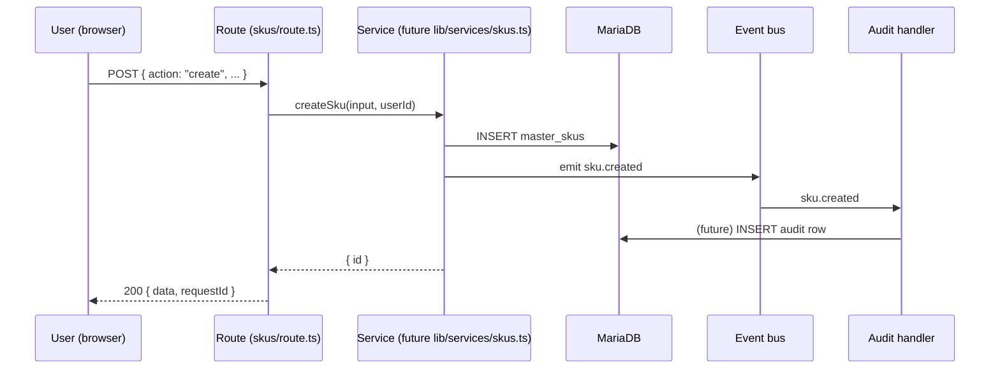
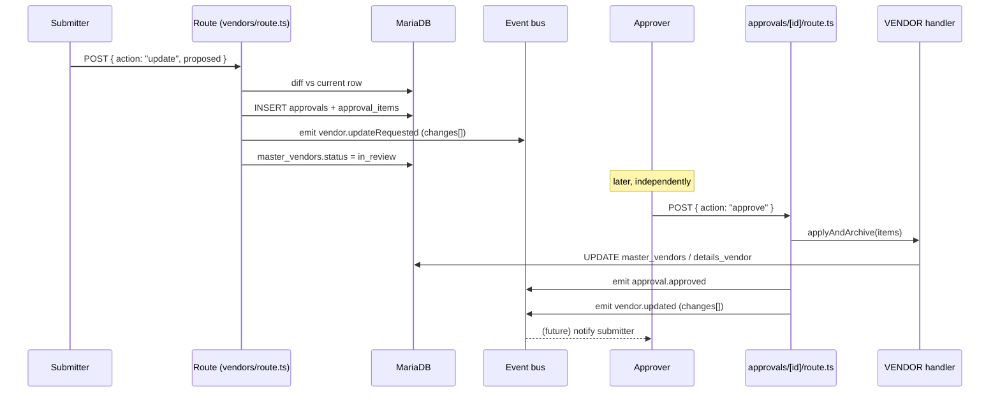
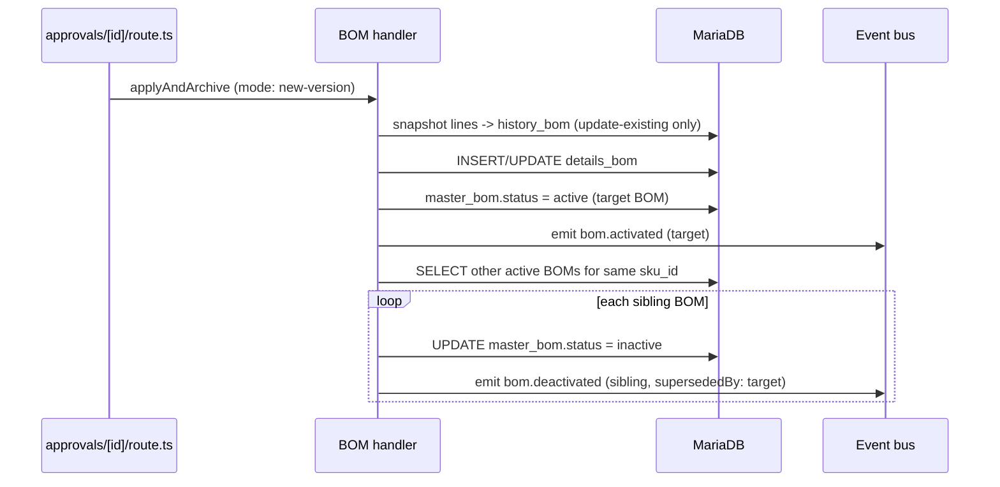
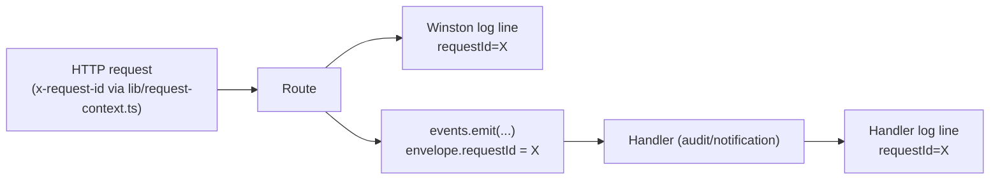

> **Related docs:** [Architecture](./architecture.md) · [Architecture Evolution](./architecture-evolution.md) · [Event-Driven Options](./event-driven-options.md) · [Interaction Logging Map](./interaction-logging-map.md) · [Event Instrumentation Blueprint](./event-instrumentation-blueprint.md)

# Event Catalog — Who Did What, and What Fires When

> **Status:** Reference catalog (no code yet) · **Purpose:** Enumerate every domain event needed to track actor/action/entity/diff across the system, and show how data flows once they exist · **Owner:** Ajay
> **Last updated:** 2026-07-03

---

## 1. Purpose & relationship to the other two docs

`architecture-evolution.md` §5.1 sketches a `DomainEvent` union with five example events (`sku.created`, `sku.bulkImported`, `vendor.created`, `po.statusChanged`, `approval.raised`) and defers "extend per module as you migrate." This doc **is** that extension, done exhaustively for every module that has real logic today — masters (SKU, RM, PM, Vendor, Mfg, BOM), approvals, and purchase orders.

This doc does **not**:
- Pick an event backbone — that decision belongs to `event-driven-options.md` and stays open.
- Write any `lib/events/*` code — that's Step 3 of `architecture-evolution.md` §6, and this catalog is what that step's `types.ts` gets populated from.
- Cover inventory, manufacturing, finance, sales-crm, or hr-payroll — those page directories exist but have no API routes or business logic to ground events in yet. Revisit this doc once they do.

When Step 3 begins, every row in §3 becomes one variant of the `DomainEvent` discriminated union in `lib/events/types.ts`, and every "fires from" cell becomes an `events.emit(...)` call at that exact call site.

---

## 2. Naming & envelope convention

**Name shape:** `<entity>.<pastTenseAction>` — e.g. `sku.created`, `bom.submitted`, `approval.decided`. Past tense because an event is a fact that already happened, never a command.

**Common envelope** — every event carries these fields regardless of type:

| Field | Type | Source |
|---|---|---|
| `id` | string (uuid) | generated at emit time |
| `type` | string literal | the event name itself |
| `occurredAt` | ISO timestamp | generated at emit time |
| `actorId` | number | `session.user.id` (via `ctx.userId` under `withGateway`, or manually derived where not yet migrated — see `architecture-evolution.md` §6 rollout gaps) |
| `actorRoles` | string[] | `session.user.roles` |
| `module` | string | one of the existing module codes: `SKU, RM_MAT, RM_RATE, RM_VRM, PM_MAT, PM_RATE, PM_VRM, VENDOR, MFG, BOM, PO, PO_BULK, APPROVAL, AUTH` |
| `entityId` | number \| null | the row this event is about (`approvals.entity_id` equivalent); `null` for bulk/session events |
| `requestId` | string | reused from `lib/request-context.ts`'s `createRequestContext()` — the same id already logged by Winston, so one HTTP request is traceable end-to-end into every event it caused |

**Payload:** entity-specific data. For every `*.updateRequested` / `*.updated` / `*.rejected` event, the payload includes:

```ts
changes: { field: string; oldValue: string | null; newValue: string | null }[]
```

This is a direct re-use of `approval_items`'s existing `(field_name, old_value, new_value)` shape — no new diff-computation code is needed, only wrapping the array that routes already build today in an event envelope.

**Reuse, don't duplicate, the existing S3 sink.** `lib/events.ts` (`recordRawEvent`/`recordProcessedEvent`/`recordFailedEvent`) already writes `(module, eventId, payload)` JSON to S3 on every masters/approval/PO action. Once real typed events exist, the audit handler that subscribes to them should *replace* these call sites (same module/eventId/payload shape) rather than the app emitting to both systems in parallel.

---

## 3. Full event catalog

### Masters — SKU (module `SKU`)

| Event | Fires from | Payload (beyond envelope) | Maps to today |
|---|---|---|---|
| `sku.created` | `app/api/masters/skus/route.ts` `action:"create"` | `skuCode, name, brand, category` | `INSERT master_skus` |
| `sku.bulkImported` | same route, `action:"bulk"` / `"bulk_from_s3"` | `count, source: "manual" \| "s3"` | batch `INSERT master_skus` |
| `sku.updateRequested` | same route, `action:"update"` (diff computed, before approval) | `changes[]` | `INSERT approvals`+`approval_items`, `master_skus.status → in_review` |
| `sku.updated` | `applyAndArchive` for `SKU` in `lib/approvals/module-handlers.ts` | `changes[]` | pre-edit row → `INSERT sku_history`, then `UPDATE master_skus` |
| `sku.updateRejected` | `setStatus` for `SKU` (reject path) | `remarks` | `master_skus.status → draft` |

### Masters — Vendor (module `VENDOR`)

| Event | Fires from | Payload | Maps to today |
|---|---|---|---|
| `vendor.created` | `app/api/masters/vendors/route.ts` `action:"create"` | `code, name, type` | `INSERT master_vendors`+`details_vendor` |
| `vendor.bulkImported` | same route, `"bulk"`/`"bulk_from_s3"` | `count, source` | batch insert |
| `vendor.updateRequested` | same route, `"update"` | `changes[]` | approval submission |
| `vendor.updated` | `VENDOR` handler in `module-handlers.ts` (field-change path) | `changes[]` | `UPDATE master_vendors`/`details_vendor` — **no history table today**; this event is the only durable record of the prior value (see §5) |
| `vendor.docsUpdated` | same route, `"update_docs"` | `docFields: string[]` (which of gst/cheque/pan/misc changed) | direct write, no approval gate today per `VENDOR_DOC_FIELDS` fast path |
| `vendor.updateRejected` | `VENDOR` handler `setStatus` | `remarks` | status → `draft` |

### Masters — Manufacturer (module `MFG`)

Mirrors Vendor exactly (same dual-table, doc-vs-field split in `module-handlers.ts`):

| Event | Fires from | Payload | Maps to today |
|---|---|---|---|
| `mfg.created` | `app/api/masters/manufacturers/route.ts` `"create"` | `mfgId, code, name` | `INSERT master_mfgs`+`details_mfg` |
| `mfg.bulkImported` | `"bulk"`/`"bulk_from_s3"` | `count, source` | batch insert |
| `mfg.updateRequested` | `"update"` | `changes[]` | approval submission |
| `mfg.updated` | `MFG` handler, field-change path | `changes[]` | `UPDATE master_mfgs`/`details_mfg` — **no history table today** |
| `mfg.docsUpdated` | `"update_docs"` | `docFields[]` | direct write, no approval gate |
| `mfg.updateRejected` | `MFG` handler `setStatus` | `remarks` | status → `draft` |

### Masters — Raw Material (modules `RM_MAT`, `RM_RATE`, `RM_VRM` — kept separate, matching the three independent approval modules today)

| Event | Fires from | Payload | Maps to today |
|---|---|---|---|
| `rawMaterial.created` | `app/api/masters/raw-materials/route.ts` `"create"` / `"create-full"` | `rmCode, name, make, uom` | `INSERT master_rm` (+ rate rows if `create-full`) |
| `rawMaterial.bulkImported` | `"bulk"`/`"bulk_from_s3"` | `count, source` | batch insert |
| `rawMaterial.updateRequested` | base-record update (`RM_MAT`) | `changes[]` | approval submission |
| `rawMaterial.updated` | `RM_MAT` handler | `changes[]` | `UPDATE master_rm` — **no history table today** |
| `rawMaterial.rateAdded` | `"add-rates"` (mfg rate, `RM_RATE`) | `mfgId, rate, effectiveFrom` | `INSERT rm_mrm_fixed` |
| `rawMaterial.rateUpdateRequested` / `.rateUpdated` | `RM_RATE` handler | `changes[]` | pre-edit row → `INSERT history_mrm`, then `UPDATE rm_mrm_fixed` |
| `rawMaterial.vendorRateAdded` | `"add-rates"` (vendor rate, `RM_VRM`) | `vendorId, rate, effectiveFrom` | `INSERT rm_vrm_dynamic` |
| `rawMaterial.vendorRateUpdateRequested` / `.vendorRateUpdated` | `RM_VRM` handler | `changes[]` | pre-edit row → `INSERT history_vrm`, then `UPDATE rm_vrm_dynamic` |
| `rawMaterial.*Rejected` (base/rate/vendorRate) | respective handler `setStatus` | `remarks` | status → `draft` |

### Masters — Packing Material (modules `PM_MAT`, `PM_RATE`, `PM_VRM`)

Identical structure to Raw Material, entity-prefixed `packingMaterial.*`:

`packingMaterial.created`, `.bulkImported`, `.updateRequested`/`.updated` (`PM_MAT`, no history table), `.rateAdded`/`.rateUpdateRequested`/`.rateUpdated` (`PM_RATE`, → `history_mrm`), `.vendorRateAdded`/`.vendorRateUpdateRequested`/`.vendorRateUpdated` (`PM_VRM`, → `history_vrm`), `.*Rejected`.

### Masters — BOM (module `BOM`)

| Event | Fires from | Payload | Maps to today |
|---|---|---|---|
| `bom.submitted` | `app/api/masters/bom-master/route.ts` main submit path | `mode: "new-version" \| "update-existing", skuId, lineCount` | `INSERT approvals`+`approval_items` (flat `line:<rm\|pm>:<id>:<field>` diff) |
| `bom.activated` | `BOM` handler in `module-handlers.ts`, both modes | `bomId, skuId` | `update-existing`: snapshot every current line → `INSERT history_bom`, delete, reinsert; `new-version`: insert only. Both then `master_bom.status → active` |
| `bom.deactivated` | same handler, once per sibling BOM | `bomId, skuId, reason: "supersededBy": <newBomId>` | `deactivateOtherActiveBomsForSku` — **fan-out**: one approval can emit many of these (see §4.3) |
| `bom.updateRejected` | `BOM` handler `setStatus` | `remarks` | `master_bom.status → draft` |

### Approvals (cross-cutting — module `APPROVAL`)

These wrap every masters module's decision step. A module-specific event (e.g. `sku.updated`) fires *from inside* the `approval.approved` handling in `module-handlers.ts`, not independently — `approval.approved`/`approval.rejected` is the trigger, the module event is the effect.

| Event | Fires from | Payload | Maps to today |
|---|---|---|---|
| `approval.raised` | any masters/PO route that computes a diff and needs sign-off | `module, entityId, approvalType: "new" \| "update", itemCount` | `INSERT approvals`+`approval_items` |
| `approval.approved` | `app/api/approvals/[id]/route.ts` POST, `action:"approve"` | `module, entityId, approverId` | `MODULE_HANDLERS[module].applyAndArchive`, `approvals.status → approved` |
| `approval.rejected` | same route, `action:"reject"` | `module, entityId, approverId, remarks` (remarks mandatory) | `MODULE_HANDLERS[module].setStatus(draft)`, `approvals.status → rejected` |

### Purchase Orders (modules `PO`, `PO_BULK`)

| Event | Fires from | Payload | Maps to today |
|---|---|---|---|
| `po.raised` | `app/api/masters/purchase-orders` POST, impromptu | `poId, skuId, vendorId, amount` | `INSERT purchase_orders` (status `draft`) + `approval.raised` |
| `po.raisedDirect` | same route, normal PO | `poId, skuId, vendorId, amount` | `INSERT purchase_orders` (status `raised`, no approval) |
| `po.bulkImported` | `PO_BULK` handler, CSV from S3 | `count, s3Key` | batch `INSERT purchase_orders` (status `raised`) — replaces the module's own double S3 log today (see §5) |
| `po.approved` | `approval.approved` for module `PO` | `poId` | `purchase_orders.status → raised` |
| `po.emailSent` | `sendPoEmail()` fire-and-forget call in `app/api/approvals/[id]/route.ts:116-131` | `poId, mfgEmail, pdfKey` | PDF generated, uploaded to S3, sent via Gmail SMTP, `email_sent_at` stamped — **formalizes the one real async side-effect pattern already in the codebase** |
| `po.split` | `app/api/masters/purchase-orders/[id]/split/route.ts` | `parentPoId, childPoIds[], splitQty` | inserts child POs, credits parent `received_qty` |
| `po.statusChanged` | `[id]/route.ts` PATCH, `[id]/close/route.ts` | `poId, from, to` | covers `raised→punched→partially_received→received`, `→short_closed`, `→cancelled` transitions |
| `po.closed` | `[id]/close/route.ts` | `poId, invoiceNo` | status → `short_closed` or `received` |

### Auth / session (module `AUTH`)

Already event-shaped via NextAuth's own `events.signIn`/`events.signOut` in `lib/auth.ts` — included for completeness since "who is doing what" starts at login. No new DB work needed, just wrap the existing writes in the same envelope for consistency with everything else in this catalog:

| Event | Fires from | Payload | Maps to today |
|---|---|---|---|
| `user.loggedIn` | `lib/auth.ts` `events.signIn` | `provider: "google-oauth-jwt"` | `INSERT sessions`, `INSERT session_history (event:"login")` |
| `user.loggedOut` | `lib/auth.ts` `events.signOut` | — | `sessions.is_active → false`, `INSERT session_history (event:"logout")` |

---

## 4. Data flow

### 4.1 Simple create — SKU



No approval needed — create is a direct write. The event exists purely so audit/notification handlers can subscribe without the route knowing they exist.

### 4.2 Field update via approval — Vendor



`vendor.updated`'s `changes[]` is the only durable record of the prior values — there is no `vendor_history` table, so this event payload is worth persisting even before any consumer needs it live (see gap analysis, §5).

### 4.3 Fan-out — BOM activation



One approval decision can emit N+1 events (one activation, N deactivations). Each is an independent fact — a future consumer (e.g. a "BOM history for this SKU" view) reacts to each `bom.deactivated` without needing to know it was caused by another BOM's activation.

### 4.4 Request tracing across the event boundary



Every event's `requestId` is the same id already generated per-request and logged by Winston (`architecture-evolution.md` §4.1). This means once handlers run asynchronously, a single `grep requestId=X` across `logs/app-*.log` still reconstructs the full causal chain — route handling → DB write → event → handler — with no new tracing infrastructure.

---

## 5. Gap analysis

| Gap | Detail | Action implied by this catalog |
|---|---|---|
| No history table for VENDOR, MFG, RM_MAT, PM_MAT | Approving an edit to these overwrites the row; the only prior-value record was the now-stale `approval_items` row | Treat `*.updated`'s `changes[]` payload as the durable record until/unless a real history table is added — do **not** assume the DB alone still has this after the fact |
| `sku_history` schema drift | Table is live in the DB (`lib/queries/skus.ts:94`) but absent from `prisma/schema.prisma` | Separate fix, out of scope here — flagging so it isn't rediscovered as a surprise later |
| `PO_BULK` double-logs to S3 | `lib/events.ts`'s `recordProcessedEvent`/`recordFailedEvent` fire once tagged `APPROVAL` (generic) and once tagged `PO_BULK` (inside the handler) for the same bulk import | `po.bulkImported` replaces both call sites once real events exist — one fact, one event |
| BOM's `in_review` has a literal space (`"in review"`) | `BOM_STATUS_IN_REVIEW` constant in `lib/queries/bom.ts:20`, unlike every other module's `in_review` | No catalog action — just don't hardcode `"in_review"` when a future handler filters on BOM status |
| PO actor not stored on the entity | `purchase_orders` has no `raised_by` column; derived by joining `approvals WHERE module='PO'` | `po.raised`/`po.raisedDirect` events carry `actorId` directly in the envelope — no join needed once events are the source of truth for "who raised this PO" |

---

## 6. Non-goals

- Does not choose an event backbone (in-process vs. EventBridge vs. SNS vs. MSK vs. Redis/BullMQ) — that decision stays with `event-driven-options.md`.
- Does not implement `lib/events/*`, `lib/services/*`, or any outbox table — this is the input to that work, not the work itself.
- Does not cover inventory, manufacturing, finance, sales-crm, or hr-payroll — no routes exist yet to ground events in; plan those once each module has real CRUD logic.
