> **Related docs:** [Architecture](./architecture.md) · [Architecture Evolution](./architecture-evolution.md) · [Event-Driven Options](./event-driven-options.md) · [Event Catalog](./event-catalog.md) · [Interaction Logging Map](./interaction-logging-map.md)

# Event Instrumentation Blueprint — Target State, Per Page

> **Status:** Design / target-state · **Purpose:** exact diagram, per page, of what should log/console/record at every touchpoint to fully support the event catalog · **Owner:** Ajay
> **Last updated:** 2026-07-05 — §8 (BOM) backend mutation-path logging/eventing has since been implemented; see the update note at the top of that section.

---

## 1. Purpose — how this differs from the other two instrumentation docs

- [`interaction-logging-map.md`](./interaction-logging-map.md) = **what fires today** (audit of current code, gaps marked dashed).
- [`event-catalog.md`](./event-catalog.md) = **what domain events should exist** (names, payloads, when they fire) once a real event bus is built.
- **This doc** = the missing middle layer: for every page, the exact sequence of `console`/`logger`/event calls that should fire at every UI touchpoint *today*, using infrastructure that already exists (`lib/logger.ts`, `lib/events.ts`) plus the new frontend calls needed to close the gaps found in the audit — laid out so it can be implemented mechanically, page by page, ahead of the real event bus.

Every diagram below is color-coded by call type (§2) and by whether the call already exists in code (solid border) or is a new addition needed to close a gap (dashed border, labeled "NEW"). Where a node corresponds to a formal domain event from `event-catalog.md`, its label includes that event name in `code font` so the two docs stay traceable to each other.

---

## 2. Color legend

| Color | Type | Meaning |
|---|---|---|
| 🔵 Blue | **Logger** | `logger.*` from `lib/logger.ts` (Winston → console + `logs/app-*.log`) |
| ⚪ Grey | **Console** | Bare `console.log`/`console.error`, typically client-side (browser devtools only, not persisted) |
| 🟠 Amber | **Raw Event** | `recordRawEvent(...)` — written to S3 `raw-events/` before the action completes |
| 🟢 Green | **Processed Event** | `recordProcessedEvent(...)` — written to S3 `processed-events/` after successful commit |
| 🔴 Red | **Failed Event** | `recordFailedEvent(...)` — written to S3 `failed-events/` on error/rollback |
| 🟣 Purple | **DB Write** | An actual `INSERT`/`UPDATE` against MariaDB |
| 🟦 Teal | **Status Transition** | A `status` column change (`draft → in_review → active`, etc.) |
| 🟡 Gold | **Approval Step** | A step inside the shared `approvals`/`approval_items` flow |
| ▢ Dashed border | **NEW** | Proposed addition — does not exist in code today; solid border = already exists |

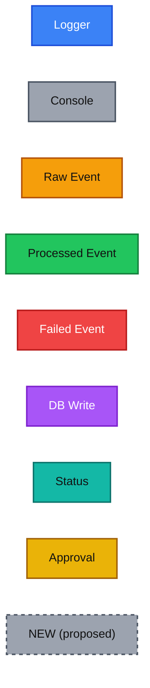

---

## 3. Manufacturer (`app/masters/manufacturers`) — full detail, both branches

Structure confirmed against `AddMfgDialog.tsx` (2-step wizard: Details → optional Documents, single submit) and `CsvImportDialog.tsx` (CSV parsed client-side with preview; Excel uploaded to S3 immediately on file-select). Existing backend instrumentation confirmed against `app/api/masters/manufacturers/route.ts`.

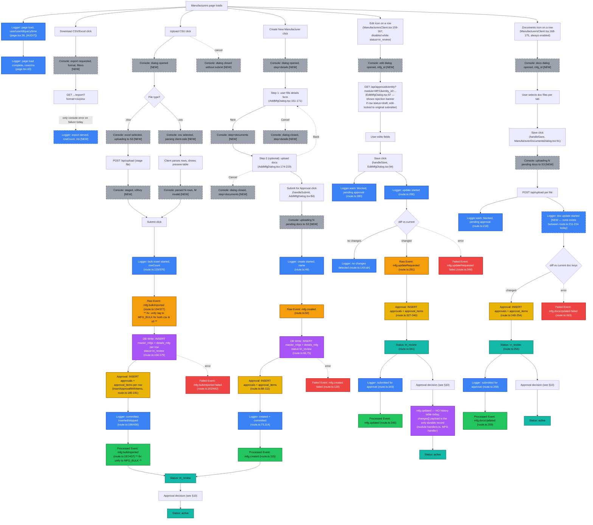

**Implementation checklist — Manufacturer:**
1. Add 8 new `console.debug`/`console.log` calls to `AddMfgDialog.tsx` and `CsvImportDialog.tsx` (dialog open, step change, file type branch, parse result, cancel) — pure frontend, no API changes.
2. Fix `MFG_BULK`/`MFG_S3BULK` tag mismatch: use one tag (`MFG_BULK`, distinguished by `source: "csv"|"s3"` in the payload) at raw, processed, *and* failed sites (`route.ts:134,197,202` and `:377,437,442`).
3. Add a `console.error`/`logger.warn` to `DownloadButton.tsx` / `export/route.ts` — export currently has no success-path or duration logging at all.
4. Add "edit dialog opened"/"docs dialog opened" consoles to `EditMfgDialog.tsx` and `ManufacturerDocumentsDialog.tsx` — two more always-available row actions beyond create/bulk, gated only by `status !== in_review`.
5. Add a `logger.info` "doc update started" line to the `update_docs` branch (`route.ts:211-224`) — it currently jumps straight from the pending-approval check to the diff, with no started-log in between, unlike every other action.

---

## 4. SKU (`app/masters/skus`)

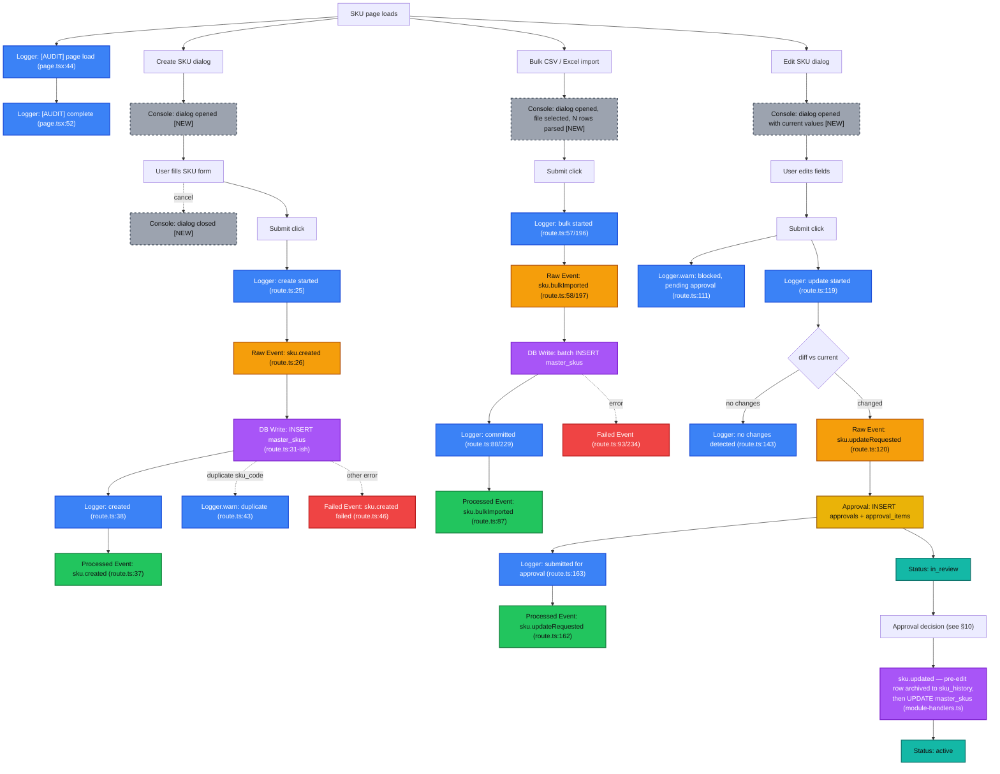

**Implementation checklist — SKU:** add dialog-open/close console calls to the create/edit dialogs and CSV import dialog (backend is already fully instrumented — no backend changes needed).

---

## 5. Vendor (`app/masters/vendors`)

Same shape as SKU plus the doc-only fast path (no approval gate).

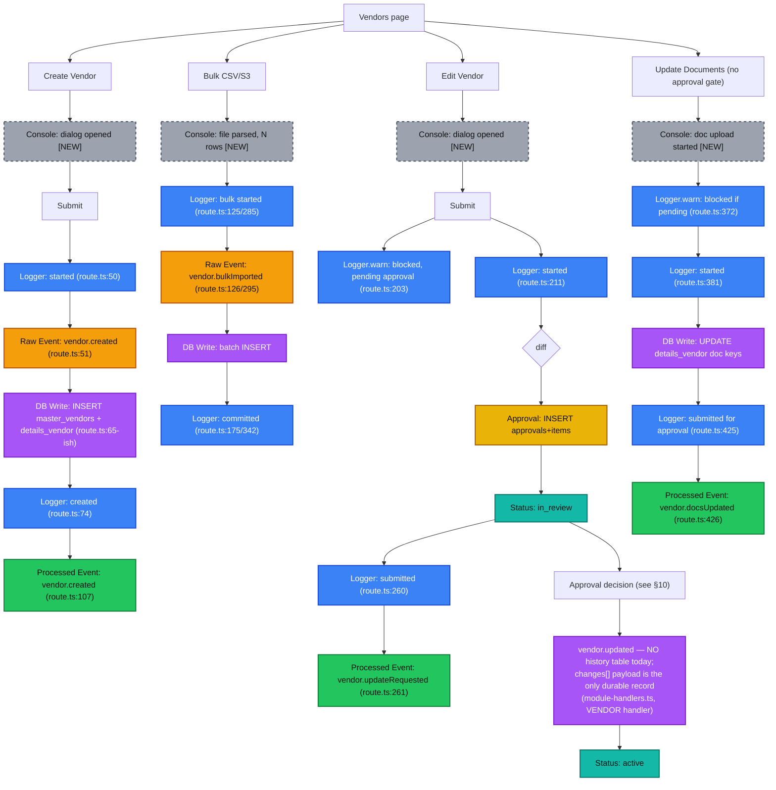

**Implementation checklist — Vendor:** add dialog-open consoles (3 dialogs); flag the missing history table as a backend follow-up, not a logging fix — `vendor.updated`'s `changes[]` payload is the interim durable record until one exists.

---

## 6. Raw Material & Packing Material (`app/masters/raw-materials`, `app/masters/packing-materials`)

Identical structure for both domains — one diagram, RM shown, PM is a mechanical substitution (`rawMaterial.*` → `packingMaterial.*`, `rm-handler.ts` → `pm-handler.ts`).

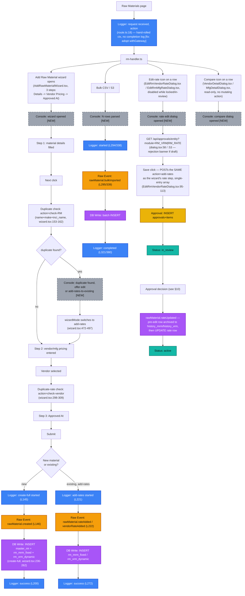

Note: editing the **base** `master_rm`/`master_pm` record (the `RM_MAT`/`PM_MAT` approval module) is **not** a dialog under these two pages at all — it lives on the separate Material Master page (§7), shared between RM and PM via a `material` prop. Don't look for it here.

**Implementation checklist — RM/PM:** migrate `route.ts` onto `withGateway` for consistent request-context + completion logging (currently hand-rolled, §0 of the interaction-logging-map audit); add dialog-open/duplicate-found consoles to the wizard and both edit-rate dialogs; **resolve the two-tag-family issue** by retiring `material-master/route.ts`'s separate `RM_CREATE`/`PM_CREATE` tags in favor of the richer `RM_MAT`/`PM` family used by the dedicated pages, since both routes represent the same domain action; add a `logger.info`/event pair around the `check-RM`/`check-PM`/`check-vendor` duplicate-check calls, which currently have none (they're read-only lookups but still worth a debug-level trace since they gate what the user is allowed to submit next).

---

## 7. Material Master — combined RM/PM view (`app/masters/material-master`)

This is the **only** place the base `master_rm`/`master_pm` record (`RM_MAT`/`PM_MAT` approval module) can be edited — not under `app/masters/raw-materials` or `app/masters/packing-materials` (§6), which only edit rates. Easy to miss since it's a separate top-level page, shared between RM and PM via `EditMaterialDialog.tsx`'s `material: "rm" | "pm"` prop.

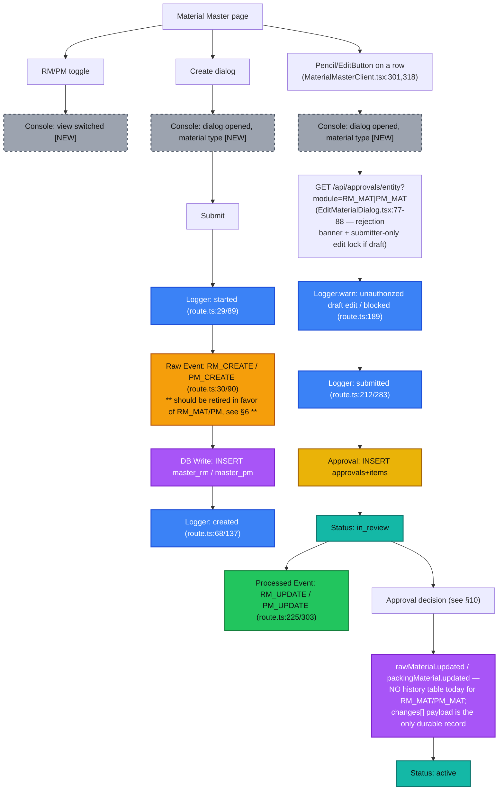

---

## 8. BOM (`app/masters/bom-master`) — backend mutation path now instrumented; frontend + a few gaps remain

> **Update (2026-07-05):** the backend logging/eventing described as "[NEW]" below has been **implemented** — `app/api/masters/bom-master/route.ts` now logs/emits `BOM` raw/processed/failed events around submit, and `bomHandler.applyAndArchive` in `lib/approvals/module-handlers.ts` now logs + emits a processed event on activation and **one per sibling BOM** inside the deactivation loop (a new `selectOtherActiveBomsForSku` query reads sibling ids before the bulk `UPDATE` runs, since MariaDB's `UPDATE` has no `RETURNING`). Diagram nodes below are updated to solid/existing styling where this is now true; genuinely remaining gaps keep the dashed "[NEW]" styling.
>
> Two corrections to this section's original framing, found while implementing:
> - The route was **already** on `withGateway` with a real Zod schema (`bomActionSchema`) before this instrumentation work — it was never on a "hand-rolled" request context the way RM/PM/Approvals are. Auth/RBAC/validation/request-tracing were already present at the same tier as SKU; only the business-fact logging/eventing was missing.
> - The approval-item diff is richer than "flat `line:<rm|pm>:<id>:<field>`" alone: it also includes a `__mode__` sentinel item recording `new-version`/`update-existing`, and `line:<type>:<id>:__removed__` sentinel items for any line dropped from an existing BOM.
>
> Also not previously documented here: a read-only **BOM History page** (`app/masters/bom-master/history/`) exists, listing BOM headers with archived `history_bom` revisions. It already has the same `[AUDIT]` page-load `console.log` pattern as the main listing (`lib/query-timing.ts`'s `timedQuery`) — no mutation path, so no action needed on it below.

```mermaid
flowchart TD
    Page["BOM Master page"] --> Wizard["BOM creation wizard opens\n(BomCreationWizard.tsx — always mode:new-version,\nuseBomWizard.ts:182-187)"] --> C1["Console: wizard opened, sku selected [NEW]"]:::consoleNew
    C1 --> WizMode{"Wizard step:\nNew version, or\n'Update Existing BOM'?"}
    WizMode -->|Update Existing BOM| SharedEdit
    WizMode -->|New version| Lines["User enters RM%/PM lines"] --> C2["Console: line added/edited, running total [NEW]"]:::consoleNew --> Review["Review step, RM-total banner"] --> Submit["Submit click"]

    Page --> DetailPanel["BOM listing row -> detail panel"] --> EditBtn["Edit BOM button\n(BomDetailPanel.tsx:169-174,\nshown only if canEdit && status not locked)"]
    EditBtn --> SharedEdit["BomEditDialog.tsx (BomLineEditorTable)\n— ONE dialog, TWO entry points\n(openEditMode, useBomDetailPanel.ts:163-171)"]
    SharedEdit --> C1b["Console: edit dialog opened, bom_id, entry=wizard|panel [NEW]"]:::consoleNew --> EditLines["User edits RM%/PM lines"] --> SaveEdit["Save for Approval click\n(BomEditDialog.tsx:72-74 -> saveEdit,\nuseBomDetailPanel.ts:179-232)"]

    Submit --> L1a["Logger: bom submit started, mode=new-version\n(route.ts, DONE)"]:::logger
    SaveEdit --> L1b["Logger: bom submit started, mode=update-existing\n(route.ts, DONE)"]:::logger
    L1a --> R1["Raw Event: bom.submitted (tag BOM, DONE)"]:::rawEvt
    L1b --> R1
    R1 --> Post["POST /api/masters/bom-master\naction=create-full, mode=new-version|update-existing\n(useBomWizard.ts:182 / useBomDetailPanel.ts:207-219)"]
    Post --> AR["Approval: INSERT approvals + approval_items\n(__mode__ sentinel + per-field line:&lt;rm|pm&gt;:&lt;id&gt;:&lt;field&gt; diff\n+ __removed__ sentinels for dropped lines)"]:::approval
    AR --> L2["Logger: submitted for approval (DONE)"]:::logger --> P1["Processed Event: bom.submitted (DONE)"]:::procEvt
    AR --> Status1["Status: in review\n** literal DB value has a space, unlike every other module's in_review —\ndeliberate, per lib/queries/bom.ts comment, not an oversight **"]:::status
    Post -.error.-> F0["Failed Event: bom.submitted failed (DONE, route.ts catch)"]:::failEvt

    Status1 --> Appr["Approval decision (see §10)"]
    Appr --> Mode2{update-existing?}
    Mode2 -->|yes| Snap["DB Write: snapshot every current line\nto history_bom [still NEW: no dedicated\nlogger.info before/after the snapshot loop itself]"]:::dbWrite
    Mode2 -->|no| Skip["(nothing to snapshot)"]
    Snap --> DB2["DB Write: delete + reinsert details_bom"]:::dbWrite
    Skip --> DB2
    DB2 --> L4["Logger: BOM activated, bomId, skuId, approverId\n(module-handlers.ts, DONE)"]:::logger --> R2["Processed Event: BOM (activation)\n(module-handlers.ts, DONE)"]:::procEvt
    R2 --> Status2["Status: active"]:::status

    Status2 --> Fanout["selectOtherActiveBomsForSku\n(reads sibling ids BEFORE the bulk UPDATE —\nMariaDB UPDATE has no RETURNING, DONE)"] --> Loop{"for each sibling BOM"}
    Loop --> DB3["DB Write: UPDATE master_bom.status = inactive\n(single bulk statement, all siblings at once)"]:::dbWrite
    DB3 --> L5["Logger: BOM deactivated (superseded),\nbomId, supersededBy — once per sibling\n(module-handlers.ts, DONE)"]:::logger --> R3["Processed Event: BOM (deactivation)\n— one per sibling, not one for the whole batch\n(module-handlers.ts, DONE — this is the fan-out\ncase event-catalog.md §4.3 describes)"]:::procEvt
    R3 --> Loop

    Page --> DL["Download export"] --> C3["Console: export served, row count\n(export/route.ts, DONE — baseline console.log\nalready existed here before this pass)"]:::console

    classDef logger fill:#3b82f6,color:#fff,stroke:#1d4ed8,stroke-width:2px;
    classDef console fill:#9ca3af,color:#111,stroke:#4b5563,stroke-width:2px;
    classDef consoleNew fill:#9ca3af,color:#111,stroke:#4b5563,stroke-width:2px,stroke-dasharray:5 5;
    classDef rawEvt fill:#f59e0b,color:#111,stroke:#b45309,stroke-width:2px;
    classDef procEvt fill:#22c55e,color:#111,stroke:#15803d,stroke-width:2px;
    classDef failEvt fill:#ef4444,color:#fff,stroke:#b91c1c,stroke-width:2px;
    classDef dbWrite fill:#a855f7,color:#fff,stroke:#7e22ce,stroke-width:2px;
    classDef status fill:#14b8a6,color:#111,stroke:#0f766e,stroke-width:2px;
    classDef approval fill:#eab308,color:#111,stroke:#a16207,stroke-width:2px;
```

**Implementation checklist — BOM:**
1. ~~Add `logger.info`/`recordRawEvent`/`recordProcessedEvent`/`recordFailedEvent` to `app/api/masters/bom-master/route.ts` at submit~~ — **Done.** Layered inside the existing `withGateway` handler; no route-wiring change was needed.
2. ~~Add the same to `lib/approvals/module-handlers.ts`'s `BOM` handler at activation and inside the sibling-deactivation loop, one event per sibling~~ — **Done.**
3. Add a `logger.warn` when the DB's literal `"in review"` (with a space) status is set/read, so it's never silently confused with every other module's `in_review` — **still open.** Low priority: this is a deliberate, commented value (`lib/queries/bom.ts`), not an accidental one, so the runtime guard is a safety net, not a bug fix.
4. Add a bare `console.error`/success log to `bom-master/export/route.ts` — **already satisfied**, both before and after this pass (matches every other export route's baseline; a success-path `console.log` was added to all masters export routes in the same session that did items 1–2).
5. Tag the started-log's payload with `entry: "wizard" | "panel"` so the two entry points into the shared edit surface stay distinguishable in logs — **still open, deliberately deferred.** This needs a new field on the wizard's/detail-panel's POST body, which is an API-contract change, not a backend-only logging fix.
6. **New item, not in the original checklist:** add a `logger.info` immediately before/after the `history_bom` snapshot loop in `bomHandler.applyAndArchive`, reporting how many lines were archived — the activation-level log (item 2) exists, but the snapshot step itself still has no dedicated line-count log, so "how many prior lines were archived on this update" isn't currently visible in a log line, only inferable from the DB.
7. **New item, not in the original checklist:** the BOM History page is read-only with page-load audit logging already in place — explicitly excluded from any future "BOM has no instrumentation" claim; no action needed.

---

## 9. Purchase Orders (`app/po-tracking/po-procurement`)

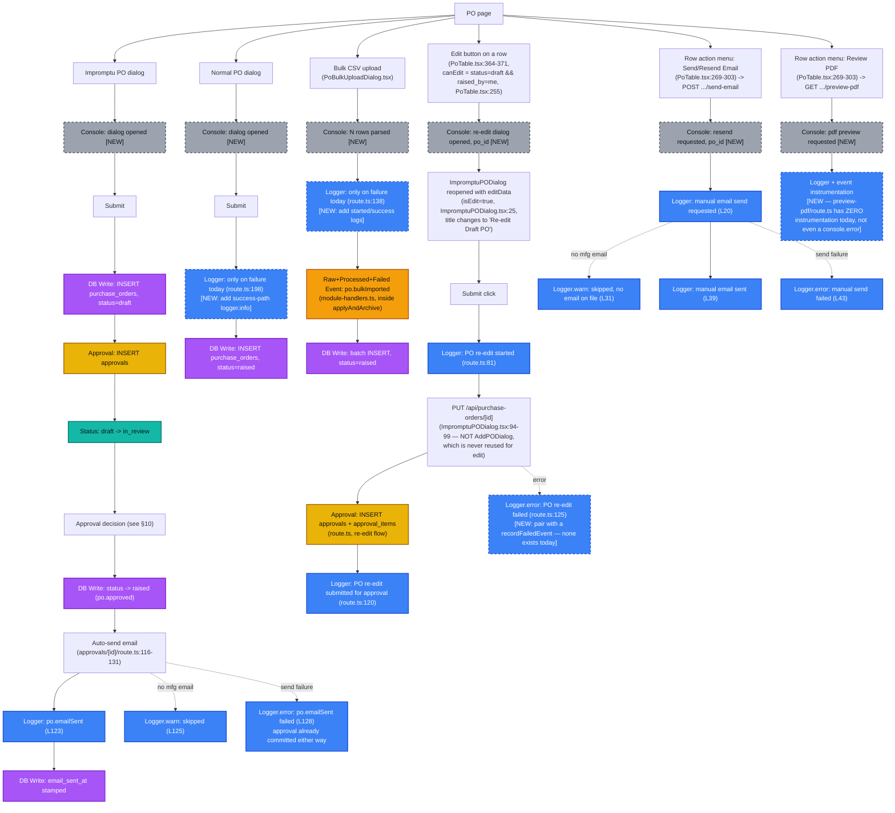

There is **no dedicated "Receive PO" action.** Receiving happens implicitly via the two flows below, whichever the user chooses when a PO still has an outstanding quantity:

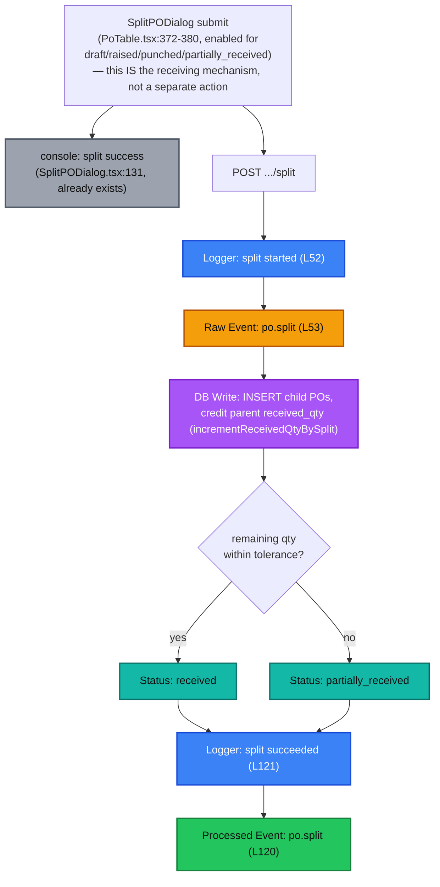

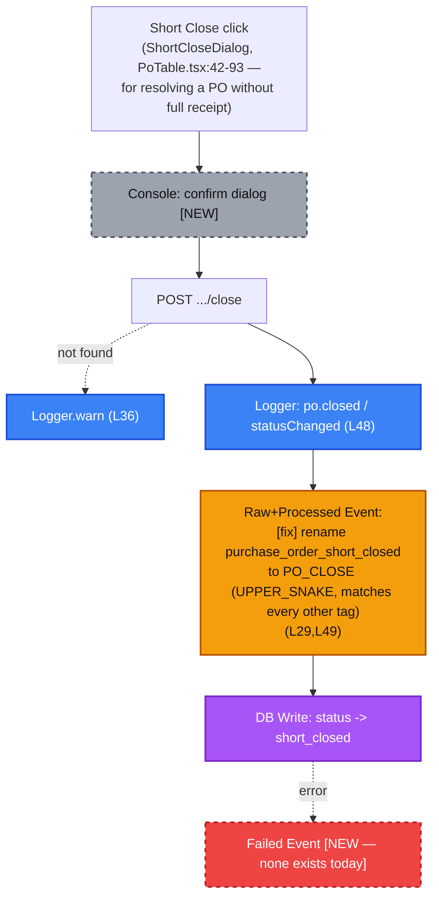

**PATCH `[id]/route.ts:132-172` (attachment replace) has no UI caller anywhere in the app** — the only invoker of the underlying `updatePoAttachment` query is `lib/mailer.ts:95`, a server-side side effect inside `sendPoEmail()` (auto-stamps `attachment_key` when a PO email is sent). Treat this route as either dead code to remove, or an intentionally server-only mechanism — don't design a "replace attachment" UI flow for it without confirming which.

**Implementation checklist — PO:**
1. Add success-path `logger.info` to the Normal PO create path and the Bulk CSV path (both currently log only on failure).
2. Rename `purchase_order_short_closed` → `PO_CLOSE`, matching the UPPER_SNAKE convention everywhere else; add the missing `recordFailedEvent` call.
3. Add `logger`/event instrumentation to `preview-pdf/route.ts` (currently zero, not even a bare `console.error`) and dialog-open consoles to `AddPODialog.tsx`/`ImpromptuPODialog.tsx`/`PoBulkUploadDialog.tsx`.
4. Pair the existing `logger.error` on re-edit failure (`route.ts:125`) with a `recordFailedEvent` call — every other approval-gated update in the app writes a failed-event, re-edit currently doesn't.
5. Add a `console.log` to the row-action menu's Send/Resend Email and Review PDF triggers — both are real, distinct user actions with backend routes but zero frontend trace today.
6. Resolve whether the attachment-replace PATCH route is dead code or intentionally server-only before instrumenting it either way.

---

## 10. Approvals (`app/approvals`) — the shared decision point every module above re-enters

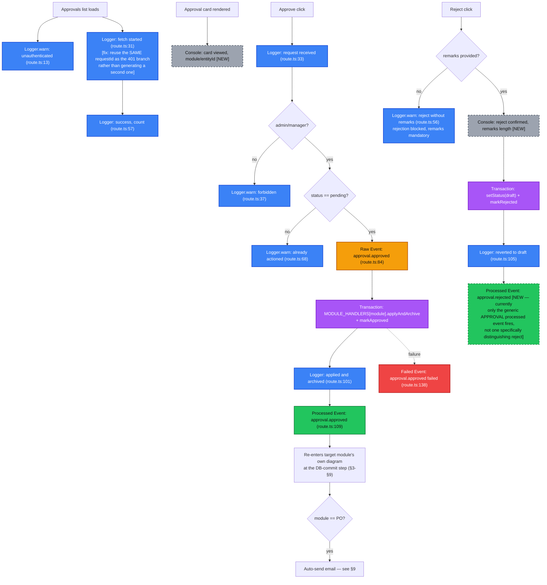

**Implementation checklist — Approvals:**
1. Fix the double-`requestId` bug: generate one id at the top of the request and reuse it in every branch (`route.ts:13` and `:21` currently diverge).
2. Add a distinct `recordProcessedEvent("APPROVAL_REJECTED", ...)` (or equivalent) so reject has its own processed-event trail instead of only the generic `APPROVAL` tag shared with approve.
3. Add a `console.debug` when an approval card is viewed, for basic "who looked at this" visibility ahead of a real audit-log UI.

**Cross-cutting pattern — not part of this page's own flow, but consumed by every module's edit dialog:** `GET /api/approvals/entity?module=...&entity_id=...` is called from seven different masters Edit dialogs (`EditMfgDialog.tsx:67`, `EditMaterialDialog.tsx:80`, `EditRmVendorRateDialog.tsx:58`, `EditRmMfgRateDialog.tsx:53`, `EditPmVendorRateDialog.tsx:57`, `EditPmMfgRateDialog.tsx:53`, `EditVendorDialog.tsx:59`) — never from `RejectDialog.tsx` or `ApprovalCard.tsx` themselves. Each fires only when the row's own status is `draft` (previously rejected), populating a "Rejected by X: '...'" banner and a submitter-only edit lock. Document this once, here, rather than repeating it in every page's own diagram — but don't attach it to the Approvals page's instrumentation, since nothing on this page consumes it.

---

## 11. Cross-page conventions to standardize before writing any of this

These apply to every checklist above — fix once, not per page:

1. **One request-context helper for every route**, not two idioms. Migrate `raw-materials`, `packing-materials`, and all three `approvals/*` routes onto `withGateway`/`createRequestContext()` so every route gets consistent `requestId`, `userId`, and duration tracking for free.
2. **One module-tag family per domain**, not two. Retire the `material-master/route.ts` tags (`RM_CREATE`, `PM_CREATE`, `RM_UPDATE`, `PM_UPDATE`) in favor of the richer tags already used by the dedicated RM/PM pages, since they describe the same actions.
3. **Every event tag is UPPER_SNAKE**, no exceptions — fix `purchase_order_short_closed` → `PO_CLOSE`.
4. **Every bulk/S3-bulk flow uses the same tag for raw, processed, and failed** — fix the Manufacturer `MFG_BULK`/`MFG_S3BULK` mismatch as the template for checking the rest.
5. **Every dialog gets exactly four frontend console calls**: opened, primary-action-completed (e.g. file parsed / step advanced), submitted, closed-without-submitting. This is the minimum set needed to reconstruct a user's path through any dialog from browser devtools alone, and it's what's systematically missing today (only `SplitPODialog.tsx` has any).
6. **Every route gets a success-path logger line**, not just a failure one — PO's Normal-create and Bulk-CSV paths currently log only on error.

---

## 12. Non-goals

- Does not implement any of the above — this is the blueprint each page's implementation PR should follow.
- Does not pick the future event backbone (`event-driven-options.md` still owns that).
- Does not cover inventory/manufacturing/finance/sales-crm/hr-payroll — no pages/routes exist yet to design instrumentation for.
