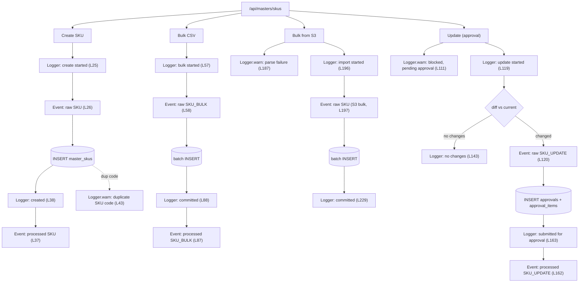
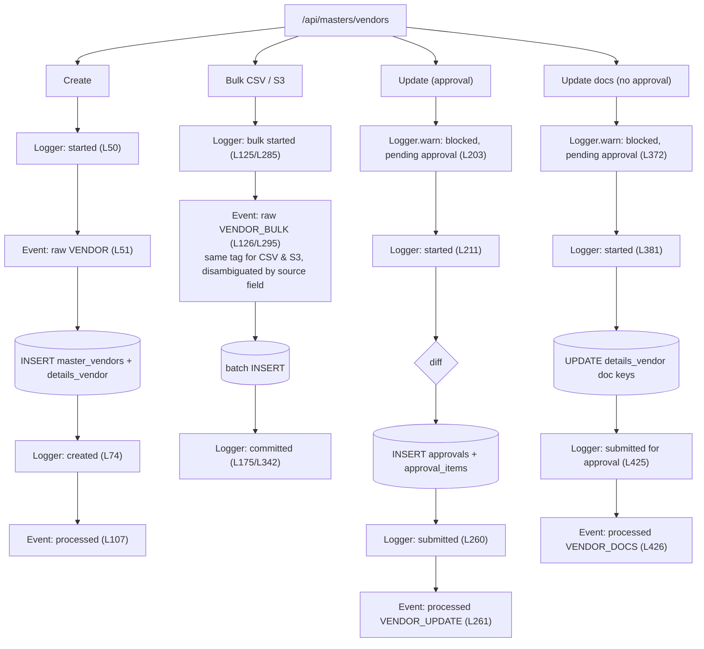
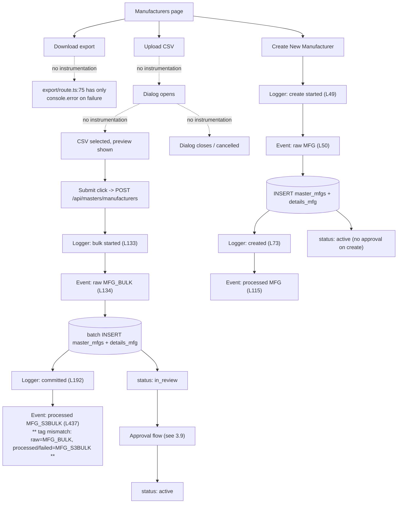
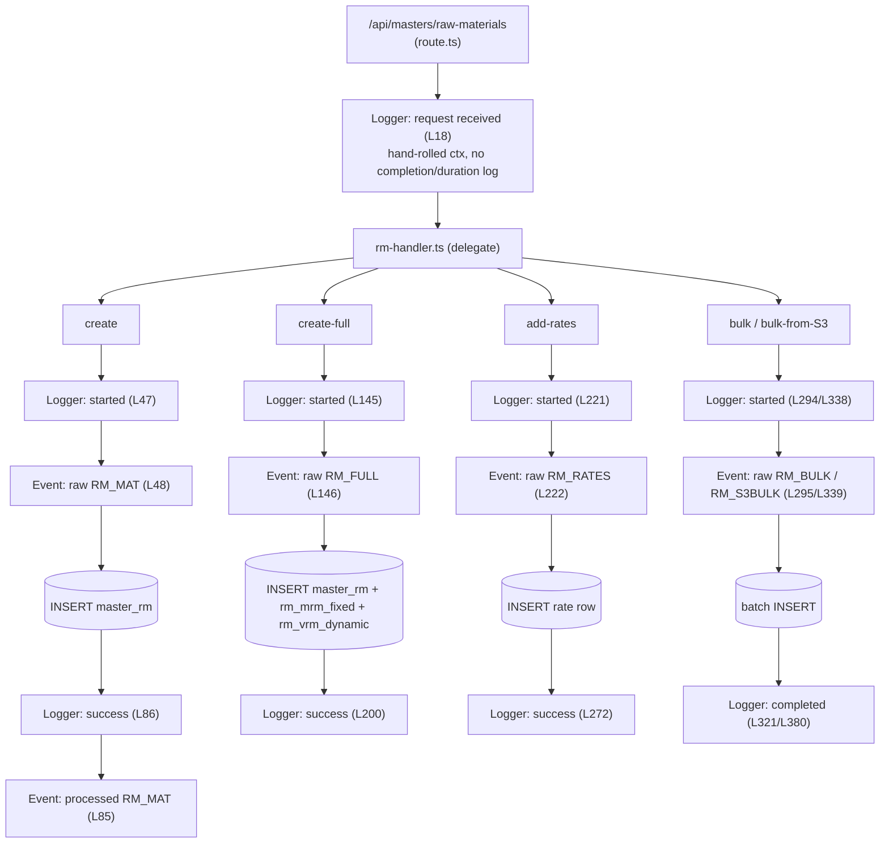
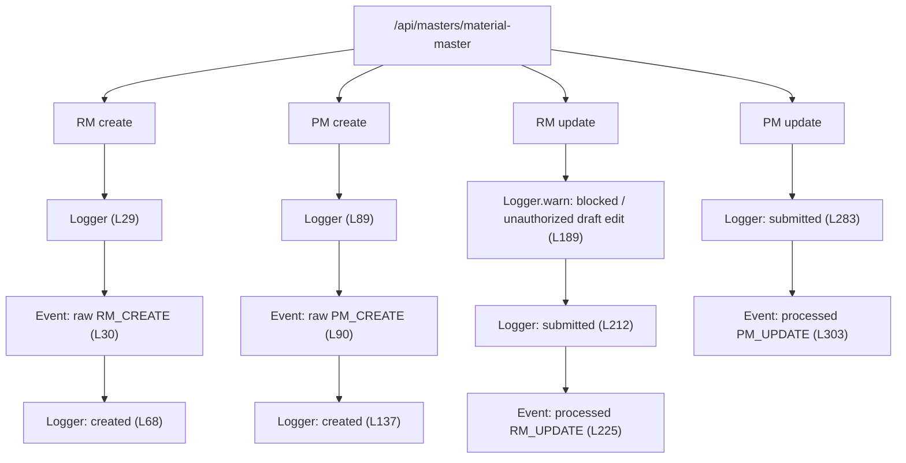
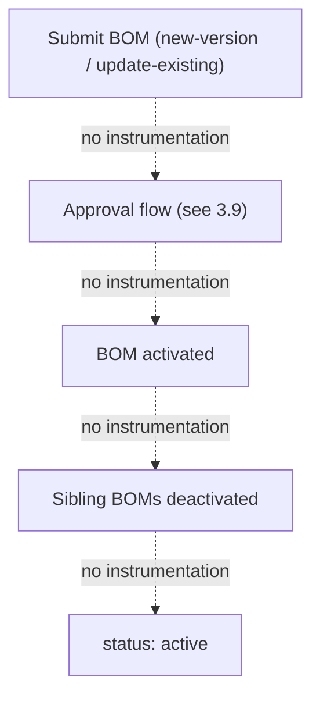
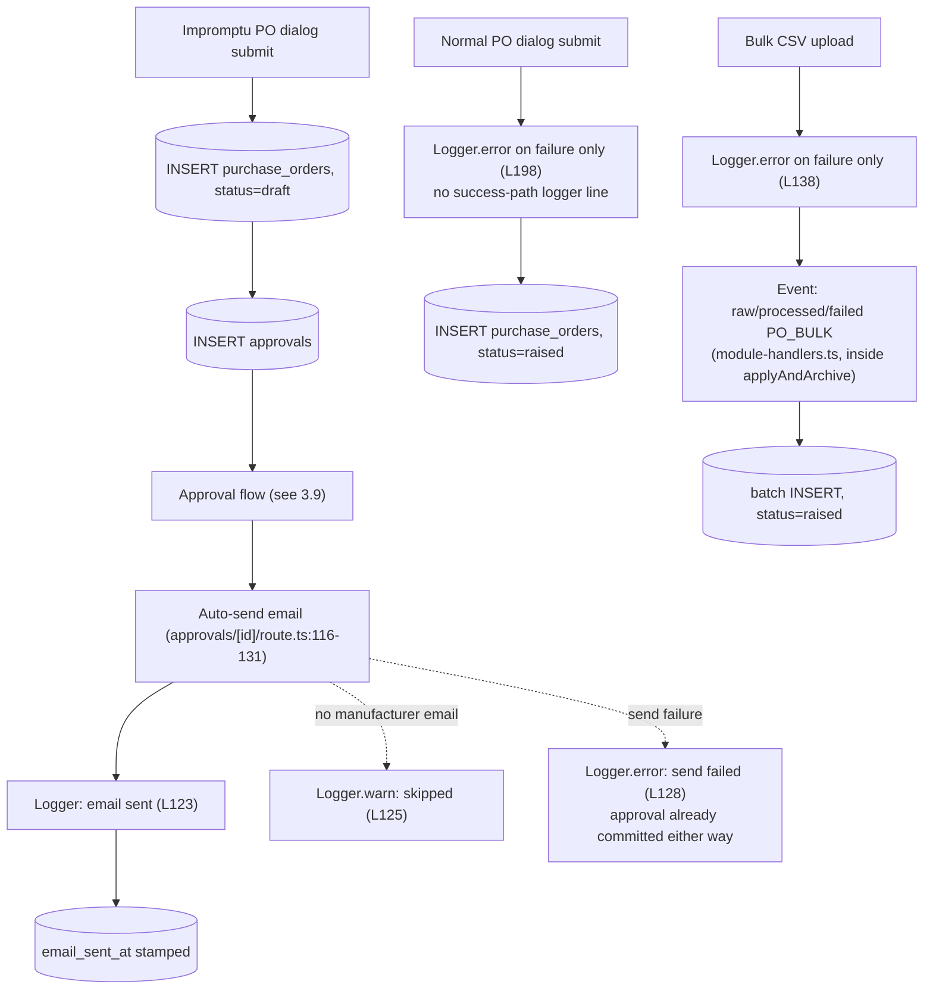
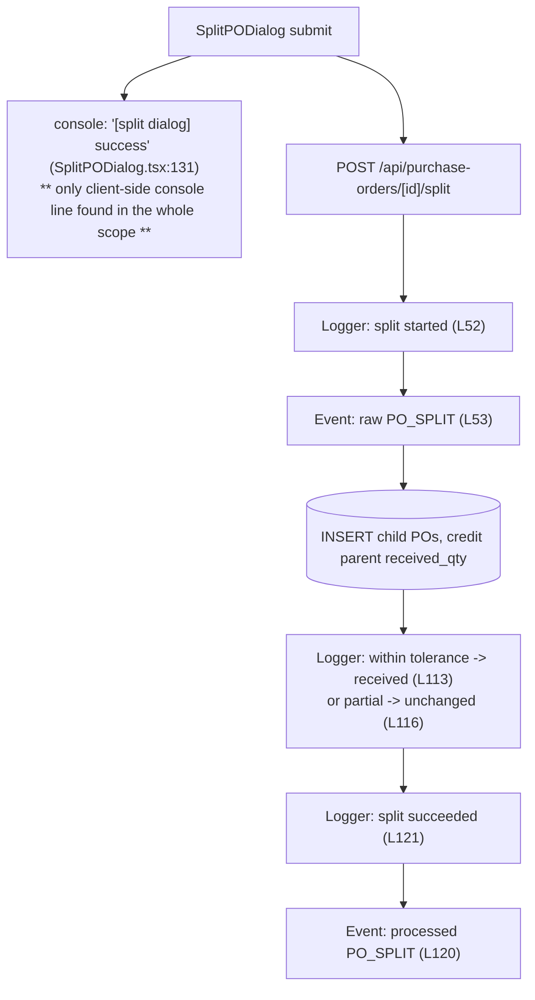
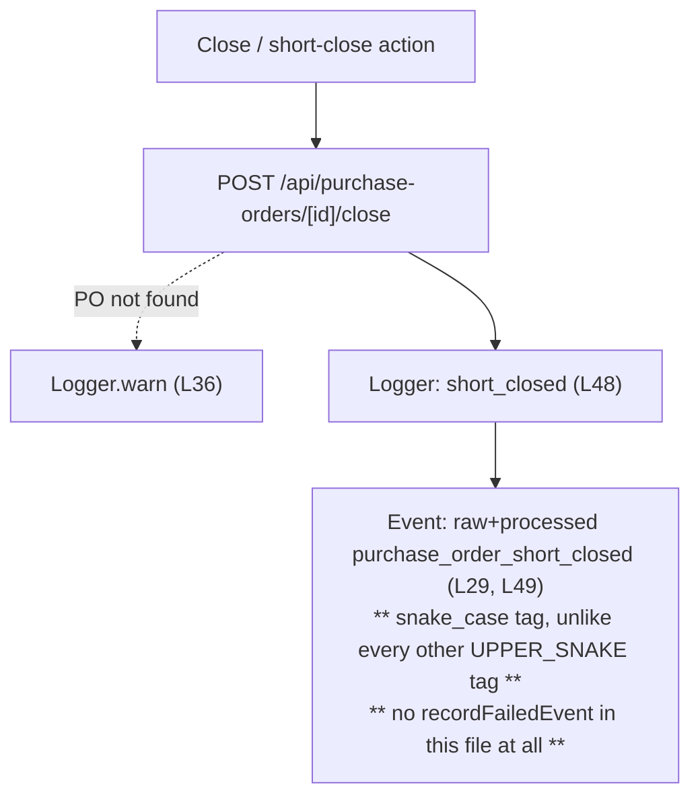
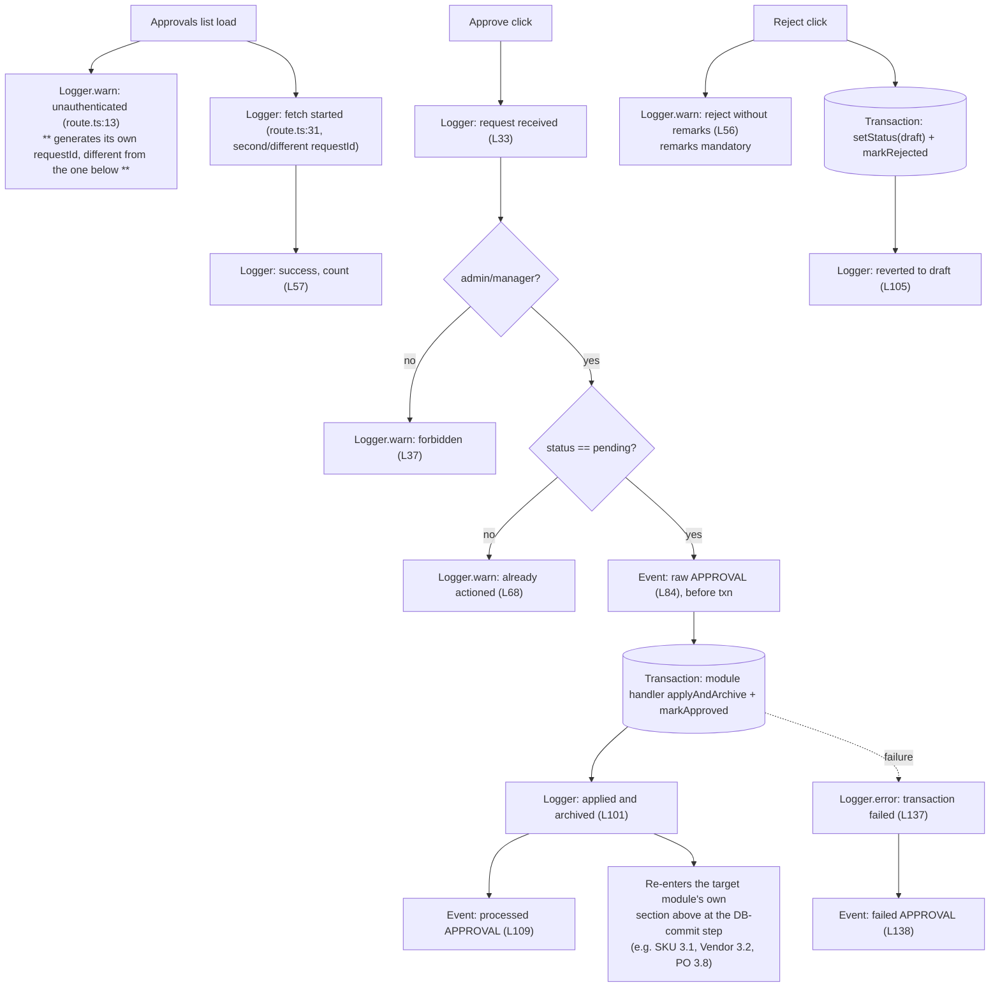

> **Related docs:** [Architecture](./architecture.md) · [Architecture Evolution](./architecture-evolution.md) · [Event-Driven Options](./event-driven-options.md) · [Event Catalog](./event-catalog.md) · [Event Instrumentation Blueprint](./event-instrumentation-blueprint.md)

# Interaction Logging Map — What Actually Logs Today

> **Status:** Audit / reference (documents current state only, proposes no changes) · **Owner:** Ajay
> **Last updated:** 2026-07-03

---

## 1. Purpose

For every masters page, the PO page, and the approvals page: at each click (page load, export download, open create/CSV dialog, submit, approve/reject), what actually fires today via `lib/logger.ts` (Winston) or `lib/events.ts` (the S3 raw/processed/failed sink)? This doc answers that question as a debugging/audit reference, grounded in the real call sites in the codebase — it is **not** the same thing as [`event-catalog.md`](./event-catalog.md), which designs a *future* typed domain-event bus. This doc describes only what exists right now, including where nothing exists.

The coverage turned out uneven: some domains (SKU, Vendor, Manufacturer, RM, PM) are richly instrumented on the backend; others (BOM, every export route, every frontend create/edit dialog) have none. Gaps are marked explicitly rather than omitted, so this doc can double as a punch list if you later decide to close them.

---

## 2. Legend

| Box | Meaning |
|---|---|
| **Logger** (solid) | A `logger.*` call from `lib/logger.ts` (Winston → pretty console + `logs/app-*.log`/`logs/error-*.log`, JSON with `requestId`/`module`/extras) |
| **Event** (solid) | A call to `lib/events.ts`'s `recordRawEvent` / `recordProcessedEvent` / `recordFailedEvent` (→ S3 `raw-events/`, `processed-events/`, `failed-events/`) |
| **console** (solid, labeled) | A bare `console.log`/`console.error`, not routed through Winston |
| *(dashed)* **No instrumentation** | Confirmed by code search — nothing fires at this touchpoint today |

---

## 3. Page-by-page

### 3.1 SKU (`app/masters/skus`)

Backed by `app/api/masters/skus/route.ts`, on `withGateway` → `createRequestContext()` gives one `requestId`/`userId` for the whole request.

All four sub-flows have a matching `recordFailedEvent`/`logger.error` on their catch branch (L46, L93, L169, L234) — omitted above for brevity.

### 3.2 Vendor (`app/masters/vendors`)

Same shape as SKU, plus a doc-only fast path with **no approval gate**.

### 3.3 Manufacturer (`app/masters/manufacturers`)

This is the page your original diagram sketched. Reproduced here against the real call sites — with the frontend touchpoints (dialog open, CSV select, preview) marked as **no instrumentation**, since none exists in `AddMfgDialog.tsx`/the CSV-import dialog today. The blue boxes at those points in your sketch describe an aspiration, not current code.

The doc-update path (`update_docs`, L218/L258/L265, tags `MFG_DOCS`) mirrors Vendor's docs fast path — no approval gate, submitted-for-approval logger line only for field updates (`update`, L281–L351, tag `MFG_UPDATE`).

### 3.4 Raw Material (`app/masters/raw-materials`)

Two-route split worth calling out: the outer router logs only one generic line per request; all the real instrumentation lives in the delegate handler.

**Same conceptual action, different tags**: creating a raw material via the separate `material-master/route.ts` combined view logs `RM_CREATE`/`RM_UPDATE` (L30, L198) instead of `RM_MAT`/`RM_FULL` above — two tag families for one action depending which route the UI went through.

### 3.5 Packing Material (`app/masters/packing-materials`)

Identical structure to Raw Material, via `pm-handler.ts`: `create` (L30/L39, tag `PM`), `create-full` (L166, tag `PM_FULL`), `add-rates` (L258, tag `PM_RATES`), `bulk`/`bulk_from_s3` (L345/L401, tags `PM_BULK`/`PM_S3BULK`). Same two-tag-family issue against `material-master/route.ts`'s `PM_CREATE`/`PM_UPDATE` (L89, L270).

### 3.6 Material Master — combined RM/PM view (`app/masters/material-master`)

No dedicated `export/route.ts` exists for this combined view (each of RM and PM has its own export route instead).

### 3.7 BOM (`app/masters/bom-master`)

**Total instrumentation gap.** `app/api/masters/bom-master/route.ts`, `[id]/route.ts`, and `export/route.ts` contain zero `logger.*` calls and zero `lib/events.ts` calls — not thin coverage, none at all. Every other masters domain has at least the create/update path instrumented; BOM has nothing, including the fan-out deactivation of sibling BOMs (`deactivateOtherActiveBomsForSku`), which is exactly the kind of side-effecting, multi-row write you'd most want a record of.

### 3.8 PO Procurement (`app/po-tracking/po-procurement`)

Largest domain — split into three diagrams by sub-flow.

**Create (impromptu → approval, or normal → direct):**

**Split:**

**Close / short-close:**

`preview-pdf/route.ts` and manual `send-email/route.ts` round out the domain: preview-pdf has **no instrumentation at all**; send-email has Logger lines (L20 started, L39 sent, L31 skipped-no-email, L43 failed) but **no event calls**.

### 3.9 Approvals (`app/approvals`)

---

## 4. Cross-cutting findings

| Finding | Where |
|---|---|
| Two request-context idioms: `withGateway`+`createRequestContext()` (duration-tracked, one requestId) vs hand-rolled inline `{ requestId: crypto.randomUUID(), userId, route }` (no duration tracking) | Gateway: SKU, Vendor, Manufacturer, Material-Master, PO routes. Hand-rolled: Raw Material, Packing Material, all three `approvals/*` routes |
| `approvals/route.ts` generates two different `requestId`s within one request | `app/api/approvals/route.ts:13` and `:21` |
| `MFG_BULK` (raw) vs `MFG_S3BULK` (processed/failed) tag mismatch for the same S3-bulk-import flow | `app/api/masters/manufacturers/route.ts:377` vs `:437/442` |
| Same conceptual action ("create a raw/packing material") logged under two different tag families depending on which route handled it | `material-master/route.ts` (`RM_CREATE`/`PM_CREATE`) vs `raw-materials/rm-handler.ts` / `packing-materials/pm-handler.ts` (`RM_MAT`/`RM_FULL`/`PM`/`PM_FULL`) |
| `purchase_order_short_closed` uses snake_case, unlike every other UPPER_SNAKE module tag; no `recordFailedEvent` call exists in that route at all | `app/api/purchase-orders/[id]/close/route.ts` |
| Zero backend instrumentation (no `logger.*`, no event calls) | BOM master — all of `app/api/masters/bom-master/route.ts`, `[id]/route.ts`, `export/route.ts`; every masters `export/route.ts` (one bare `console.error` only); PO `preview-pdf/route.ts` |
| Zero frontend dialog instrumentation except one line | `SplitPODialog.tsx:131` is the only client-side console call in any create/edit/CSV-import dialog across all masters and PO pages — dialog-open, file-select, and preview-generated events shown in the original Manufacturers sketch don't exist in code today |

---

## 5. Non-goals

- Does not propose fixes for the gaps or inconsistencies above — that's a follow-up decision once you decide which ones are worth closing.
- Does not touch the future domain-event bus design — see [`event-catalog.md`](./event-catalog.md) for that.
- Does not cover RM/PM Procurement or Dispatch Calendar pages (`app/po-tracking/rm-pm-procurement`, `app/po-tracking/dispatch-calendar`) — no dedicated API routes or instrumentation exist there to document.
