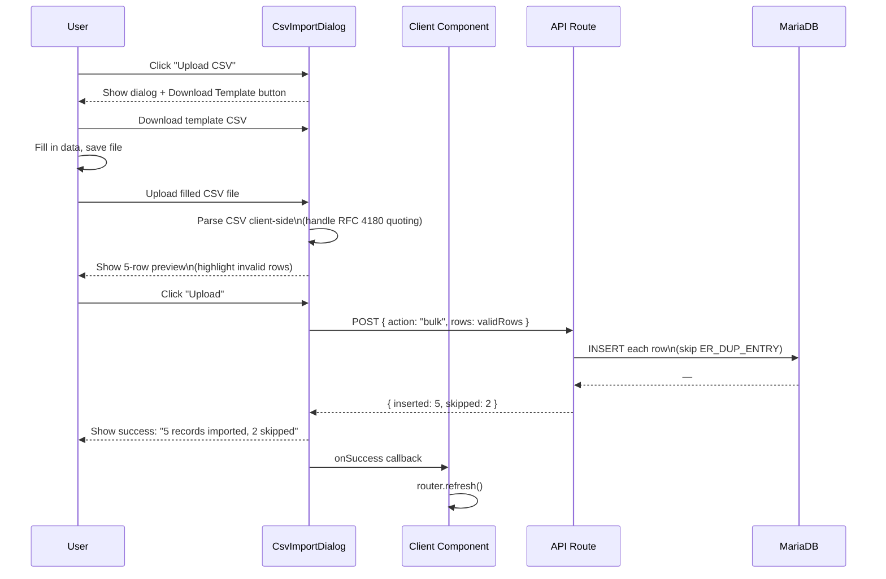

# Masters Module

> **Related docs:** [API Reference](./api-reference.md) · [Frontend Patterns](./frontend-patterns.md) · [Database Schema](./database-schema.md)

The Masters module is the **fully implemented reference module** of this ERP. It manages master data — the reference tables that every other module depends on (materials, products, suppliers, manufacturers, bills of materials). Study this module before building any new module.

## What "Master Data" Means

Master data records are created once and referenced repeatedly by transactional data (POs, manufacturing orders, invoices). Without master records, nothing else can function. The Masters module manages the lifecycle of these entities: create, bulk import, view, and update.

## Entities, Routes, and Tables

| Entity | Route | API Endpoint | Tables |
|--------|-------|-------------|--------|
| SKUs | `/masters/skus` | `POST /api/masters/skus` | `skus` |
| Vendors | `/masters/vendors` | `POST /api/masters/vendors` | `vendors`, `vendor_details` |
| Manufacturers | `/masters/manufacturers` | `POST /api/masters/manufacturers` | `mfgs`, `mfg_details` |
| Raw Materials | `/masters/raw-materials` | `POST /api/masters/raw-materials` | `rm`, `rm_vrm`, `rm_mrm`, `vrm_history` |
| Packing Materials | `/masters/packing-materials` | `POST /api/masters/packing-materials` | `pm`, `pm_vrm`, `pm_mrm`, `vrm_history` |
| Material Master | `/masters/material-master` | `POST /api/masters/material-master` | `rm`, `pm` |
| BOM Master | `/masters/bom-master` | `POST /api/masters/bom-master` | `bom`, `bom_details` |

## Server + Client Component Pattern

Every entity follows the same two-file pattern:

```
app/masters/<entity>/
├── page.tsx          ← Server Component (data fetch + auth gate)
└── <Entity>Client.tsx  ← Client Component (interactivity)
```

**Server Component** (`page.tsx`) responsibilities:
1. Call `auth()` — redirect to `/auth/signin` if no session
2. Call `resolveAccess(userId, roles, "/masters")` — redirect to `/auth/unauthorized` if `"none"`
3. Run a `query<Type[]>(sql)` via `lib/db.ts`
4. Render the Client Component, passing data as a prop

**Client Component** (`*Client.tsx`) responsibilities:
1. Receive `initialData` as a prop (typed array)
2. Render MasterToolbar + SearchInput + HTML table
3. Open AddRecordDialog for single creates, CsvImportDialog for bulk imports
4. On successful mutation: call `router.refresh()` to trigger the Server Component to re-fetch

```ts
// Example: app/masters/skus/page.tsx (Server Component)
export default async function SkusPage() {
  const session = await auth();
  if (!session) redirect("/auth/signin");

  const access = await resolveAccess(Number(session.user.id), session.user.roles, "/masters");
  if (access === "none") redirect("/auth/unauthorized");

  const skus = await query<Sku>("SELECT id, sku_code, name, brand, category, status, created_at FROM skus ORDER BY sku_code ASC");
  return <SkusClient initialSkus={skus} />;
}
```

## Data Flow Diagram

```mermaid
flowchart LR
    U["User action\n(Add record / Upload CSV)"]
    CC["Client Component\n(*Client.tsx)"]
    AR["API Route\n(/api/masters/*)"]
    DB["MariaDB\n(via lib/db.ts)"]
    SC["Server Component\n(page.tsx re-runs)"]
    T["Updated table\nin browser"]

    U --> CC
    CC -->|POST { action, ...fields }| AR
    AR -->|execute() or transaction| DB
    DB -->|{ id } or { inserted, skipped }| AR
    AR --> CC
    CC -->|router.refresh()| SC
    SC -->|query<T>()| DB
    DB --> SC
    SC --> T
```

## Shared Components (`components/masters/`)

### `AddRecordDialog`

A generic form dialog for creating a single record. Driven by a `fields: MasterField[]` configuration — no custom form code needed for standard entities.

```ts
<AddRecordDialog
  entityLabel="SKU"
  endpoint="/api/masters/skus"
  fields={[
    { key: "sku_code", label: "SKU Code", type: "text", required: true },
    { key: "name", label: "Name", type: "text", required: true },
    { key: "brand", label: "Brand", type: "text" },
    { key: "category", label: "Category", type: "text" },
    {
      key: "status",
      label: "Status",
      type: "select",
      options: ["active", "inactive", "discontinued", "new_launch"],
    },
  ]}
  onSuccess={() => router.refresh()}
/>
```

Posts `{ action: "create", ...formValues }` to `endpoint`. Shows inline error messages on failure.

### `CsvImportDialog`

A file-upload dialog for bulk imports. Generates a downloadable CSV template from the field config, parses the uploaded file client-side, shows a 5-row preview, then POSTs `{ action: "bulk", rows: validRows[] }`.

Returns `{ inserted, skipped }` — both are shown to the user in a success message.

### `MasterToolbar`

Top toolbar that renders:
- An **Add** button → opens `AddRecordDialog`
- An **Upload CSV** button → opens `CsvImportDialog`
- A `SearchInput` for client-side filtering

### `SearchInput`

Controlled text input. On change, filters the displayed rows in the Client Component by matching the search term against row values. Client-side only — does not hit the API.

## Raw Materials — Special Case

Raw Materials is the most complex master entity due to the rate master structure.

### Dual View

The `/masters/raw-materials` page supports two views, toggled by the `?view=` URL parameter:
- `?view=vendor` (default) — shows `rm_vrm` rows joined with `rm` (one row per vendor rate)
- `?view=manufacturer` — shows `rm_mrm` rows joined with `rm` (one row per manufacturer approval)

The `ViewToggle` component switches between views. Switching views triggers a full server-side re-fetch.

### Add Raw Material Wizard (`AddRawMaterialWizard.tsx`)

A multi-step modal wizard instead of the standard `AddRecordDialog`. Steps:

1. **Step 1 — Material details:** Name, make, INCI name, type, UOM, HSN code
2. **Duplicate check:** Calls `action: "check-RM"` — warns if a material with the same name + make + INCI already exists
3. **Step 2 — Vendor rates:** Add one or more vendor rates (vendor, price, MOQ, UOM, effective date)
4. **Vendor rate check:** For each vendor, calls `action: "check-vendor"` — shows existing rate if found
5. **Step 3 — Manufacturer approvals:** Select which manufacturing sites this material is approved for
6. **Final submit:** Single `action: "create-full"` POST — transactional insert of RM + vendor rates + manufacturer approvals

### Rate Archive Pattern

When updating a vendor rate, the existing `rm_vrm` row is **archived to `vrm_history`** before the update, preserving the audit trail. This is handled server-side in `app/api/masters/raw-materials/route.ts`.

## Packing Materials — Special Case

Packing Materials mirrors the Raw Materials pattern with the same dual-view and wizard structure.

### Dual View

The `/masters/packing-materials` page supports two views:
- `?view=vendor` (default) — shows `pm_vrm` rows joined with `pm`
- `?view=manufacturer` — shows `pm_mrm` rows joined with `pm`

### Add Packing Material Wizard (`AddPackingMaterialWizard.tsx`)

Same 3-step pattern as RM:

1. **Step 1 — Material details:** Name, type, HSN code, UOM, status — calls `action: "check-PM"` for duplicate check (name + type)
2. **Step 2 — Vendor rates:** Add one or more vendor rates; calls `action: "check-vendor"` per vendor; shows amber warning if rate already exists
3. **Step 3 — Manufacturer approvals:** Select manufacturing sites
4. **Final submit:** `action: "create-full"` — transaction insert of PM + vendor rates + manufacturer approvals

### Rate Archive Pattern

Same as RM: existing `pm_vrm` rows are archived to `vrm_history` (with `mtrl_type = 'pm'`) before updating. The `vrm_history` table covers both RM and PM via this `mtrl_type` enum.

---

## Material Master — Flat View

The `/masters/material-master` page provides a unified, simplified view of all materials without the rate data columns.

### What it is

- **Single toggle** between Raw Material and Packing Material (no vendor/manufacturer sub-toggle)
- Shows base material fields only: code, name, make (RM only), type, UOM, HSN code, status
- URL: `?material=rm` (default) or `?material=pm`
- Queries the `rm` / `pm` base tables directly — no JOINs

### Add Material Dialog (`AddMaterialDialog.tsx`)

A simple single-step dialog (no wizard). Fields shown depend on the active material toggle:

**Raw Material fields:** Name\*, Make\*, INCI Name\*, Type, UOM, HSN Code, Status

**Packing Material fields:** Name\*, Type\*, UOM, HSN Code, Status

Posts to the dedicated `POST /api/masters/material-master` route with `{ action: "create", material: "rm" | "pm" }`. No vendor or manufacturer data is collected — those are managed from the individual Raw/Packing Materials pages.

### File Structure

```
app/masters/material-master/
├── page.tsx               ← Server Component (fetches base rows, no joins)
├── MaterialToggle.tsx     ← RM / PM pill toggle (client, uses Link)
├── MaterialMasterClient.tsx  ← Table + search + status filter (client)
└── AddMaterialDialog.tsx  ← Simple create dialog (client)
```

---

## BOM Master

### Structure

A BOM (Bill of Materials) links a SKU to a manufacturing site with a versioned `bom_code`. It contains material line items (`bom_details`) specifying what raw and packing materials are needed, in what quantity, and at what cost.

```
bom (header)
├── sku_code → which product
├── mfg_id   → which plant
├── bom_code → version identifier
└── bom_details[] (line items)
    ├── mtrl_type: "rm" or "pm"
    ├── mtrl_id: FK to rm or pm
    ├── amount: quantity per batch
    ├── mtrl_cost: cost per unit
    └── effective_from / effective_till: validity window
```

### Status Lifecycle

```
draft → in_review → active → inactive
                           → discontinued
```

A SKU can have multiple BOMs (different versions or different manufacturing sites). The currently active BOM is referenced by `sku_details.curr_bom_id`.

### BOMMasterComponent

`app/masters/bom-master/BOMMasterComponent.tsx` renders a flat joined view of `bom_details` + `bom` (one row per material line). Each row shows the BOM code, SKU code, material type and ID, amounts, costs, and effective dates.

## CSV Import Workflow


